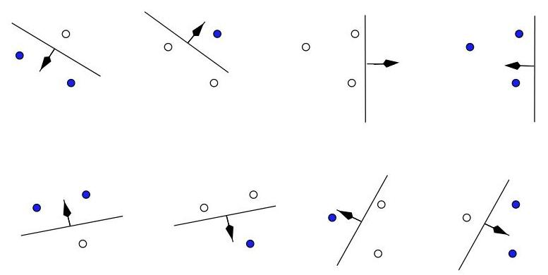
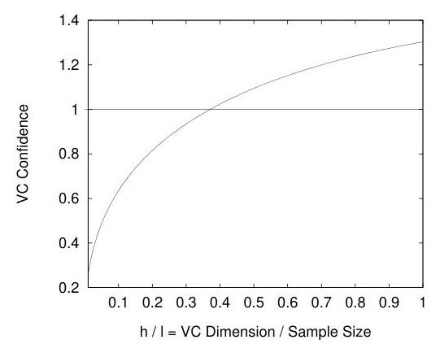

논문 : **Burges, C. J. C. (1998). A tutorial on support vector machines for pattern recognition. Data mining and knowledge discovery, 2(2), 121-167.**

 &nbsp;

최근 핸즈온 머신러닝 교재에서 SVM(Support Vector Machine)에 대해 공부하면서 논문을 읽어보고 싶었다. Survey 논문으로 시작하는 것이 좋을 것 같아 논문을 서칭해 '패턴 인식을 위한 서포트 벡터 머신 튜토리얼'이라는 주제의 논문을 선택했다. 논문을 읽었을 때 해당 기술에 대한 배경과 의도를 알 수 있어서 좋다. 그 배경을 알면 그 활용법을 조금 더 이해하지 않을까 기대를 한다.

바로 레츠고오.

 &nbsp;

## Abstract

---

이 논문은 키워드를 '**서포트 벡터 머신**', '**통계적 학습 이론**', '**VC 차원**', '**패턴 인식**'로 선택했다. 이 중에 VC 차원에 대해 먼저 알고 가는 것이 좋을 것 같다.

 &nbsp;

 **VC 차원**(Vapnik-Chervonenkis dimension)은 모델의 복잡도와 학습 능력을 측정하는 지표인데, **주어진 모델이 얼마나 다양한 데이터를 정확히 구분할 수 있는지**를 나타낸다. 어떤 모델(분류기)로 데이터셋을 분류한다고 하자. 분류기는 선형(직선), 원 등의 모델을 가질 수 있다. 즉, 직선으로 클래스를 나눌 수 있고, 원으로 원의 안쪽과 바깥쪽의 클래스를 나눌 수 있다.

각 데이터 포인트는 자신의 실제 클래스(레이블)가 있을 것이다.
**얼마나 많은 데이터 포인트(점)까지 각 분류기로 자신의 클래스에 맞게 분류될 수 있는지**에 관한 것이 **VC 차원**이라는 개념이다.

 &nbsp;

그러면, "**직선 분류기(선형 모델)**"를 먼저 생각해보자.
(각 데이터셋은 2차원, 3차원, 그보다 높은 차원에 나타낼 수 있지만 2차원으로 나타낸다고 하자.)

* **직선 하나로 서로 다른 점 2개를 두 그룹으로 분리할 수 있는가?** => **그렇다.**

  조금 더 자세히 설명해보면,
  
  이진 분류에서 두 점이 같은 클래스를 갖는다(+, +).
   그러면 직선 |에 대해 "**+ + |**"와 같이 클래스를 나눌 수 있다.
  이진 분류에서 두 점이 다른 클래스를 갖는다(+, -).
   그러면 직선 |에 대해 " **+ | -**"와 같이 클래스를 나눌 수 있다.
* **직선 하나로 서로 다른 점 3개를 두 그룹으로 분리할 수 있는가?** => **그렇다.**

  그림으로 좀 더 자세히 보자.

  

  * 위와 같이 3개의 데이터 포인트는 직선 하나로 두 그룹으로 분리 가능하다.
  * 그런데 의문이 하나 있긴 하다..

    > **3개의 데이터 포인트가 일자(-) 형태로 존재할 경우,**
    > **양 끝의 데이터들이 같은 클래스이면 (+ - +) 이 데이터셋은 직선 하나로 분리할 수 없지 않는가...?**
    >
    > * ~~일반적으로 데이터들은 일직선 상에 존재하지 않기 때문에 그런 것인가..~~
    > * 2.1 VC 차원에서 설명하듯, **어떤 한 점을 기준으로 할 때 나머지 점들의 위치 벡터가 선형 독립임을 가정하고 있다**!! (수학적으로 점들이 일직선 상에 없다는 것을 가정한다는 것이다.)
    >

&nbsp;

* **직선 하나로 서로 다른 점 4개를 두 그룹으로 분리할 수 있는가?** => **그렇지 않다!!**

  **XOR 문제**를 알아보자.

  * 논리 연산에서 배타적 논리합(Exclusive OR)은 **두 값이 다를 때 참(True)이고**, **같을 때 거짓(False)**로 클래스를 나눈다.
  * 한 데이터의 특성 $x_1$, $x_2$에 대해 데이터 포인트 $(x_1, x_2)$를 나타낼 수 있는데, 배타적 논리합에 의해 **점 (0, 1) , (1, 0)은 참(True, +)인 클래스**, **(0, 0), (1, 1)은 거짓(False, -) 클래스**이다.
  * **(0,1) +**    **(1,1) -**

    **(0,0) -**    **(1,0) +**

    => 위와 같이 나타낼 수 있는데, **직선 하나로 분류가 불가능**하다.

결국, **직선 분류기**는 **최대 3개의 점까지 정확히 분류가 가능**하므로 **직선 분류기의 VC 차원은 3**이라고 할 수 있다.
(원 분류기(타원 아님)도 비슷한 방법으로 생각해보면, 원 분류기의 VC 차원은 3이다.)

&nbsp;

VC 차원에 대한 더 자세한 설명은 나중에 하자.
(그리고 Abstract에 따르면 VC 차원과 구조적 위험 최소화 개념에 대한 개요로 시작해서 분리 가능하고 분리 불가능한 데이터셋에 대한 선형 서포트 벡터 머신을 설명할 것이고, 목적 함수의 최솟값(지역, 전역 최솟값)이 있을 때 최적의 해에 대해 논의할 것이라 한다. 또한, 비선형인 해를 구하기 위해 서포트 벡터 머신에서 중요한 커널 매핑 기법에 대해 설명할 것이고, VC 차원과 일반화 성능 관련성에 대해 설명한다고 한다.)

이제 하나씩 자세히 뜯어보자.

 &nbsp;

## 1. Intoduction

---

이 튜토리얼에서는 **패턴 인식 문제**에만 초점을 맞추고, 회귀 추정과 선형 연산자 역변환 등의 주제에 대한 탐구는 제외했다고 한다.

SVM의 초기 연구자들은 **편향-분산 트레이드오프**(Bias Variance Tradeoff)과 **용량 제어**(Capacity Control), **과적합**(Overfitting)에 대해 초점을 맞췄다고 한다.

유한한 양의 훈련 데이터로 최상의 일반화 성능을 달성해야 하는데, **학습 데이터에서의 정확도(훈련 데이터에 얼마나 적합한지)와 기계의 용량(모델이 얼마나 복잡한 패턴을 학습할 수 있는지) 간의 균형이 필요**하다고 한다. Capacity가 너무 크면 모델이 훈련 데이터에 과적합되어 새로운 데이터에 대한 일반화 성능이 좋지 않고, 반대로 Capacity가 너무 작으면 모델이 훈련 데이터에 과소적합되어 새로운 데이터에 대해 엉뚱한 결론을 내어 일반화 성능이 좋지 않다고 한다.

앞으로 보게 될테지만 **학습 데이터에서의 정확도**는 **경험적 위험(훈련 오차)** $R_{\text{emp}}$와 관련 있으며, 기계의 용량은 **VC 차원** $h$과 관련 있다!!

&nbsp;

## 2. A Bound on the Generalization Performance of a Pattern Recognition Learning Machine

---

1. **일반화 오차 $R(\alpha)$는 경험적 위험(훈련 오차) $R_{\text{emp}}$보다 커질 수 없다.**

   $R(\alpha) \leq R_{\text{emp}}(\alpha)+\sqrt{\left(\frac{h(\log (2 l / h)+1)-\log (\eta / 4)}{l}\right)}$

   * $R_{\text{emp}}(\alpha)+\sqrt{\left(\frac{h(\log (2 l / h)+1)-\log (\eta / 4)}{l}\right)}$ : **위험 경계** (risk bound, 상한)
   * $\sqrt{\left(\frac{h(\log (2 l / h)+1)-\log (\eta / 4)}{l}\right)}$: **VC 신뢰도**

     * **일반화 오차와 경험적 위험 사이의 오차 상한(일반화 오차의 상한)**이라고 생각하면 된다.
       즉, 모델이 학습 데이터뿐만 아니라 새로운 데이터에 대해 일반화할 때 추가로 발생할 수 있는 오차의 상한이다.
     * 모델의 복잡도(VC 차원 $h$), 훈련 데이터의 수($l$), 신뢰 수준($\eta$)에 따라 결정된다.
     * 모델의 복잡도($h$)가 커지면 일반화 오차의 상한이 커진다.
     * 훈련 데이터($l$)가 많아질수록 일반화 오차의 상한이 작아진다.
     * 신뢰구간에 대한 확률 $\eta$이 작을수록 일반화 오차의 상한이 커진다.
       => 신뢰도 $1-\eta$ 를 크게 해 일반화 오차가 상한 안에 있을 가능성을 높이므로(상한을 더 커지게 해서 상한 이하의 범위을 넢힘), 그만큼 일반화 오차의 상한을 크게 만든다.

&nbsp;

2. **구조적 위험을 최소화(SRM)하기 위해 경험적 위험 $R_{\text{emp}}$과 모델 복잡도(VC 차원) $h$ 간의 균형을 맞추는 것이 중요하다.**
   * $R(\alpha)$을 계산하는 것은 일반적으로 불가능한데, 모델의 복잡도(VC 차원 $h$)를 알면 위험 경계를 쉽게 계산할 수 있다.
     즉, **우선 $\eta$를 충분히 작게 한 후(일반화 오차가 상한 안에 있을 가능성(신뢰성)은 높여 놓고), 모델의 복잡도(VC 차원 $h$)와 경험적 위험 $R_{\text{emp}}$ 사이의 최적점을 찾아서 위험 경계를 최소화하는 것**이 쟁점이다.
     => **서로 다른 VC 차원을 갖는 여러 모델 중에서 위험 경계가 가장 작은 모델을 선택하면 된다**!!
   * 참고로 모델의 복잡도($h$)가 커지면 과대적합 가능성이 높아지고, 훈련 데이터($l$)가 많아질수록 과소적합 가능성이 높아진다.

&nbsp;

### 2.1 VC Dimension

VC 차원이 무엇인지는 Abstract에서 설명했다. 하지만 VC 차원에 대한 정의를 좀 더 명확히 할 필요가 있다.

VC 차원을 좀 더 엄밀히 정의하기 위해 단계적으로 서술해보자. (참고로 직선 분류기를 이용)

1. **$l$개의 점의 위치(배치)를 먼저 정해준다.**
2. **해당 배치에서 각 점마다 1과 -1 레이블을 정해주는 모든 경우($2^{l}$가지)에서 각각 분할할 수 있는 직선이 존재할 때,**
   **해당 점의 배치에서 $2^{l}$가지 레이블 조합을 함수 집합 내의 어떤 함수로든 정확히 분할 가능하다고 한다.**
3. **결국, $l$개의 점의 배치마다 레이블을 정해주는 경우들이 있는데, 적어도 하나 $l$개의 점의 배치라도 모든 레이블 조합에서 분할 가능한 직선이 있으면 된다.**
4. **점의 수 $l$을 늘려 그 최댓값 $h$을 찾으면 $h$가 VC 차원이다.**
   **(모든 레이블 조합에서 분류가 가능한 점의 배치가 존재하는데, 그 최대 점의 개수를 VC 차원)**

결국 **$h$개의 점 집합(배치) 중 적어도 하나가 분할 가능해야 하며, 모든 $h$개의 점 집합(배치)가 반드시 분할 가능한 것은 아니며, $h+1$점은 어떠한 배치에서도 모든 레이블 조합을 분할하는 경우는 없다**.

차근차근 읽어보면서 그 예시를 생각해보면 이해갈 것이다. (점 4개에서는 XOR문제 떠올리기!!)

아, 함수에 대해 잠시 설명하고 넘어가자.
$\{f(\alpha)\}$는 모델이 사용할 수 있는 함수들의 집합(학습 알고리즘이 선택할 수 있는 가능한 함수들이며 여기서는 모든 직선임)이며, $\alpha$는 특정 함수를 선택해주는 매개변수라 생각하면 된다(직선인 경우 기울기와 절편을 포함할 것임).
그리고, $f(x,\alpha)$은 $\alpha$로 정해지는 직선에 의한 특정 데이터 x에 대한 입력의 출력 레이블 값 1 또는 -1이다.

&nbsp;

### 2.2 Shattering Points with Oriented Hyperplanes in $R^{n}$

Abstract에서 스포했듯이(?) 2차원 공간($R^{2}$)에서 3개의 점까지 직선으로 분리(분할, Shattering)할 수 있었다. 그러면 **n차원 공간($R^{n}$)으로 확장해서 보았을 때 hyperplane(초평면)은 최대로 n+1개의 점들까지 분리할 수 있지 않을까?** => Yeeeeees!!!

수학적으로 보았을 때, n+1개의 점 중에서 1개의 점을 기준(원점)으로 잡고, 나머지 n개의 점들의 위치벡터를 선형 독립 관계를 갖도록 선택할 수 있다. (n차원 공간까지 있으니 n개의 위치벡터를 n개의 기저 벡터로 선택할 수 있다!!)

반면에 $R^{n}$ 공간에서 n+2개 점은 hyperplane(초평면)으로 분리할 수 없다. 1개 점 선택하고, 나머지 n+1개의 점의 위치 벡터를 정해줘야 하는데 반드시 1개의 위치 벡터는 일차 종속이 될 수 밖에 없다. (이 부분에 대한 이해가 부족하다면 선형대수학 학습을 추천한다.)

결국, **n차원 공간 $R^{n}$에서 VC 차원은 n+1이다.**

아 참고로, hyperplane은 2차원에서 직선을 확장한 것이라 생각하면 된다. 3차원에서는 초평면이 평면이라고 생각하면 된다!!

&nbsp;

### 2.3 The VC Dimension and the Number of Parameters

2.3절은 **(1) 어떤 모델이 VC 차원이 무한하지만, (2) $l$개의 점의 어떤 특정 배치에서 레이블의 모든 조합을 분할할 수 없는 하나의 예시**를 보여준다.
(참고로, VC 차원의 정의에 따라 해당 점의 개수에서 **다른 특정 하나의 배치에서만이라도** 모든 레이블 조합을 분할할 수 있기만 하면 된다.)

&nbsp;

아래와 같은 선형 분류기 모델이 있다고 하자.

$f(x, \alpha) \equiv \theta(\sin (\alpha x)), \quad x, \alpha \in \mathbf{R}$

* $\theta(x), x \in \mathbf{R}:\{\theta(x)=1, \forall x>0 ; \quad \theta(x)=-1, \forall x \leq 0\}$

&nbsp;

**(1) VC 차원이 무한하다고 한다.**

즉, 점의 개수 $l$마다 점의 배치 $x_i$를 적절히 정해주면 어떠한 레이블 조합 $y_i$이든 $\alpha$가 적절히 정해져 모델이 정확히 분할 가능하다는 것이다.
그런데, **이 논문에서 VC 차원의 증명 아이디어가 잘못된 것으로 보인다**. (누가 정답을 알려주십쇼..)

* $x_{i}=10^{-i}, \quad i=1, \cdots, l$ (점의 위치)
* $y_{1}, y_{2}, \cdots, y_{l}, \quad y_{i} \in\{-1,1\}$
* $\alpha=\pi\left(1+\sum_{i=1}^{l} \frac{\left(1-y_{i}\right) 10^{i}}{2}\right)$

와 같이 점의 위치(배치)를 정해주고, 레이블 조합 $y_i$ 값에 따라 $\alpha$값이 정해지도록 했다.
즉, 점의 위치(배치)를 정해준 후 레이블 조합마다 $\alpha$가 알아서 정해지고, $f(x, \alpha)$의 값이 정해진다. 해당 레이블 조합에서 $f(x, \alpha)$의 값과 $y_i$ 값이 같으면 분할 가능한 것이다.

&nbsp;

=> 그렇지만...... **이 논문에서 위와 같은 $x_i$에서는 증명이 되지 않는 것 같다..**

&nbsp;

> **[증명이 되지 않았던 이유]**
>
> 점의 개수($l$)는 3이고, **점의 위치는 $x_{i}=10^{-i} (i=1, \cdots, l$)** 일 때, **레이블 조합이 (-1, +1, -1)**인 경우
>
> * $\alpha=\pi(1+10+0+1000)=1011\pi$이므로, $f(x, \alpha)=\theta(\sin(1011\pi x))$이다.
> * $x_1=10^{-1}$의 레이블 $y_1=1$인데 $f(x, \alpha)=\theta(\sin(1011\pi \cdot 10^{-1})) = \theta(\sin(101.1\pi))=-1$이므로, 그 값은 $y_{1}=1$과 다르다.
> * 결국엔 현재 점의 배치에서는 어떤 레이블 조합을 분할할 수 없다는 이야기다.
>
> 결론은 **점의 개수마다 적절한 배치를 설정하면 VC 차원이 무한함을 증명할 수 있지 않을까** 한다..

&nbsp;

(2) $l$개의 점의 어떤 특정 배치에서 레이블의 모든 조합을 분할할 수 없는 예시

간단하다. 위와 같은 모델에 대해 **동일한 간격의 배치**에서는 모든 레이블 조합에 대해 분할이 불가능하다고 한다.
스킵해도 충분하다고 생각한다.

&nbsp;

### 2.4 Minimizing The Bound by Minimizing $h$

VC 차원을 최소화함으로써 위험 경계를 최소화하는 것에 대해 설명하고 있다.

아까 봤던 $R(\alpha) \leq R_{\text{emp}}(\alpha)+\sqrt{\left(\frac{h(\log (2 l / h)+1)-\log (\eta / 4)}{l}\right)}$ 식을 기억하자. 아래의 그림은 $95 \%$ 신뢰 수준 $(\eta=0.05)$을 선택하고 훈련 샘플 크기 10,000을 가정할 때 VC 차원 $h$에 따라 VC 신뢰도 항이 어떻게 보여주는지를 보여준다.



* $l$의 값에 관계없이, VC 차원이 증가할수록 VC 신뢰도가 커진다. (단조 증가 함수)
* 경험적 위험 $R_{\text{emp}}$이 0인 경우, VC 신뢰도 항만 최소화하는 기계를 선택하면 된다.
* 일반적으로 경험적 위험 $R_{\text{emp}}$이 0이 아닌 경우, 위험 경계 전체 항을 최소화하는 기계를 선택한다.
* **$h$가 작을수록 훈련 데이터에 과소적합 되어 경험적 위험 $R_{\text{emp}}$이 커질 수 있지만,**
  **VC 신뢰도가 낮아 실제 위험(오류율) $R(\alpha)$가 더 tight한 상한에 제한되어, 예측의 오류율이 적어질 수 있는 가능성이 있다.**
* **$h$가 클수록 훈련 데이터에 과대적합 되어 경험적 위험 $R_{\text{emp}}$이 작아질 수 있지만,**
  **VC 신뢰도가 높아 실제 위험(오류율) $R(\alpha)$가 느슨한 상한에 제한되어, 예측의 오류율이 커질 수 있는 가능성이 있다.**
* $h/l>3.7$일 때 VC 신뢰도가 1을 초과한다. VC 신뢰도가 1을 넘으면 상한(위험 경계)도 1이상인데, 이는 실제 위험(오류율) $R(\alpha)$를 0과 1 사이의 범위를 제한하지 못하기 때문에 의미가 없는 상황이다. 결론적으로, **적어도 VC 신뢰도가 1미만이 되도록 $h/l$의 값을 제한해야 상한이 유의미하다.**

&nbsp;

그래서 결론이 무엇이냐.
VC 차원을 크게 설정한다고 좋은 상황이 되는 것도 아니고, 작게한다고 좋은 상황이 되는 것이 아니다.

"**우선 VC 신뢰도가 1미만이 되도록 하는 $h/l$을 선택해야 하고, $h$의 값에 따라 경험적 위험과 VC 신뢰도는 반대로 변화하기 때문에 위험 경계(경험적 위험과 VC 신뢰도의 합)를 최소화하는 적절한 $h$값을 찾아야 한다는 것이다.**"

&nbsp;

### 2.5 Two Examples

넘어가도록 한다. 2.4의 결론을 직접적인 예시를 보여준다. 궁금하신 분은 논문 한 번 읽어보시면 됩니다.

&nbsp;

논문이 조금 길어서 끊고 가겠습니다. 2편에서 봐요!


```toc
```


