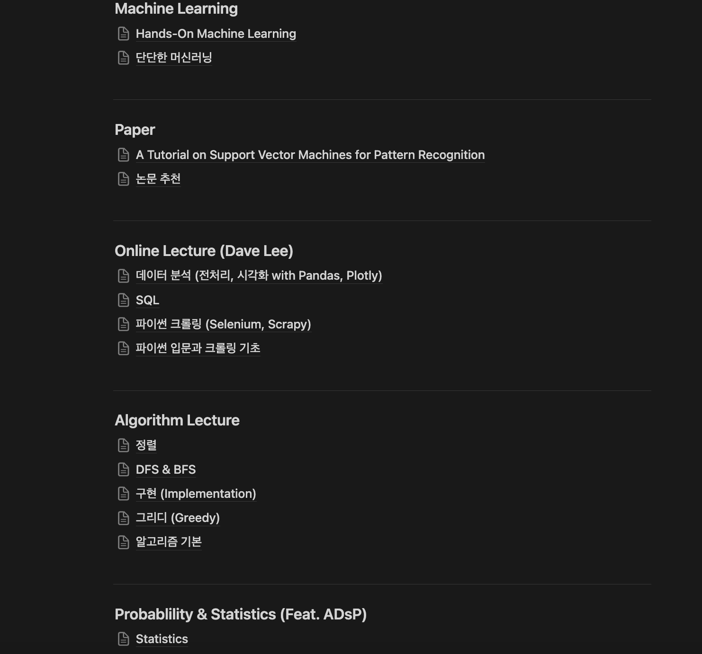
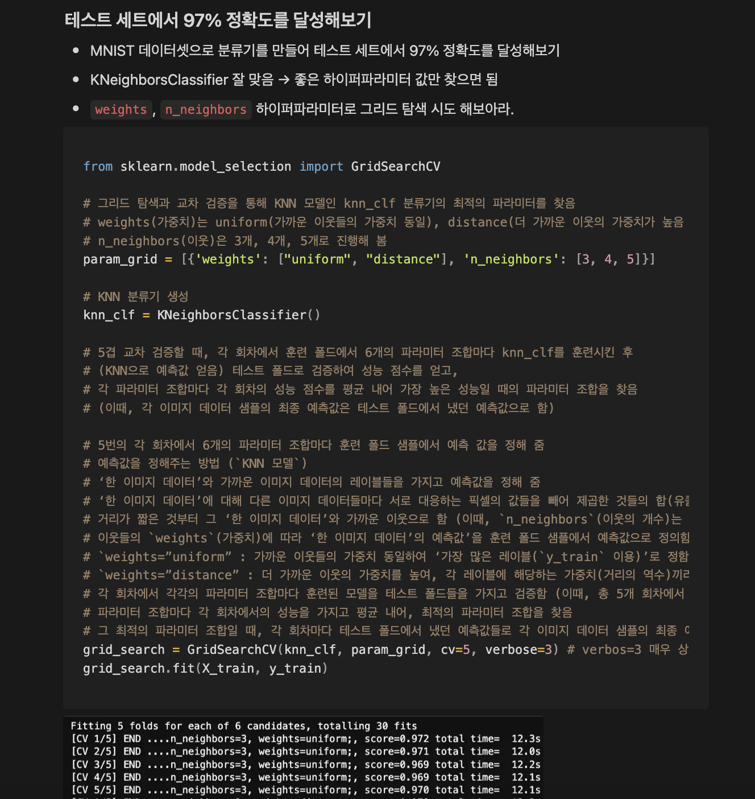
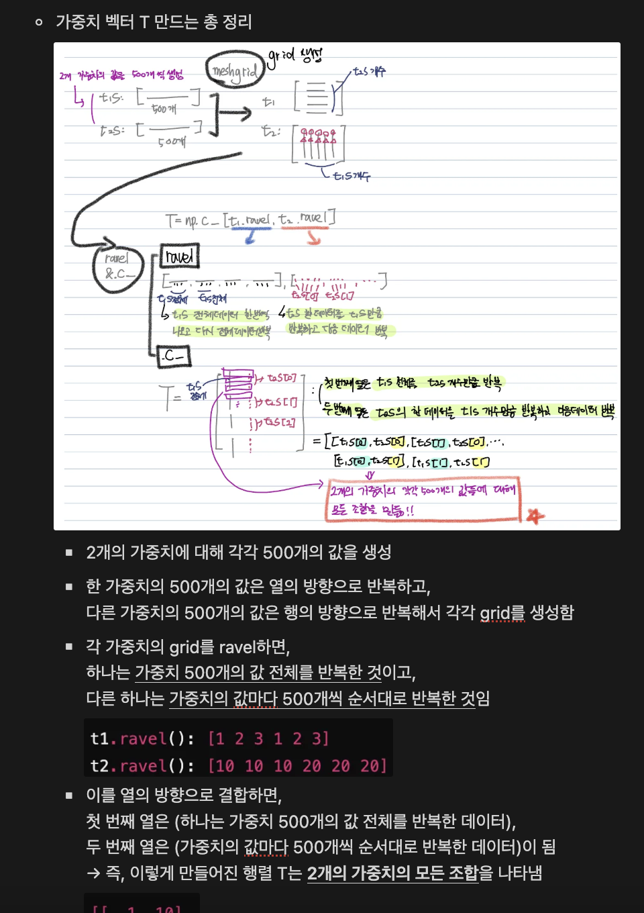
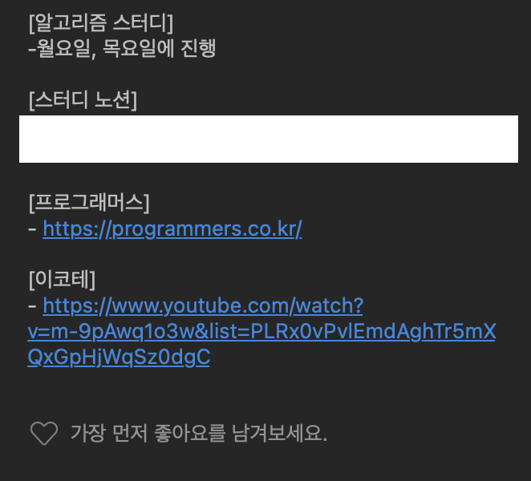
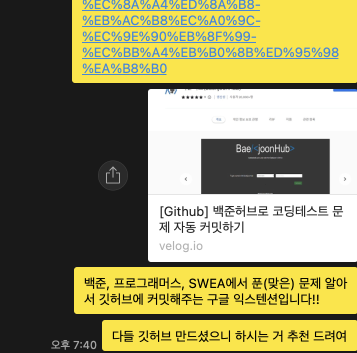
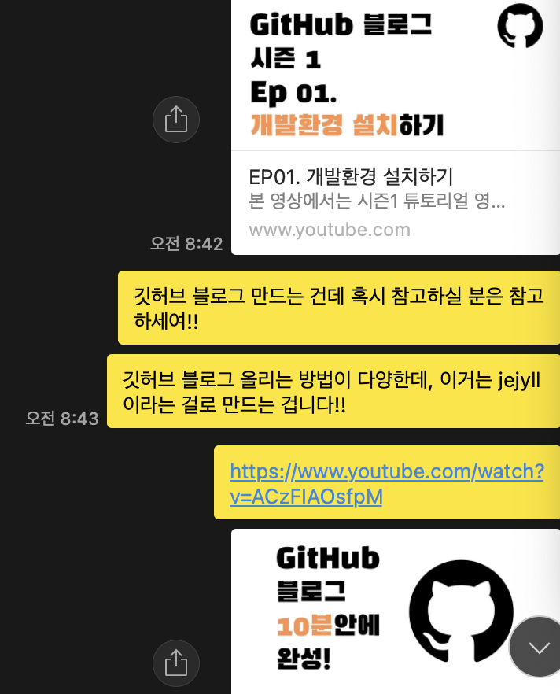
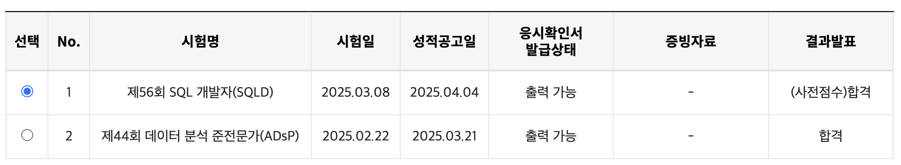

## 시작

---

25년 3월 19일 수요일 ASAC 빅데이터 분석가 교육 과정이 시작됐다.

그동안 혼자 파이썬 기본 문법부터 시작해서 SQL, 머신러닝의 전통적 모델들을 하루 9~12시간(?)씩 공부해 왔다.

'**내 속도에 맞게, 궁금한 것은 깊이 파면서**' 공부하는 습관대로 공부를 해왔는데 이 방향성이 맞을지에 대한 고민이 많았다.

(아래는 공부했던 내용 중의 일부다.)



&nbsp;

엉덩이 무겁게 공부하는 것에는 자신이 있었지만 조금 더 방향성을 잘 잡고, 효율적으로 공부하기 위해 SK 플래닛에서 진행하는 ASAC 과정에 지원하게 되었다.

&nbsp;

## 1주차

---

공부하는 것이 즐겁다. (미친 소리 같겠지만..)

정확히는 무언가에 대해 공부할 때 깊이 파는 걸 선호한다. aka. 대충하지 않는다.

간단한 예시를 들면 [Hands-on machine learning] (이하 생략)을 공부할 때 이해한 것을 모두 다 적느라 주석이 좀 많다..



또 다른 예시를 보여주면...



이해가 안 되면, GPT를 괴롭히거나 그림을 직접 다 그려보면서 어떻게든 알고 기록해 놓는다.

&nbsp;

작은 한 부분을 놓치지 않으려는 습관 때문에 **학습 시간이 많이 필요하다**.

그래서 내가 더 많이 공부하고 싶은 마음에 **1주차 첫째 날부터 2주차 동안** 9 to 6가 아닌, **8 to 8** 해왔다. (저녁 8시 30분에서 9시 사이에 퇴근한 적이 많긴 하다..)

내가 열심히 하려는 모습이 다른 교육생분들께도 잘 와닿았는지 많은 분들이 함께 남아서 공부하고, 파이썬 알고리즘 아이디어를 공유한다.

&nbsp;

1주차 첫 날은 토스뱅크 데이터 분석 직무 현직자 특강과 프롬프트 엔지니어 현직자 특강을 했다.

데이터를 분석한 이후에 하는 직무에 따라 데이터 분석가 직무를 더 세세히 나눌 수 있다는 것을 배웠다. 즉, 해당 회사에서는 데이터 분석을 한 결과를 바탕으로 어떤 프로세스에 의해 의사결정하고 있는지에 대한 것을 배웠다. 내가 Report, Sharing에 관심이 있는지, Action에 관심 있는지, Modeling에 관심 있는지 등을 좀 더 깊이 생각해 봐야겠다. (사실 지금은 Modeling을 너무나 하고 싶다.)

이외에도 현직자 강사님께서 생각하시는 데이터 분석가가 가져야 할 역량에 대해 깊이 있게 이야기 들었고, 프롬프트 엔지니어가 실제로 하는 일들을 보았다.

하고 싶은 프로젝트를 고민하고 정리해두고 있는데

단순히 취업용 프로젝트를 진행하는 것이 아닌, 진심으로 내가 하고 싶고 가치를 만들어 낼 수 있는 프로젝트를 고민해 봐야겠다.

&nbsp;

## 2주차

---

### 알고리즘 공부

1주차 금요일(3일차)부터 파이썬 프로그래밍을 2주차까지 이어서 배웠다. 백준, 프로그래머스, 나동빈님 문제를 기반으로 파이썬 알고리즘 공부를 했다.

구현과 BFS/DFS에 대해 학습했는데, 아직까지 이전에 열심히 공부해왔어서 할 만 했다.

단, 1문제 빼고.

https://school.programmers.co.kr/learn/courses/30/lessons/92343

프로그래머스 Lv.3 문제 [2022 카카오 블라인드 채용 - 양과 늑대]다..

```python
# 프로그래머스 양과 늑대 (매우 어렵다...)
# DFS (이진탐색 가능)
# 방문했던 곳도 다시 방문하면서 모든 경우의 수를 탐색해야 함
# queue.append([node, move_nodes[:i] + move_nodes[i+1:] + node_tree[node], num_sheep, num_wolf + 1]) 이 부분을 기억하자!!


from collections import deque

def dfs():
    nodes, max_sheep = stack.pop()
    for node in nodes:
        if info[node] == 0:
            max_sheep += 1
    node_max_sheep[node] = max_sheep
        
    stack.append(stack)
    
    return 
    

# info : 각 i번째 노드에 양(0) 또는 늑대(1)가 있음(리스트)
# edges : 각 i번째 노드와 연결된 노드가 있음(리스트이고, 단방향으로 되어 있음, 되돌아오는 것은 고민해보자.)
def solution(info, edges):
    answer = 0
    node_tree = {i:[] for i in range(len(info))}

    # 트리모양에 대한 딕셔너리 코드화
    for s, e in edges:
        node_tree[s].append(e)

    # [0번 노드, 연결된 노드들, 양 1마리, 늑대 1마리]를 넣어 초기화
    queue = deque([[0, node_tree[0], 1, 0]])

    while queue:
        new_node, move_nodes, num_sheep, num_wolf = queue.pop() # 스택 형식 -> DFS
        
        # 기존의 양의수보다 현재 경로의 양의 수가 많으면 갱신
        if answer < num_sheep:
            answer = num_sheep
        
        # 현재의 점도 다시 갈 수 있음
        for i, node in enumerate(move_nodes):
            # 늑대가 있다면
            if info[node] == 1:
                # 현재 모아온 양의 수가 다음 늑대의 수(현재 늑대의 수 + 1)보다 크면
                if num_sheep > num_wolf + 1:
                    # 늑대 있는 곳으로 일단 가서 (num_wolf + 1)
                    # 지금 늑대 있는 곳으로 가기 전의 노드에서 그 전에 방문했던 노드들과 다른 연결된 노드들, 지금 양 있는 곳에서 연결된 노드들을 모두 같이 넣어줌
                    queue.append([node, move_nodes[:i] + move_nodes[i+1:] + node_tree[node], num_sheep, num_wolf + 1])
            
            # 양이 있다면 
            else:
                # 양 있는 곳으로 일단 가서 (num_sheep + 1)
                # 지금 양 있는 곳으로 가기 전의 노드에서 그 전에 방문했던 노드들과 다른 연결된 노드들, 지금 양 있는 곳에서 연결된 노드들을 모두 같이 넣어줌
                queue.append([node, move_nodes[:i] + move_nodes[i+1:] + node_tree[node], num_sheep + 1, num_wolf])
    
    return answer
```

위 소스코드에서

```python
queue.append([node, move_nodes[:i] + move_nodes[i+1:] + node_tree[node], num_sheep, num_wolf + 1])
```

이 부분을 생각해보지 못했었다.

이진트리 모양으로 각 노드에 양 또는 늑대가 있는데, 해당 노드에 방문 시 각 동물(양 또는 늑대)을 끌고 다녀야 한다. 그런데 노드 방문할 때 모은 양의 수와 모은 늑대의 수가 같아지거나 늑대의 수가 더 많아지면 양이 모두 잡아먹혀 그 전에 루트 노드로 돌아와야 한다. 최대한 많은 양의 수를 확보한다고 했을 때 양의 수는 몇 마리인지 출력하는 문제이다.

여기서 단순히 내가 얼마만큼 깊은 곳까지 양을 데려올 수 있는지에 대한 문제가 아니다. **방문했던 곳을 다시 방문할 수도 있다**!!

**오른쪽 노드에서 양을 데려와서 왼쪽 노드를 방문하면서 양을 더 데려올 수 있고, 그 상태에서 오른쪽 노드 깊이까지 방문하여 양을 데려올 수 있다**. 이를 코드화 하는 것이 가장 문제였다...🫢

변수 queue (주의: 여기서 queue 형식이 아니고 **stack 형식**이다. bfs로 풀다가 변수 이름 수정을 못했다..)에는 현재 노드, **앞으로 갈 노드들**(연결된 노드들), 현재까지 모은 양의 수, 현재까지 모은 늑대의 수를 저장했다.

>  "내가 이번에 이동해서 양 또는 늑대를 데리고, 이전에 방문했던 곳들을 어떻게 방문할 수 있을까...?"
>
> -> **이를 코드화하기 위해서는 더어어어어 구체화해야 한다!!!**

나는 **이번에 이동한 노드**에서 **양 또는 늑대의 수를 추가한 후에**, **이동하기 이전의 노드에서 연결된 노드들 중에 이미 방문했던 노드들(move_nodes[:i])과 아직 방문하지 않은 노드들(move_nodes[i+1:])을 방문하고 싶고**, **이번에 이동한 노드에서 연결된 노드들(node_tree[node])도 방문하고 싶다**는 것이다.

이렇게 구체화하면서 문제를 풀 수 있었다..

**추상적으로 표현한 말**을 더욱 **구체화**하여 **코드화**해야 한다. (2주차에서 인상 깊었던 나만의 결론...)

&nbsp;

### 스터디

적극적으로 알고리즘 코딩 테스트 스터디를 구했다. 꾸준함을 보여주는 것이 알고리즘 공부라 생각한다. 꾸준히 하지 않으면 금방 까먹는 것들이기에 일찌감치 스터디원들을 구했다.


&nbsp;

스터디 운영 경력(임용 고시 준비로 인해..)은 3년 이상이기에 스터디 방식을 짜고 의견 조율하는 것은 전혀 어렵지 않았다.

스터디원들의 수준을 고려해 난이도별로 문제를 먼저 선정하여 자신이 생각하는 수준의 문제를 선택해 풀고, 스터디 시간에 자신이 고민한 흔적들, 좋은 코드와 라이브러리 등을 공유하기로 했다.

나는 **공유의 힘**을 믿는다. 통신이 발달한 이래로 급격히 산업이 이렇게 발전한 것은 각자 알고 있는 지식을 공유하기 수월해졌기 때문이 아닌가. 또, 현재 다양한 오픈 소스들도 AI 발전을 위한 것이라 알고 있다. (TMI. 심지어 고등학교 교사 근무할 때 모둠학습을 많이 진행했다..)



&nbsp;



&nbsp;



&nbsp;

열심히 공유 중이다... 다함께 파이팅해서 나중에 하고 싶은 일을 하자고요💪🏻

&nbsp;

### 자격증 합격

짧게 얘기하면, 2월, 3월달에 연달아 봤던 ADsP 자격증과 SQLD 자격증 시험에 합격했다!!!!



열심히 머신러닝 공부했던 것이 ADsP 공부하는 데에 도움이 많이 됐었고, MySQL로 실습하면서 열심히 공부했던 것이 SQLD 시험에 도움이 많이 됐었다.

자격증만이 중요한 분야는 아니지만, 이정도는 기본으로 있어야지라는 마음으로 공부했다. 이것도 따지 못하면 ML, DL은 어찌 공부하랴 이 마인드로 하다보니, 아침에 공부 시작해서 저녁 늦게까지 한끼도 안 먹고 공부한 적도 있다. (몰입하다보니 시간이 어느새..)

아무튼 기분이 좋다.. 끝.


```toc
```

