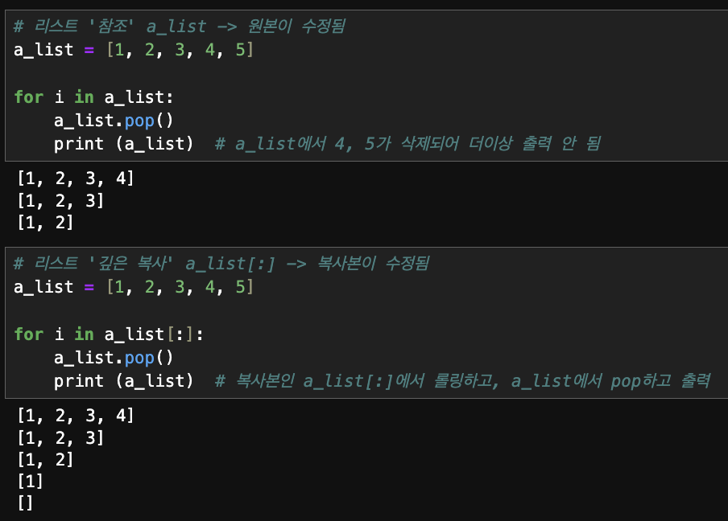

이번 주에는 많은 일들이 있었다(매주 많을 것 같지만..?).

그동안 파이썬 알고리즘 문제를 풀면서 그 문법들을 익혔고, 이번 주부터는 **파이썬 알고리즘**을 마무리한 후 **MySQL**에서 원하는 데이터를 읽어보는 방법을 학습했다.

그런데 MySQL까지 진도를 다 나갔고... 무려 금요일에 **Python 알고리즘과 MySQL 데이터로 결과값 찾는 테스트**까지 봤다!!! (미친 속도🔥)

이번 주부터 나의 주도로 만든 **Python 알고리즘 스터디**도 시작되었다. 스터디는 일주일에 2번 진행됐고 스터디 내에서 선정한 알고리즘 문제를 자신의 난이도에 맞게 선택하여 풀어오는 방식으로 진행되었다.

몇몇 분들과 함께 **공공데이터를 활용한 데이터 분석 및 AI 관련 공모전**도 나가기로 해서 관련 회의와 데이터 서칭을 했다.

정신 없는 일주일. 회고를 시작해보자.

&nbsp;

## '시점'에 대한 정의로 알고리즘 문제해결

---

그동안 구현과 그리디, DFS/BFS 위주로 알고리즘 문제를 풀고 학습했다.

먼저 문제에 대한 이해를 완벽히 한 후, **어떻게 코드화할지 깊이 고민하는 연습**을 했다.

지금까지 풀었던 문제들은 대개(아직 문제풀이 경험은 적지만..) **내가 필요한 정보를 어떠한 방식으로 저장해둘지**가 관건이었다.

1. 먼저, **어떤 노드**에 대한 **같은 시점**의 관련 정보가 **무엇이 있을지** 생각해야 한다. (⭐️)

* 지난 회고에 올렸던 [카카오 블라인드 채용 기출문제 '양과 늑대']에서도 **어떤 node**에 대해 **연결된 노드**와 **현재 시점의 양의 수와 늑대의 수**를 같이 묶어서 저장했다.
* (https://school.programmers.co.kr/learn/courses/30/lessons/92343)

&nbsp;

2. 다음으로, 어떤 노드에 대한 **같은 시점의 정보**를 **어떠한 방식으로 저장**할지 고민해야 한다.

* 노드 간의 연결성 정보를 저장하기 위해서 **딕셔너리 형태**로 해당 노드 번호를 Key로 하고, Value에 해당 노드에 관련된 정보들을 리스트로 넣을 수 있다.

* 다른 방법으로는, **해당 노드 번호를 리스트 인덱스 위치**로 하여 **그 노드에 관한 정보만 리스트 인덱스에 맞게 저장**하는 것이다.

&nbsp;

처음에는 문제를 풀 때 어떤 정보가 필요할지 단순히 나열하다보니 해결되지 않는 경우가 많았는데, **'시점'에 대한 정의로 문제 풀이 계획을 깔끔하게 할 수 있음을 알게 되었다**.

(우선순위 큐를 이용한 다익스트라 알고리즘 문제 풀이를 올리려고 했는데, Algorithm 카테고리에 따로 분석해서 올리겠습니다!!)

&nbsp;

## MySQL: 보고 싶은 부분을 최대한 구체화하여 코드화하자.

---

문법적으로는 기본적인 SELECT 문, DELIMITER 구분자와 BEGIN과 END, JOIN의 다양한 방법, 서브쿼리 활용 방법(비연관 서브쿼리 중심으로), CONCAT 함수, VIEW, INDEX에 대해 학습했다.

항상 그랬듯이 **문법을 아는 것과 문제해결은 다른 것**이다. 일상어로 이루어진 요구사항 또는 내가 필요한 정보를 뽑아내기 위해서는 '**코드 구현을 위한 구체화**'의 작업이 필요하다.

어떤 커머스 회사가 **신규 유입자들이 이탈하지 않도록 하고 싶다**고 하자.

의사결정을 내리기 전에 정보를 탐색해봐야 한다.

1. 신규 유입자들의 order 정보를 봐야할 것이다.
2. 더 깊이 들여다 보면, 신규 유입자의 이탈은 첫 주문 이후 얼마나 이탈되었는지와 관련있어 보인다.
3. 첫 주문 이후 두번째 주문이 없는 유저의 비율을 살펴보는 것이 좋아 보인다.

이정도 구체화하고, 코드화하면서 더 구체화해보자.

``` mysql
SELECT * FROM orders LIMIT 5;
```

먼저 orders 테이블의 데이터 내용들을 살펴본다.

&nbsp;

다음으로, CustomerID 별로 구매횟수를 살펴보자. (바로 구매횟수가 1번인 사람들을 볼 수 있지만 하나씩 탐색해 나가는 것이 결과물을 찾는 방향이 꼬이지 않는다.)

``` mysql
SELECT CustomerID, COUNT(DISTINCT InvoiceDate) `구매 횟수`
FROM orders
GROUP BY CustomerID
```

CustomerID 별로 구매횟수를 살펴보기 위해 COUNT() 함수를 이용하는데, **DISTINCT InvoiceDate**를 이용했다. (InvoiceDate는 주문 날짜) 나는 **같은 날의 주문들은 모두 같은 구매로 취급**했다. **오늘 주문하고 이탈하는 고객들을 보고 싶었다**.

코드화 과정에서 이러한 구체성을 갖고 분석할 수 있다.

&nbsp;

다음으로, **구매횟수가 1인 고객들이 몇 명**인지 보자.

``` mysql
SELECT COUNT(CustomerID) `첫 구매 후 이탈 고객의 수`
FROM (
	SELECT CustomerID, COUNT(DISTINCT InvoiceDate) `구매 횟수`
	FROM orders
	GROUP BY CustomerID
)A
WHERE `구매 횟수` = 1;
```

구매 횟수가 1인 행 데이터만 필터링하여 CustomerID의 개수를 파악하면 된다.

그런데 '**첫 구매 후 이탈 고객 비율**'을 어떻게 구할까....?

-> **전체 고객의 수가 필요하다**. (첫 구매 후 이탈 고객의 수)/(전체 고객의 수) 계산을 해야 하는데, WHERE 절에서 필터링을 거쳤다.

-> 그러면, **WHERE 절에서 필터링을 하지 않으면서 전체 고객의 수를 가져오는 대신에, 필터링을 SELECT 절에서 하는 것이 좋을 듯**하다.

&nbsp;

``` mysql
SELECT SUM(CASE WHEN `구매 횟수`=1 THEN 1 ELSE 0 END)/COUNT(*) `첫 구매 후 이탈 고객 비율`
FROM (
	SELECT CustomerID, COUNT(DISTINCT InvoiceDate) `구매 횟수`
	FROM orders
	GROUP BY CustomerID
)A;
```

SUM() 함수와 CASE WHEN을 이용해서 필터링하면 해결할 수 있다.

이렇게 첫 구매 후 이탈 고객의 비율을 확인할 수 있는데, 이뿐만 아니라 구매 횟수별로 이탈 고객의 비율을 확인하거나 구매 날짜 등을 확인하면서 고객에게 푸시 알람, 프로모션 등에 대한 계획을 할 수 있을 것이다.

의사결정을 하기 전의 하나의 정보를 탐색하기 위해 해야하는 생각의 흐름을 깊이 돌아봤다. 문법은 찾으면 된다. 중요한 것은 **내가 의사결정을 위해 어떠한 정보를 탐색할 것인지와 그 정보를 살피기 위해 보고 싶은 부분을 최대한 구체화하여 코드화해야 하는 것**이다.

&nbsp;

## Python, MySQL 테스트

---

3주차 금요일에 Python, MySQL 테스트를 약 4시간 동안 보았다. 지난 수업에서 다뤘던 것들과 새로운 문제들을 섞어서 출제됐는데.. 결론은 반성 좀 하자.. 정신 없이 2~3주를 보냈던 것도 맞고, 잠을 많이 줄여 최악의 컨디션이었던 것도 맞지만, 다 핑계다.

어렵거나 헷갈리는 문제를 건너띄지 않고 시간을 할애해 어떻게든 풀고자 하는 습관은 좋은 점도 있지만 테스트에서는 독이 될 수 있다. 집에 가서 푹 자고 난 후, 주말에 다시 풀어보았는데 금방 다 풀 수 있던 문제들...^^

**[개선할 점]**

1. **문제를 읽고 문제 정의를 제대로 하자**.
   * SQL 문제에서 묻는 것을 정확히 문제 정의하자.
   * 문제 정의에서 필요한 것은 **필요한 컬럼 정리**와 **구조화**이다.
     * 우선 필요한 컬럼을 하나씩 다 써보자.
     * JOIN, FROM절에 서브쿼리, SELECT절에 서브쿼리, CASE WHEN, SUM() 함수 등을 이용해 해당 컬럼들을 어떻게 넣어볼지 생각하자.


2. **Python 알고리즘 방식을 제대로 뜯어보면서 이해하자**.

   * 양과 늑대 문제... DFS를 이용하여 왔던 길도 다시 방문하는 방식을 이해하고 그 방식도 알고 있었지만, 그 세밀한 부분에서 이해가 좀 부족했던 것 같다.

   * queue.append([node, move_nodes[:i] + move_nodes[i+1:] + node_tree[node], num_sheep + 1, num_wolf]) 에서 move_nodes 리스트와 node_tree 리스트는 다른 것이다. (1-2주차 회고에서 소스코드를 올렸던 부분이다.)

   * for문으로 롤링하고 있는 리스트에 대해 현재 노드 전에 롤링으로 방문했던 곳과 앞으로 롤링으로 방문해야 할 곳이 move_nodes[:i], move_nodes[i+1:]이고, for문에서 롤링으로 현재 방문한 노드에 대해 연결된 노드들이 node_tree[node]이다. 헷갈리지 말자.

&nbsp;

## Python 알고리즘 코딩테스트 스터디

---

Python 알고리즘 코딩테스트 스터디를 이번 주 2번 진행했다.

프로그래머스 Level 1, Level 2 위주의 문제를 선정해서 자신의 수준에 맞는 (약간의 도전감 있는) 문제를 선택해서 풀어오면 된다. 물론 풀어오지 못한 문제가 있을 수 있다.

스터디의 목적은 함께 공유하고 도와주면서 알고리즘 실력 향상에 있다. 자신이 선택한 문제를 풀지 못하더라도 고민을 충분히 하고, 자신의 고민에 대한 나눔을 진행했다. **고민에 대한 피드백 제공**과 **같은 문제의 여러가지 풀이 방법 이해**에 초점을 맞추어 스터디를 진행했다.

이번 주 스터디에서 2가지가 기억난다.

1. **나의 잘못된 설명을 스터디원이 바르게 고쳐줬던 것**

   문제 상황은 "for문에서 리스트(a_list)를 롤링하는데, 리스트의 정보를 수정했을 때(ex. a_list.pop()을 진행) 반영이 되어 롤링이 진행될 것인가?" 이다.

   

   * **결론**은 **for문에서 리스트의 정보를 수정하면 그 수정사항을 반영하여 for문이 돌아간다**.
   * 그렇다면 **for문에서만큼은 그 리스트가 수정사항을 반영하지 않으면서 롤링하고, for문이 끝난 후에 수정사항이 반영된 리스트를 사용할 수 있을까?**
     * 리스트의 복사본(깊은 복사)을 롤링하면 된다.
     * **for element in a_list[:]:**을 이용하면 a_list의 깊은 복사인 a_list[:]를 롤링하고, a_list를 수정하면 된다.

&nbsp;

2. **스택&큐 문제 중에서 시간 복잡도를 확 줄인 풀이 방법**

   * 문제 출처 : https://school.programmers.co.kr/learn/courses/30/lessons/42584

   * 다들 2중 for문으로 시간 복잡도가 $O(n^{2})$가 되도록 문제풀이를 했는데... 굉장히 효율적인 방식을 배웠다.

   * 문제 설명

     * 초 단위로 기록된 주식가격 prices 리스트가 있는데 가격이 떨어지지 않은 기간은 몇 초인지를 기록하는 것이다.
     * prices = [1, 2, 3, 2, 5] 이라 하자.
     * 리스트의 인덱스 기준으로 순번(0번째, 1번째, 2번째 ...)을 본다고 하자. 0번째의 1은 끝까지 주식가격이 떨어지지 않으므로 4초로 기록되고, 1번째의 2도 끝까지 주식가격이 떨어지지 않으므로 3초로 기록되고, 2번째의 3은 1초 뒤에 2로 떨어지므로 1초로 기록된다. 3번째의 2는 끝까지 주식가격이 떨어지지 않으므로 1로 기록되고, 4번째의 5는 마지막이므로 0초로 기록된다.
     * 최종 결과는 [4, 3, 1, 1, 0]으로 출력된다.

   * 시간 복잡도 $O(n^{2})$ 인 2중 for문 방법의 풀이

     ``` python
     # 프로그래머스 lv2 주식가격
     def solution(prices):
         answer = []
     
         # 각 price마다 위치(i)도 같이 가져옴
         for i, price in enumerate(prices):
             # 마지막 위치에서는 0을 추가하고 종료
             if i == len(prices) - 1:
                 answer.append(0)
                 break
             
             # 각 price에서 그 이후부터 확인
             for j in range(i+1, len(prices)):
                 # 중간에 자신의 price 보다 더 작아지면 앞으로 더 걸린 시간 만큼 저장함
                 if price > prices[j]:
                     answer.append(j-i)
                     break
                 
                 # 끝까지 가면
                 if j == len(prices)-1:
                     answer.append(j-i)
     
         
         return answer
     
     ```

   * 시간 복잡도 $O(n)$인 풀이

     ``` python
     def solution(prices):
         answer = [0] * len(prices)  # 결과 리스트 초기화
         stack = []  # 가격과 인덱스를 저장할 스택
     
         i = 0
         while i < len(prices):  
             # 가격이 떨어졌다면 스택에서 pop()하여 처리
             while stack and prices[i] < stack[-1][0]:  
                 _, index = stack.pop()
                 answer[index] = i - index  # 가격 유지 시간 계산
     
             stack.append([prices[i], i])  # 현재 가격과 인덱스 추가
             i += 1
     
         # 끝까지 가격이 유지된 경우 처리
         while stack:
             _, index = stack.pop()
             answer[index] = len(prices) - 1 - index 
         
         return answer
     ```

     * prices에서 하나씩 꺼내면서 1초가 지난다. 그러면 각 가격에 대해 [현재 가격, 현재 지난 시간(초)]를 함께 stack에 추가할 수 있을 것이다.
     * 그런데, stack에 추가하기 전에 **현재 가격**이 **가장 마지막에 추가된 가격보다 작아지면** **그 마지막에 추가된 가격을 stack에서 제거**하고, **시간(현재 시간-그 가격이 추가된 시간)을 계산**하여 answer에서 그 가격에 맞는 인덱스에 맞게 저장한다.
     * 이때, 앞에서 마지막에 추가된 가격이 stack에서 제거되면 **그 현재 가격으로 다음 마지막에 추가된 가격도 계속 비교해서 제거한다**. 더이상 비교할 것이 없으면 그 현재 가격과 현재 지난 시간을 함께 stack에 추가한다.
     * 결국, 이 방식은 **리스트 한 바퀴만(n번 연산) 돌리는데 조건에 맞는 것들만 한 번씩 pop하여(모든 값이 최종적으로 pop이 되므로 n번 연산) 결과를 추가한다**. **2n번 연산만 진행되므로 시간 복잡도는 O(n)이다**.

리스트를 인덱스 i를 이용해 접근하여 현재 가격과 지나가는 시간을 자연스럽게 저장하면서 조건에 맞는 것만 pop하는 방식이다.

찾아보니 **스택을 사용해서 과거 가격들만 스택에 쌓아두고, 떨어지면 pop하는 방식이 '모노토닉 스택 패턴'이라고 한다**고 한다. 잊지 말자...!!!!!!!!

&nbsp;

## 공모전 도전

---

열심히 공부하는 모습을 보면서 어떤 분이 함께 공모전을 나가자는 제안을 해주셨다.

마침 관심이 있던 주제이기도 하여 함께 준비하기로 했다. '청소년'이라는 주제로 공공데이터 분석, AI 관련 공모전을 준비하고자 한다. 현재는 첫 회의한 후에 여러 데이터셋을 수집하는 과정에 있다.

파이리이이잉💪🏻 


```toc
```

