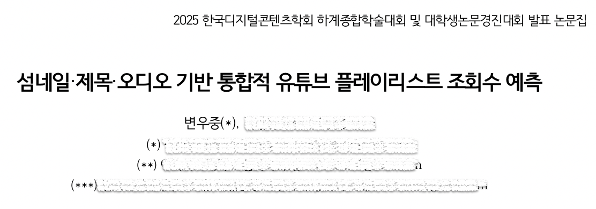
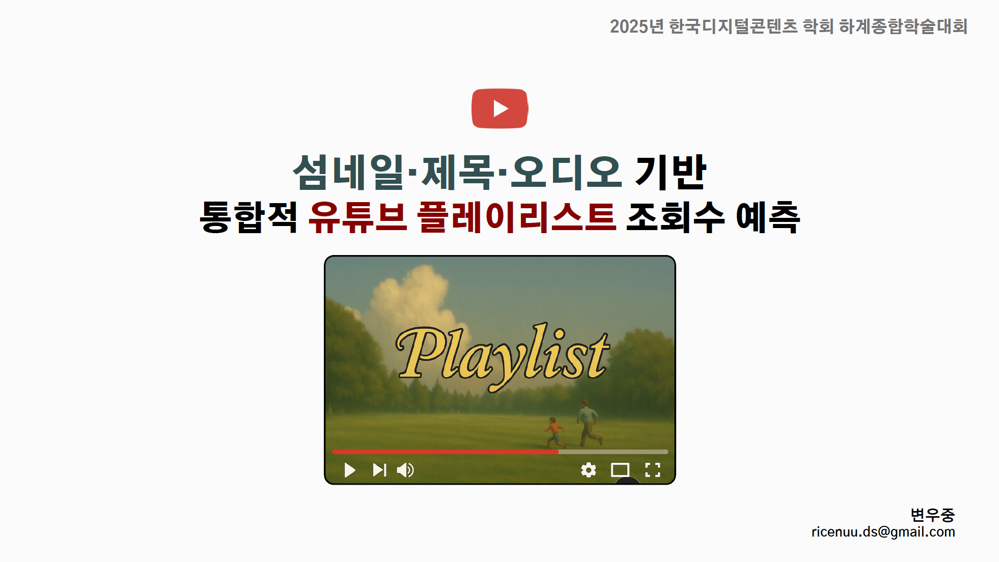
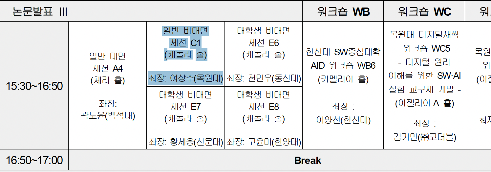
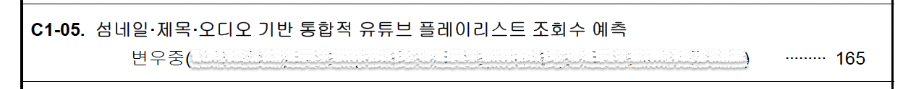

GitHub Repository: https://github.com/byeonwoojung/youtube-playlist-MLproject

&nbsp;

## 들어가며(?)

---

2025년 7월 3일, 생애 처음으로 학회에서 논문 발표를 했다.

"섬네일·제목·오디오 기반 통합적 유튜브 플레이리스트 조회수 예측"이라는 주제로 **한국디지털콘텐츠학회 하계종합학술대회**에 참가했다. ASAC 교육과정에서 발표를 위해 1개월 정도 준비했고, 이후 딥러닝 프로젝트, 기업연계 프로젝트와 병행하면서(진짜 너무 힘듦 ㅠ) 약 5~6주 동안 디벨롭해 학회 논문 발표를 진행했다.. 프로젝트 2개를 병행하니 잠을 거의 못 자며 준비했었다,,,

정말 발표 때가 오니, 약간 긴장도 되고 설레기도 했다.(사실 긴장 안함🥶)



진짜 마감 직전까지 수정한...ㅠ 학회 논문은 내겐 아픈 손가락이다.. 더 잘할 수 있었을 텐데 아쉬움이 많이 남는다.. (다른 분들은 원치 않으실 수 있으니 가렸음다,,ㅎ)

&nbsp;

## 프로젝트를 시작한 계기

---

평소 유튜브 플레이리스트 영상을 자주 봤다. 퇴근길 듣는 감성 노래, 잠들기 전에 듣는 음악, 공부할 때 틀어놓는 장작 타는 소리 등... 그러다 보니 자연스럽게 "어떤 플레이리스트가 조회수가 높을까?"라는 궁금증이 생겼다.

찾아보니 플레이리스트 콘텐츠는 유튜브에서 인기 있는 카테고리인데, 관련 연구는 거의 없없다. 특히 유튜브 조회수 예측 관련해서 **섬네일, 제목, 오디오**를 통합적으로 분석한 연구는 찾기 어려웠다.

그래서 직접 해보기로 했다. 이미지, 텍스트, 오디오의 비정형 데이터를 활용해서 조회수를 예측하고, 플레이리스트 제작자들에게 도움이 될 만한 인사이트를 찾아보자는 목표로 시작했다.

&nbsp;

## 사용한 기술들

---

이 프로젝트에서는 여러 기술을 활용했다.

* **ML/DL**: PyTorch, TensorFlow, Scikit-learn
* **Computer Vision**: YuNet (정면얼굴 검출), Google Vision API (텍스트 추출), OpenCV, KMeans (색상 분석), (SAM, YOLOv8, mediapipe 등 실험하면서 더 써봄,,)
* **NLP**: OpenAI API, TfidfVectorizer (제목 분석)
* **Audio**: Wav2Vec2, Librosa (음향 특징 추출)
* **Data Processing**: Pandas, Numpy

섬네일에서는 얼굴 유무, 색상 분포, 텍스트를 추출했고, 제목에서는 키워드와 감성을 분석했다. 오디오는 음향 특징을 뽑아서 모델에 넣었다.



&nbsp;

## 발표 준비 과정

---

### 발표 자료 만들기

우리의 이야기를 담기엔 발표시간 10분은 너무 적다. 발표시간이 적은 '적은 만큼 다 덜어내면 되겠지?' 했는데, 무엇을 덜어내야 할지, 피처에 대한 설명은 어느정도로 해야할지 등 발표 내용을 압축하는 것이 너무 어려웠다.

처음엔 모든 실험 결과를 다 넣으려고 했는데, 그러다 보니 발표 자료가 너무 길어졌다. 결국 우리 발표의 핵심인  남기고 과감하게 덜어냈다. **"왜 이 연구를 했는지", "어떻게 했는지", "결과는 어땠는지"**에 집중했다.

발표 자료를 만들면서 프로젝트를 다시 정리하는 시간을 가질 수 있었다. 뭐가 중요한지, 뭘 강조해야 하는지 명확해졌다.


### 발표 연습

발표 시간은 딱 10분이었다. 시간을 맞추는 게 생각보다 까다로웠다.

집에서 혼자 타이머 켜놓고 여러 번 연습했다. 처음엔 12분 넘게 걸렸는데, 불필요한 설명을 줄이고 핵심만 말하는 연습을 했다. 발표 당일 아침에도 한 번 더 리허설을 했다.

예상 질문도 미리 정리했다. "왜 이 주제를 선택했나요?", "데이터는 어떻게 수집했나요?", "모델 성능은 어떤가요?" 같은 질문들을 생각해두고 답변을 준비했다.
(근데, 생각했던 질문 거의 안 나왔네요... ㅎㅎ)

&nbsp;

## 발표 당일

---





ASAC 교육과정에서 딥러닝 프로젝트, 기업연계 프로젝트을 함께 준비하느라, 도저히 제주도를 갈 수 없어서 비대면으로 했습니다^^(너무 아쉬운.........)

&nbsp;

### 발표 후, 질의응답

발표가 끝나고 5분간 질의응답 시간이 있었다.

첫 번째 질문은 **실제 활용 가능성**에 관한 것이었다. 현재 모델로도 어느 정도 가능성이 있지만, 피처를 더 세밀하게 구성하면 실제로 활용할 수 있을 것 같다고 답했다.

두 번째 질문이 인상 깊었다.

*"유튜브는 조회수보다 **시청시간**이 수익에 더 중요한데, 유튜브 API에서는 시청시간 데이터를 제공하지 않는다. 이 부분에 대해 고민해봤는지, 어려움은 없었는지?"*

정말 핵심을 찌르는 질문이었다. 프로젝트 진행하면서 이 부분이 늘 아쉬웠는데, 질문으로 나오니 솔직하게 답할 수 있었다.

*"맞다. 시청시간 데이터를 못 구한 게 가장 아쉬웠다. 만약 유튜브 제작자와 직접 협력해서 시청시간이나 조회수 변화량 같은 데이터를 받을 수 있다면, 모델 성능을 훨씬 더 높일 수 있을 것 같다. 지금보다 더 세밀한 분석이 필요하다고 생각한다."*

답변하면서도 '다음엔 이 부분을 보완해야겠다'는 생각이 들었다.

&nbsp;

## 느낀 점

---

### 배운 것들

학회 발표는 프로젝트를 정리하고 되돌아보는 좋은 기회였다. 4개월간 열심히 했던 작업들이 하나의 스토리로 완성되는 느낌이었다.

다른 발표자들의 연구도 들으면서 많은 자극을 받았다. 특히 비슷한 주제로 연구하는 분들과 이야기를 나누며 새로운 아이디어도 얻을 수 있었다.

질의응답 시간이 특히 유익했다. 내가 미처 생각하지 못했던 부분들을 질문으로 받으니, 프로젝트의 한계와 개선점이 명확하게 보였다.

### 아쉬웠던 점

우선, 10분이라는 시간이 짧아서 많은 설명을 다 하지 못한 게 아쉬웠다.

프로젝트 과정에서 아쉬웠던 점은 피처 정의를 더 세심하게 하고 그 피처를 추출하기 위한 모델들을 더 많이 실험해봤으면 하는 아쉬움이다.

그리고, 유튜브 영상에서 사람들이 '가장 많이 봤던 장면 부분'과 '적게 봤던 부분'에 대해 프레임들을 가져와 분석해보면 어떨까 하는 생각도 있었다. (굉장히 많은 리소스가 들것으로 보이긴 하지만!)

### 다음 목표

이번 경험을 바탕으로 다음 단계를 생각해봤다.

* 유튜브 크리에이터와 협력해서 **더 많은 데이터** 수집하기
* 시청시간, 조회수 변화량 같은 **추가 데이터**로 모델 개선하기
* 실제 크리에이터가 활용할 수 있는 **웹 서비스** 만들기
* 다른 콘텐츠 유형(브이로그, 게임 등)으로 연구 확장하기

&nbsp;

## 마무리이이

---

비록 논문지 게재는 아닌 학회 논문 발표였지만, 충분히 그 과정에서 얻은 경험이 너무나 갑졌다.

주제와 방향성을 정하고, 피처를 정의하고, 피처를 추출하는 모델에 대해 논의하는 과정이 너무 힘들었지만 즐거웠다.

마감 기한이 다가오지만 특정 피처 추출이 잘 진행되지 않을 때, 현 상황을 어떻게 진단하고 어떻게 대처할지에 대해 서로 열렬히 논의했던 그 모든 것이 소중한 경험이었다.

그리고... 마음같아서 대학원 가서 더 깊이 연구도 하고 싶다. 끝.

```toc

```
