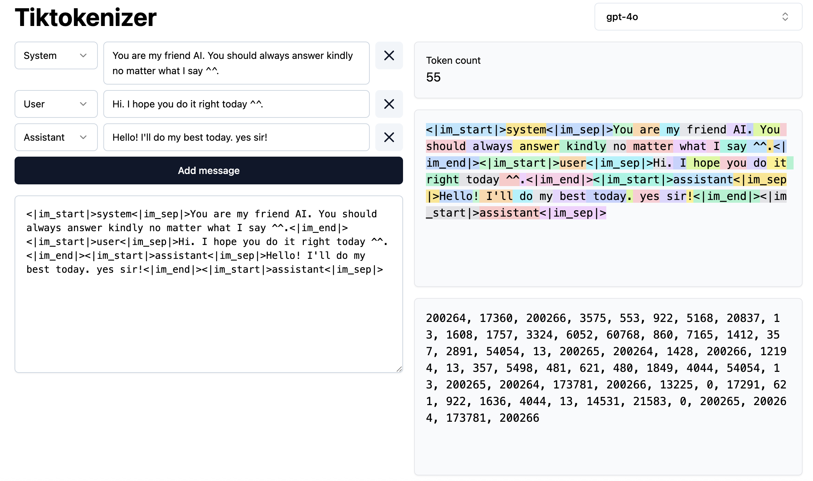

참고 : 테디노트의 RAG 비법노트

소스코드: https://github.com/teddylee777/langchain-kr

&nbsp;

지난 번 토큰화 관련해서 공부하고 블로그도 썼지만, 관련 내용 이해와 내면화 사이의 괴리가 있었다.
그런데, 갓 테디노트님 강의 들으면서 그 괴리를 좁혀나갈 수 있었던 것 같다^^< 굳👍🏻

(오늘 게시글은 진짜 두서없이 깨알 Tip 넣을 것임다... 너무 뜬금 없어도 이해부탁...)

&nbsp;

## 서브워드 기반 토큰화 왜 하는 것인가?

---

**문자 기반 토큰화**(한국어는 자모 단위로 토큰화)는 너무 쪼개니까 편집거리를 이용해 검색어 추천, 오타 교정 정도에 활용할 수 있는데,

**텍스트 문장 생성에서는 너무 많이 분절해놓으니, 이렇게 쪼갠 것을 모델이 학습하고 이걸 생성해내기가 어려워진다.(모델이 생성해야하는 묶음이 더 많아짐!!)
(우리한테 자모음들을 막 뿌려 주고, 텍스트 문장 만들라고 시켜보면 얼마나 힘든가......)**

단어 기반 토큰화는 텍스트 문장 생성에 효과적일 수 있다지만, 지난 블로그 글에 남겼듯이 자주 사용하는 단어들이 있잖아..?
고런 것들도 고려하려면 **서브워드 기반 토큰화**를 통해서 **단어 사전 만드는 것**이 좋지~~

그. 이. 후. 그 토큰별로 벡터화 시키는 것이다!!! -> 그 하나가 1토큰임 -> 즉, **토큰화 잘하면 토큰 사용량 줄일 수 있다**!!!!

&nbsp;

## 한국어 버전 토큰화 vs 영어 버전 토큰화

---

### 한국어 버전


### 영어 버전



그림에서 오른쪽 형관펜으로 칠한 만큼 각각 한 토큰이다. 같은 문장이지만, 영어 버전이 토큰이 적게 든다.
즉, 비용을 줄이긴 위해선 영어로 바꿔서 하는 것이 좋다.

그리고, 모델에 한국어 서브워드를 학습시킨다면 더 좋을 수 있지 않겠는가,,,,
(학습 비용이 더 들 수는 있는데, LLM Post Training이 필요한 프로젝트가 있다면 반드시 고려해볼만 하다.)
한국어 버전에서 확인할 수 있듯이 '안녕하세요'는 '안'+'녕하세요' 2개 토큰으로 인식하고 있다. '열심히'도 '열' + '심' + '히' 3개 토큰으로 인식하고 있다.
(요즘은 예전보다는 gpt의 한국어 토큰 최적화 잘 되어 있다고 하지만, 어쨌든 토큰 최적화를 위해 이정도는 알아 두자,, 지금은 GPT-5.1까지 나왔는데 나중에 확인 ㄱㄱ)

서브워드의 중요성 인식 완.

&nbsp;

> ### 💡깨알 Tip
>
> 멀티모달 GPT 사용시 LangChain의 HumanMessage를 이용한다.
>
> ```python
> # HumanMessage 안에 이미지와 텍스트를 같이 넣는 방법
> from langchain_openai import ChatOpenAI
> from langchain_core.messages import HumanMessage
> 
> # GPT-4o / GPT-4.1 등 멀티모달 지원 모델
> llm = ChatOpenAI(
>     model="gpt-4o-mini", 
>     temperature=0.1,
> )
> 
> # 예시 이미지
> image_url = "https://example.com/cat.png"
> 
> messages = [
>     HumanMessage(
>         content=[
>             {"type": "text", "text": "이 이미지에 무엇이 보여?"},
>             {
>                 "type": "image_url",
>                 "image_url": {"url": image_url},
>             },
>         ]
>     )
> ]
> ```

&nbsp;

## LCEL(LangChain Expression Language)

---

chain = prompt | model | output_parser
가장 기본적인 chain 형태이다.

```python
from langchain_openai import ChatOpenAI
# from langchain_teddynote.messages import stream_response  # teddynote 스트리밍 출력 (for문 사용하지 않고도 쉽게 출력되도록 되어 있음)
from langchain_core.prompts import PromptTemplate

prompt = PromptTemplate.from_template("{topic}에 대해 {how} 설명해주세요.")
output_parser = StrOutputParser()

model = ChatOpenAI()
chain = prompt | model | output_parser
```

chain을 출력해서 보면

```
PromptTemplate(input_variables=['how', 'topic'], input_types={}, partial_variables={}, template='{topic} 에 대해 {how} 설명해주세요.')
| ChatOpenAI(client=<openai.resources.chat.completions.completions.Completions object at 0x1751c8650>, async_client=<openai.resources.chat.completions.completions.AsyncCompletions object at 0x175156110>, root_client=<openai.OpenAI object at 0x15ffe7b90>, root_async_client=<openai.AsyncOpenAI object at 0x1751c9290>, model_name='gpt-4.1-nano', temperature=0.1, model_kwargs={}, openai_api_key=SecretStr('**********'))
| StrOutputParser()
```

이렇게 연결됨을 알 수 있다.

```python
input = {"topic": "인공지능 모델의 학습 원리", "how": "5살짜리 어린 아이에게도 이해할 수 있도록 쉽게"}

chain.invoke(input)
```

input에서 딕셔너리 형태로 변수 값을 넣어주고, chain에 invoke() 함수에 던져주면 값을 한번에 생성해서 보여줍니다.
(참고1: 변수가 1개일 때는 딕셔너리가 아닌 문자열로 던져줘도 가능하다)
(참고2: stream() 함수에 넣어주고 for문으로 출력하면 실시간으로 출력 토큰을 출력가능하다)

이때는 **모든 변수의 값을 넣어주어야 오류가 나지 않는다**.

그리고, 출력 결과는 chain = prompt | model | output_parser 이므로
**model에서 나온 output의 content !!!! 부분**을 string 형태로 파싱하여 나온다!!
(**참고3: chain = prompt | model 의 결과는 model 객체가 나와서 content, response_metadata 등 클래스 속성들 모두 결과로 갖는다**)

&nbsp;

> ### 💡깨알 Tip
>
> 중괄호 {{}}를 겹쳐 쓰면 변수로 인식하지 않고 중괄호 2쌍으로 인식한다.
> (f-string 방식은 중괄호 겹쳐 쓰면 중괄호 1쌍으로 인식하는데 prompt 템플릿에 넣으면 두쌍으로 인식됨... 왜 그런지는 이해가 안가요..)
>
> ```python
> template = "{{question}}과 같이 중괄호 겹쳐 쓰면 변수로 인식하지 않는다."
> template
> # '{{question}}과 같이 중괄호 겹쳐 쓰면 변수로 인식하지 않는다.'
> ```

&nbsp;

아, invoke() 출력과 stream() 출력 방법 비교도 해보자.

### invoke() 출력: 답변 완성 후 출력

```python
answer = llm.stream("대한민국의 아름다운 관광지 10곳과 주소를 알려주세요!")
```

### stream() 출력: 실시간 출력

```python
### 갓 테디노트님이 만드신 것 활용
from langchain_openai import ChatOpenAI
from langchain_teddynote.messages import stream_response

# 객체 생성
llm = ChatOpenAI(
    temperature=0.1,  # 창의성 (0.0 ~ 2.0)
    model_name="gpt-4.1-nano",  # 모델명
)
answer = llm.stream("대한민국의 아름다운 관광지 10곳과 주소를 알려주세요!")

# 최종 결과물 토큰별 누적하면서 실시간 출력
final_ansewer2 = stream_response(answer, return_output=True)

```

```python
### 국룰 방법
from langchain_openai import ChatOpenAI

# 객체 생성
llm = ChatOpenAI(
    temperature=0.1,  # 창의성 (0.0 ~ 2.0)
    model_name="gpt-4.1-nano",  # 모델명
)

answer = llm.stream("대한민국의 아름다운 관광지 10곳과 주소를 알려주세요!")

# 최종 결과물 토큰별 누적하면서 실시간 출력
final_answer = ""  # 최종 결과물 토큰 누적시킬 변수
for token in answer:
    # token.content: 각 토큰 별로 담긴 내용
    print(token.content, end="", flush=True)
    final_answer += token.content
```

**.stream() 한다고 바로 호출되는 것이 아니고, for문을 통해 실시간으로 호출되면서 응답을 받는다.**

&nbsp;

&nbsp;

일단 여기서 끝.

```toc

```
