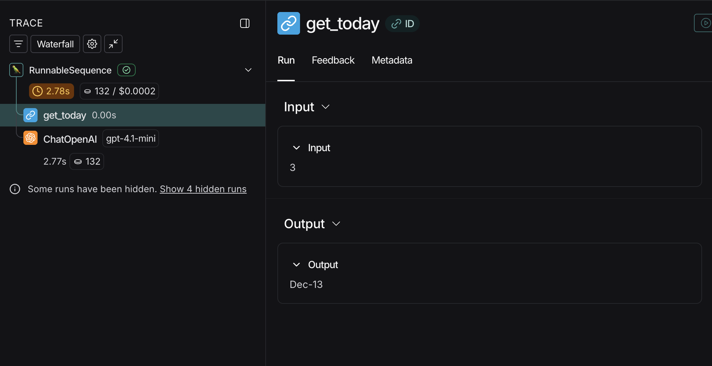
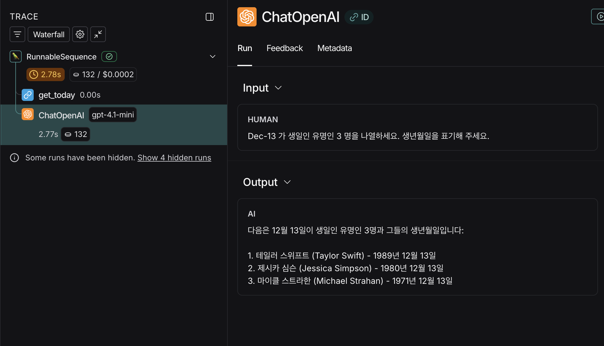

참고 : 테디노트의 RAG 비법노트 (https://fastcampus.co.kr/data_online_teddy)

소스코드: https://github.com/teddylee777/langchain-kr

&nbsp;

오늘도 가즈아..!!!!
새로운 걸 알아가는 건 정말 즐겁다~ 다만 알게된 것을 {정리}하는 것은 별개일 뿐.... O--<

거두절미. 레츠고~!

&nbsp;

## LCEL 인터페이스

---

지난 글에서는 invoke(), stream() 메서드를 살펴봤는데
사실 batch() 메서드도 있다.

#### batch(): 배치 처리

```python
from langchain_openai import ChatOpenAI
from langchain_core.prompts import PromptTemplate
from langchain_core.output_parsers import StrOutputParser

model = ChatOpenAI()
prompt = PromptTemplate.from_template("{topic}에 대하여 3문장으로 설명해줘.")
# 프롬프트와 모델을 연결하여 대화 체인을 생성합니다.
chain = prompt | model | StrOutputParser()

chain.batch([{"topic": "ChatGPT"}, {"topic": "Instagram"}])
# 출력: ['ChatGPT는 자연어 처리 기술을 사용하여 사람과의 대화를 시뮬레이션하는 인공지능 챗봇이다. 최신의 딥러닝 모델을 바탕으로 학습하며 사용자의 질문에 대답하고 다양한 주제에 대한 정보를 제공한다. 사용자와 자연스럽게 상호작용하면서 학습과 업데이트를 거쳐 보다 정확하고 유용한 응답을 제공한다.', 'Instagram은 사진과 동영상을 공유하고 다른 사용자들과 소통할 수 있는 소셜 미디어 플랫폼이다. 인스타그램은 휴대폰 앱을 통해 이용되며, 다양한 필터와 효과를 통해 사진을 가공하고 세련된 프로필을 만들 수 있다. 또한 해시태그를 통해 다양한 주제와 관심사에 맞는 콘텐츠를 검색하고 소통할 수 있다.']
```

리스트에 input_variables의 값들을 갖는 딕셔너리를 모아서 각각 배치로 chain에 던진다.<br>
**model을 거치고 파싱을 거치면서 각 배치 결과의 content들을 리스트에 묶어서 저장된다.**

참고로 config 딕셔너리에서 max_concurrency 키의 값을 설정하여 동시 처리할 수 있는 최대 작업 수를 정해줄 수 있다. 즉, 한번에 배치를 여러 개 처리를 할 수 있고 결과는 똑같이 모든 배치를 묶어서 정리되어 있다.

```python
chain.batch(
    [
        {"topic": "ChatGPT"},
        {"topic": "Instagram"},
        {"topic": "멀티모달"},
        {"topic": "프로그래밍"},
        {"topic": "머신러닝"},
    ],
    config={"max_concurrency": 3},
)
```

&nbsp;

### 비동기 메소드

어떤 작업을 기다리는 동안 다른 작업도 할 수 있는 것을 비동기라고 한다.

async 키워드 사용하여 비동기 스트림, 호출, 배치 가능하다.

#### 1. 비동기 스트림: async for, astream()

```python
async for token in chain.astream({"topic": "Youtube"}):
    print (token, end="", flush=True)
```

#### 2. 비동기 호출: ainvoke()

```python
# 비동기 호출 체인 객체 생성
my_process = chain.ainvoke({"topic": "Youtube"})

# 비동기로 처리하며 프로세스 완료 후 출력됨
await my_process
```

**ainvoke는 비동기 체인 객체 생성 후, await 키워드 호출로 답변을 생성한다.**

#### 3. 비동기 배치: abatch()

```python
# 비동기 배치 체인 객체 생성
my_abatch_process = chain.abatch(
    [{"topic": "YouTube"}, {"topic": "Instagram"}, {"topic": "Facebook"}]
)

# 비동기적으로 배치를 일괄 처리하며 프로세스 완료 후 
await my_abatch_process
""" 출력:
['YouTube는 온라인 동영상 공유 플랫폼으로, 사용자들이 동영상을 업로드하고 시청할 수 있는 서비스이다. 먹방, 게임 플레이, 뷰티 관련 콘텐츠 등 다양한 주제의 동영상을 제공하며, 수많은 유저들이 이용하고 있다. 유명 인플루언서나 크리에이터들이 YouTube를 통해 수익을 창출하고, 전 세계적으로 인기를 끌고 있다.',
 '인스타그램은 사진과 동영상을 공유할 수 있는 소셜미디어 플랫폼이다. 사용자들은 팔로워들과 소통하며 일상 속의 순간들을 공유할 수 있다. 또한 해시태그를 통해 관심사나 주제에 맞는 콘텐츠를 찾을 수도 있다.',
 'Facebook은 소셜 네트워크 서비스로, 사용자들이 글을 게시하고 사진이나 동영상을 공유할 수 있는 플랫폼입니다. 전 세계적으로 많은 사람들이 가입해 사용하며, 친구들이나 가족과 소통하고 소셜 미디어를 통해 정보를 공유합니다. 또한 광고도 활발히 진행되어 상품이나 서비스를 홍보하는데 이용됩니다.']
"""
```

**비동기적으로 각 배치를 기다리지 않고 동시 작업을 수행하며, 프로세스 완료 후 리스트로 출력한다.**<br>이때, 결과는 뱉어 내고 어디에 저장이 되지 않습니다!!

> ### 💡깨알 Tip
>
> 그래서!! '변수 = await 비동기 배치 체인 객체'로 결과를 받아 놓을 수 있습니다!
>
> ```python
> my_abatch_process = chain.abatch(
>     [{"topic": "YouTube"}, {"topic": "Instagram"}, {"topic": "Facebook"}]
> )
>
> result = await my_abatch_process
> result
> ```

&nbsp;

&nbsp;

## Runnable Interface

---

**Runnable**은 채팅 모델, LLM, 프롬프트 템플릿, 출력 파서, 검색기 등 **입력을 받아 실행 가능한 LangChain의 기본 구성요소**를 의미합니다.

이러한 Runnable들을 순차 또는 병렬로 연결해 하나의 실행 흐름으로 구성한 것을 **Chain**이라고 합니다.

&nbsp;

### Runnable 프로토콜

**Runnable 프로토콜**은<br>
 LangChain에서 **모든 실행 가능한 구성요소가 따라야 하는 공통 실행 규약(interface)**입니다.

> 즉,
> **“입력을 받아 실행하고, 출력을 반환하는 방법을 표준화한 약속”**

&nbsp;

LangChain에 서로 성격이 완전히 다른 구성요소들이

1. 실행 방식이 통일되어야 하고
2. 입력/출력 흐름이 예측 가능해야 하므로

**Runnable 프로토콜**이 필요합니다.

Runnable 프로토콜 덕분에 **객체들은 모두 동일한 실행 인터페이스를 가집니다.**

| 메서드             | 의미                   |
| ------------------ | ---------------------- |
| `invoke(input)`  | 단일 입력 → 단일 출력 |
| `batch(inputs)`  | 여러 입력 → 여러 출력 |
| `stream(input)`  | 출력 스트리밍          |
| `astream(input)` | 비동기 스트리밍        |
| `ainvoke(input)` | 비동기 실행            |

&nbsp;

즉,

**LLM도 Runnable**

```python
llm.invoke("2+3은?")
```

**PromptTemplate도 Runnable**

```python
prompt.invoke({"question": "2+3은?"})
```

**Retriever도 Runnable**

```python
retriever.invoke("2+3")
```

전부 `invoke()`로 실행 가능하다는 말입니다.

참고로 Chain도 그 자체가 Runnable이라 동일한 실행 인터페이스로 호출 가능합니다. (쉿🤫 Chain이라는 Runnable을 병렬로 연결 가능한데, 그것도 가능함~)

&nbsp;

결국, Runnable의 핵심 철학은

> "무엇을 하는가"가 아니라
> "어떻게 실행되는가"를 통일한다

&nbsp;

이해 완.🧐✨

&nbsp;

&nbsp;

### 데이터 전달 방법

LangChain에서 Runnable들을 연결할 때는

- 앞 Runnable의 **출력 형태**
- 다음 Runnable이 **기대하는 입력 형태**

를 맞춰야 하고, 이를 위해 **데이터를 전달·변형하는 여러 방법**이 존재합니다.

&nbsp;

#### 1. 값 전달: RunnablePassthrough

RunnablePassthrough는 값을 그대로 전달해주는 친구입니다.

```python
from langchain_core.runnables import RunnablePassthrough

RunnablePassthrough().invoke({"num": 10})
# 출력: {"num": 10}
```

이렇게 RunnablePassthrough()에서 invoke 메서드 호출하면 입력값 그대로 출력됩니다.<br>일반적으로 invoke() 통해 Runnable 실행할 때는 사용자 입력은 **딕셔너리 형태**로 전달하잖아요?

**사용자 입력을 딕셔너리가 아닌 '입력 변수의 값'만 받고, RunnablePassthrough를 통해서 chain 내부에서 입력(딕셔너리 형태) 키의 값으로 곧바로 넣어줄 수가 있습니다.**

```python
# chain에 딕셔너리 {입력 변수명: RunnablePassthrough()}를 넣고 연결해줌
runnable_chain = {"num": RunnablePassthrough()} | prompt | ChatOpenAI()

# 사용자 입력은 입력 변수의 '값'만 받음
runnable_chain.invoke(10)
```

**그럼 이것의 장점이 뭐냐?**<br>**=> 체인 설계할 때  딕셔너리 형태로 변수를 미리 다 넣어 두고, 입력 변수 넣고 호출할 때는 변수명 기억 못해도 값만 넣을 수 있음!!**

> ### 💡깨알 Tip
>
> **RunnablePassthrough.assign**()을 이용해서 RunnablePassthrough의 **입력 key/valu**e와 **새롭게 할당할 key/value를 통합할 수 있다.**<br>
> => **RunnablePassthrough.assign(새롭게 할당할 key이름=Runnable/lambda 함수).invoke({입력 key: value})을 이용하면 된다.**
>
> **즉, 입력은 그대로 가져오면서 assign을 통해 새로운 key/value도 가져와 출력한다.**
>
> ```python
> # "RunnablePassthrough.assign(new_num=lambda x: x["num"] * 3)"에 입력 {"num": 1}을 넣음
> # 입력 {"num": 1} 자체가 x로 들어감 (x={"num": 1})
> # x["num"] * 3 결과를 new_num 키의 값에 넣어 새로운 key/value 만듦
> # 입력은 그대로 가져오면서 assign을 통해 새로운 key/value도 가져와 출력한다.
> (RunnablePassthrough.assign(new_num=lambda x: x["num"] * 3)).invoke({"num": 1})
> # 출력: {'num': 1, 'new_num': 3}
> ```

&nbsp;

### 2. Runnable 병렬 연결: RunnableParallel

```python
from langchain_core.runnables import RunnableParallel
from langchain_openai import ChatOpenAI
from langchain_core.prompts import PromptTemplate
from langchain_core.output_parsers import StrOutputParser

model = ChatOpenAI()

# {country} 의 수도를 물어보는 체인을 생성합니다.
chain1 = (
    PromptTemplate.from_template("{country} 의 수도는 어디야?")
    | model
    | StrOutputParser()
)

# {country} 의 면적을 물어보는 체인을 생성합니다.
chain2 = (
    PromptTemplate.from_template("{country} 의 면적은 얼마야?")
    | model
    | StrOutputParser()
)

# 위의 2개 체인을 동시에 생성하는 병렬 실행 체인을 생성합니다.
combined = RunnableParallel(capital=chain1, area=chain2)
combined.invoke({"country": "대한민국"})
# 출력: {'capital': '대한민국의 수도는 서울이에요.', 'area': '대한민국의 총 면적은 약 100,363km² 입니다.'}
```

각 chain 객체를 생성한 후,<br>**RunnableParallel를 이용해 chain들을 동시에 실행하는 병렬 실행 체인을 생성할 수 있습니다.** (정확히 말하면 Runnable인 chain 객체를 병렬 연결 가능합니다.)

그리고,<br>**RunnableParallel 안에 capital과 area는 각 체인의 응답 결과를 받는 변수명입니다.** **그 capital과 area을 키로 갖는 딕셔너리 형태로 최종 결과를 내어 줍니다.** (이렇게 체인 간 데이터 전달도 가능한 겁니다~)

결과를 보면,<br>각 체인을 **병렬로 실행한 후, 각 응답 결과를 capital과 area의 키의 값으로 넣어 딕셔너리를 반환**하고 있습니다.

> ### 💡깨알 Tip
>
> **Q1. 병렬로 연결한 Chain들의 input_variables이 다르다면?**<br>
> => 호출 메서드(여기서 invoke)의 입력값에 **하나의 딕셔너리에 input_variables 값들을 모두 넣어주면 된다!!**
>
> ```python
> # input_variables: country2
> chain1 = (
>  PromptTemplate.from_template("{country1} 의 수도는 어디야?")
>  | model
>  | StrOutputParser()
> )
> 
> # input_variables: country2
> chain2 = (
>  PromptTemplate.from_template("{country2} 의 면적은 얼마야?")
>  | model
>  | StrOutputParser()
> )
> 
> combined = RunnableParallel(capital=chain1, area=chain2)
> # ⭐️ 하나의 딕셔너리에 input_variables 값을 넣어줌 ⭐️
> combined.invoke({"country1": "대한민국", "country2": "미국"})
> ```
>
> &nbsp;
>
> **Q2. 병렬로 묶은 Chain들을 배치 가능한가?**<br>
> => ~~쌉가능~~ 매우 가능. **RunnableParallel() 객체 또한 Runnable이기 때문에 동일한 batch 실행 인터페이스로 호출 가능합니다요.**
>
> ```python
> # input_variables: country2
> chain1 = (
>  PromptTemplate.from_template("{country1} 의 수도는 어디야?")
>  | model
>  | StrOutputParser()
> )
> 
> # input_variables: country2
> chain2 = (
>  PromptTemplate.from_template("{country2} 의 면적은 얼마야?")
>  | model
>  | StrOutputParser()
> )
> 
> combined = RunnableParallel(capital=chain1, area=chain2)
> combined.invoke([{"country1": "대한민국", "country2": "미국"}, {"country1": "일본", "country2": "중국"}])
> ```
>
> 위 예시는 좀 복잡해 보이는데
>
> 1) 각 배치의 체인의 결과는 capital, area로 받으면서
> 2) 각 체인의 input_variables는 첫번째 배치에서는 대한민국, 미국, 두번째 배치에서는 일본, 중국을 넣어줌
>
> 그럼 최종 결과는 첫번째  `{"country1": "대한민국", "country2": "미국"}`로 넣은 결과와 두번째  `{"country1": "일본", "country2": "중국"}`로 넣은 결과를 리스트로 묶은 것이 나오겠죠?<br>
> 즉, 최종 응답 결과는 capital, area 키와 값을 갖는 딕셔너리 2개를 리스트로 묶은 것이다!
>
> ```python
> # 출력
> [{'capital': '대한민국의 수도는 서울입니다.', 'area': '대한민국의 면적은 약 100,363km² 입니다.'},
>  {'capital': '미국의 수도는 워싱턴 D.C.입니다.', 'area': '미국의 면적은 대략 9,833,520 제곱 킬로미터이며, 이는 세계에서 세 번째로 넓은 국가입니다.'}]
> ```
>
> 아, 참고로 병렬처리는 각 배치에서 **chain 결과 받아오는 것을 병렬로 처리**되는 것이니까 헷갈리지 않도록.
>
> &nbsp;
>
> **Q3. Chain에 RunnablePassthrough()를 이용해 직접 딕셔너리를 만들었는데, chain들을 병렬로 RunnableParallel()로 병렬로 연결한다면 입력 변수가 서로 다를 때는 어떻게 전달해야 하는 것인가?** (참고로 입력변수 서로 같으면 그냥 값만 넣어도 됩니다.)
>
> ```python
> chain1 = (
>     {"country1": RunnablePassthrough()}
>     | PromptTemplate.from_template("{country1} 의 수도는?")
>     | ChatOpenAI()
> )
> chain2 = (
>     {"country2": RunnablePassthrough()}
>     | PromptTemplate.from_template("{country2} 의 면적은?")
>     | ChatOpenAI()
> )
> 
> combined_chain = RunnableParallel(capital=chain1, area=chain2)
> combined_chain.invoke#("여기에 무엇을 넣어야 하는 것인가?")
> ```
>
> (❌) combined_chain.invoke({"country1": "대한민국", "country2": "대한민국"})<br>
> (❌) combined_chain.invoke("대한민국")<br>
> 입력 변수명이 달라서 이런 식으로는 다 안 됩니다.
>
> 마음 편히 하는 방법은 chain을 좀 뜯어 고치는 것.
>
> ```python
> from langchain.schema.runnable import RunnableLambda
> 
> chain1 = (
>     # 방법: RunnableLambda를 사용해 country1 키에 값을 매핑
>     {"country1": RunnableLambda(lambda x: x["country1"])}
>     | PromptTemplate.from_template("{country1} 의 수도는?")
>     | ChatOpenAI()
> )
> 
> chain2 = (
>     # 방법: RunnableLambda를 사용해 country2 키에 값을 매핑
>     {"country2": RunnableLambda(lambda x: x["country2"])}
>     | PromptTemplate.from_template("{country2} 의 면적은?")
>     | ChatOpenAI()
> )
> 
> combined_chain = RunnableParallel(capital=chain1, area=chain2)
> 
> combined_chain.invoke(
>     {
>         # 방법: country1, country2 키에 각각 값을 전달
>         "country1": "대한민국",
>         "country2": "대한민국",
>     }
> )
> ```
>
> **아래에서 배울 RunnableLambda() 함수를 이용해서 직접 입력 값에서 꺼내어 쓰면 됩니다.**
>
> 굳👍🏻

&nbsp;

**Q. Runnable 병렬 연결, RunnablePassthrough(), RunnablePassthrough.assign() 메서드, 일반 lambda 함수에 관한 복잡한 예시의 결과를 예상해봅시다.**

```python
from langchain_core.runnables import RunnableParallel

runnable = RunnableParallel(
    passed=RunnablePassthrough(),
    extra=RunnablePassthrough.assign(mult=lambda x: x["num"] * 3),
    modified=lambda x: x["num"] + 1,
)

runnable.invoke({"num": 1})
```

1. 최종 응답 결과는 RunnableParallel 내부를 병렬로 실행하여 각 결과를 passed, extra, modified 키의 값으로 하는 딕셔너리 형태로 반환한다.
2. `passed`: 입력  `{"num": 1}` 그대로 반환함
3. `extra`: 입력  `{"num": 1}`를 x로 받아와서 num의 값 1에 3을 곱한 값을 mult에 '추가 할당'하여 결과 `{"num": 1, "mult": 3}`을 반환함
4. `modified`: 입력  `{"num": 1}`를 x로 받아와서 num의 값 1에 1을 더하여 반환함

그래서 최종 결과는 `{'passed': {'num': 1}, 'extra': {'num': 1, 'mult': 3}, 'modified': 2}`가 나옵니다.

&nbsp;

### 3. 사용자 정의 함수 매핑: RunnableLambda

함수를 호출한 후에 프롬프트에 넣고 싶을 때 사용합니다. RunnableLambda(사용자 정의 함수)로 이용하면 됩니다.

대충, 머릿 속으로 그려보자면

> invoke(입력 변수) -> RunnableLambda(사용자 정의 함수)을 통해 프롬프트에 전달

이런 식이 될 것 같은데, 이때 **사용자 정의 함수는 정말 함수 이름만 작성합니다.**

그렇다면,<br>
사용자 정의 함수 즉, 함수가 있다는 것은 매개변수를 전달하는 상황이 있을 텐데, **전달하는 입력 변수가 딕셔너리 형태**일 때는

1) 직접 키로 접근하는 방법 뿐만 아니라
2) **operator 라이브러리의 itemgetter 모듈을 이용하여 접근하는 방법**이 있습니다.

```python
chain = (
    {
        "a": itemgetter("word1") | RunnableLambda(length_function),
        "b": {"text1": itemgetter("word1"), "text2": itemgetter("word2")}
        | RunnableLambda(multiple_length_function),
    }
    | prompt
    | model
)

chain.invoke({"word1": "hello", "word2": "world"})
```

요런 느낌으로 각 입력 `{"word1": "hello", "word2": "world"}`에서 `itemgetter("word1")`, `itemgetter("word2")`을 이용해서 각 키의 값을 꺼내어 쓸 수 있습니다.

> **Q. 그러면 그냥 딕셔너리에서 직접 키 값으로 접근하며 되지, 왜 itemgetter()을 이용하나요?**
>
> => operator.itemgetter()을 작성하면, ""내가 이것을 뽑아 쓸 거다"라는 **명확성**과 간결함을 제공하기 때문입니다.

&nbsp;

그러면 입력 변수가 여러 개는...? ~~(딕셔너리 1개에 여러 개 있는 것 말고, 진짜 여러 개 말하는 것임)~~

> **Q. 입력 변수가 여러 개면 사용자 정의 함수에 어떻게 전달하는 것인가?**
>
> => 결론부터 말하면, **입력 변수는 반드시 하나**여야 합니다.
>
> 입력 변수가 1개면 매개변수도 하나일테니 적당히 잘 매칭될 것 같은데,<br>
> 입력 변수가 2개면 어떻게 매칭하나 걱정이 됐습니다.
>
> 그런데, 여기서 **입력 변수는 반드시 하나여야 하며,<br>여러 개를 전달하고 싶을 땐 반드시 딕셔너리를 이용해서 전달해준 후 이를 전달 받아서 키의 값을 읽는 형태로 이용**하여야 합니다.
>
> 그래서 **사용자 정의함수에서 매개변수는 보통 딕셔너리 1개 받는 형태로써 다루게 됩니다.** (_dict !!)
>
> ```python
> from operator import itemgetter
> 
> from langchain_core.prompts import ChatPromptTemplate
> from langchain_core.runnables import RunnableLambda
> from langchain_openai import ChatOpenAI
> 
> 
> # 문장의 길이를 반환하는 함수입니다.
> def length_function(text):
>     return len(text)
> 
> # 두 문장의 길이를 곱한 값을 반환하는 함수입니다.
> def _multiple_length_function(text1, text2):
>     return len(text1) * len(text2)
> 
> # ⭐️ 딕셔너리를 매개변수로 받아오기 떄문에 _dict로 받음 ⭐️
> def multiple_length_function(_dict):
>     return _multiple_length_function(_dict["text1"], _dict["text2"])
> 
> 
> prompt = ChatPromptTemplate.from_template("{a} + {b} 는 무엇인가요?")
> model = ChatOpenAI()
> 
> chain1 = prompt | model
> 
> chain = (
>     {
>         # 입력 변수 딕셔너리에서 값을 꺼내어 사용자 정의 함수 length_function에 전달
>         # ⭐️ 즉, length_function에 word1의 값 1개를 전달 ⭐️
>         "a": itemgetter("word1") | RunnableLambda(length_function),
>         "b": {"text1": itemgetter("word1"), "text2": itemgetter("word2")}
>         # ⭐️ multiple_length_function에 {"text1": itemgetter("word1"), "text2": itemgetter("word2")} 1개를 전달 ⭐️
>         | RunnableLambda(multiple_length_function),
>     }
>     | prompt
>     | model
> )
> 
> # 입력변수: {"word1": "hello", "word2": "world"}
> chain.invoke({"word1": "hello", "word2": "world"})
> ```

&nbsp;

> ### 💡깨알 Tip
>
> **RunnableLambda 내부 사용자 정의 함수를 invoke() 메서드로 호출 시,<br>입력 변수가 그 함수의 매개변수로 값을 전달해줘야 하기 때문에, 실제로 그 함수에서 입력 변수를 사용하지 않더라도 매개 변수를 써줘야 한다.**
>
> ```python
> from langchain_core.output_parsers import StrOutputParser
> from langchain_core.prompts import PromptTemplate
> from langchain_openai import ChatOpenAI
> from datetime import datetime
> from langchain_core.runnables import RunnableLambda, RunnablePassthrough
> 
> 
> def get_today(a):
>  # 오늘 날짜를 가져오기
>  return datetime.today().strftime("%b-%d")
> 
> # 오늘 날짜를 출력
> # print(get_today(None))
> 
> 
> # prompt 와 llm 을 생성합니다.
> prompt = PromptTemplate.from_template(
>  "{today} 가 생일인 유명인 {n} 명을 나열하세요. 생년월일을 표기해 주세요."
> )
> llm = ChatOpenAI(temperature=0, model_name="gpt-4.1-mini")
> 
> # chain 을 생성합니다.
> chain = (
> 
>  {"today": RunnableLambda(get_today), "n": RunnablePassthrough()}
>  | prompt
>  | llm
>  | StrOutputParser()
> )
> print(chain.invoke(3))
> ```
>
> 1. `chain.invoke(3)`에서 3을 `RunnableLambda(get_today)`에서 사용자 정의 함수 `get_today`에 전달한다.
> 2. `get_today`는 그 3을 이용하지 않더라도, 매개변수를 작성해야 하므로 `def get_today(a):` 라고 작성한다.
>
> (참고로 get_today() 함수를 호출할 때는 입력변수에 None과 같이 매개변수 값을 써줘야 한다.)
>
> LangSmith에서 직접 확인해보면 이런 흐름으로 진행되었음을 확인할 수 있습니다.
>
> 
>
> 

&nbsp;

&nbsp;

끄-읕.

```toc

```
