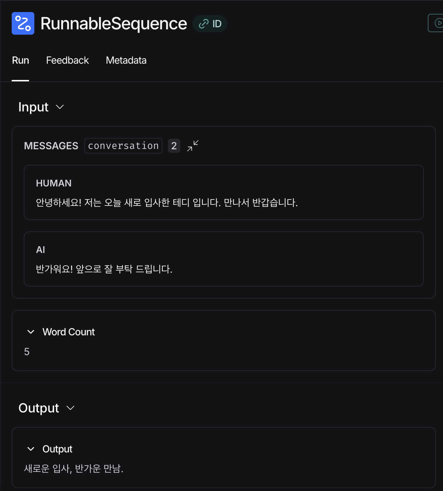

참고 : 테디노트의 RAG 비법노트

소스코드: https://github.com/teddylee777/langchain-kr

&nbsp;

오늘도 작성하는데 Pydantic 파싱 따로 공부한 것 좀 끄적이고 가겠습니다.

레츠기릿!

&nbsp;

## PydanticOutputParser

---

BaseModel/Field, partial_variables, 결과 포맷 지시사항, parser 등을 알아야 합니다.

예시로 바로 봅시다.

```python
# LangChain + PydanticOutputParser “전체 예시 코드”
# - BaseModel / Field로 출력 스키마 정의
# - parser.get_format_instructions()를 partial_variables로 프롬프트에 주입
# - prompt | llm | parser 로 "구조화된 결과"를 강제 파싱
# - RunnablePassthrough로 단일 입력(str)도 체인 내부에서 dict로 매핑

from typing import Optional
from pydantic import BaseModel, Field

from langchain_openai import ChatOpenAI
from langchain_core.prompts import PromptTemplate
from langchain_core.output_parsers import PydanticOutputParser
from langchain_core.runnables import RunnablePassthrough


# 1) 출력 스키마 정의 (LLM 출력이 반드시 이 형태로 파싱되어야 함)
class CountryInfo(BaseModel):
    country: str = Field(description="국가 이름")
    capital: str = Field(description="수도")
    population_million: Optional[int] = Field(
        default=None,
        description="인구(백만 단위). 모르면 null"
    )


# 2) Pydantic 파서 생성
parser = PydanticOutputParser(pydantic_object=CountryInfo)

# 3) 프롬프트 템플릿 (format_instructions는 '사용자 정의 변수명'임)
prompt = PromptTemplate(
    template=(
        "너는 정확히 지정된 형식으로만 답하는 도우미야.\n"
        "{format_instructions}\n"
        "국가: {country}\n"
        "주의: 추가 설명 금지. JSON만 출력."
    ),
    input_variables=["country"],
    partial_variables={
        # parser가 요구하는 출력 형식 지침을 프롬프트에 '고정 문자열'로 주입
        "format_instructions": parser.get_format_instructions()
    },
)

# 4) LLM
llm = ChatOpenAI(model="gpt-4o-mini", temperature=0)

# 5) 체인 구성 (Prompt → LLM → Pydantic Parser)
chain = prompt | llm | parser

# (A) dict로 실행
result_a = chain.invoke({"country": "대한민국"})
print("A) dict 입력 결과:", result_a)
print("A) 타입:", type(result_a))

# (B) 단일 값(str) 입력을 받고 싶으면 RunnablePassthrough로 내부에서 dict로 매핑
chain_str_input = (
    {"country": RunnablePassthrough()}
    | prompt
    | llm
    | parser
)

result_b = chain_str_input.invoke("일본")
print("\nB) str 입력 결과:", result_b)
print("B) 타입:", type(result_b))

```

### 1) `BaseModel` / `Field`는 무엇인가?

- **`BaseModel`**: “출력 데이터는 반드시 이 구조여야 한다”를 정의하는 **스키마(계약서)**
  - 필드 누락, 타입 불일치, 구조 깨진다? → **즉시 에러** 발생하도록 합니다.
- **`Field`**: 각 필드의 의미/제약(설명, 기본값 등)을 붙이는 **메타데이터**
  - LLM에게 “이 필드는 이런 의미”라고 알려줘서 출력 품질을 올려줄 수 있습니다.

### 2) `partial_variables`를 넣으면 항상 형식이 맞나?

- **아닙니다. 프롬프트에 지침 문자열을 미리 채워 넣어주는 기능이라, LLM이 지침을 따를 확률만 높여줄 뿐입니다.**
- ⭐️ **진짜 강제는 parser가 합니다.** ⭐️
  - LLM 출력이 스키마와 다르면 `PydanticOutputParser`가 파싱 실패로 **에러 발생**

### 3) `format_instructions`는 원래 있는 변수인가?

- **아닙니다. 예약어가 아닙니다.** `{format_instructions}`는 내가 프롬프트 템플릿에 만든 변수명일 뿐 착각 NO.
- `partial_variables={"format_instructions": ...}`로 그 변수 자리에 들어갈 값을 채운 것이라, 변수명은 `schema_guide`, `output_rules` 등으로 바꿔도 됩니다. (프롬프트의 `{...}`와만 일치하면 OK)

실제로 프롬프트는 아래와 유사하게 만들어집니다.

```
너는 정확히 지정된 형식으로만 답하는 도우미야.
The output should be formatted as a JSON instance that conforms to the JSON schema below.

{
  "title": "CountryInfo",
  "type": "object",
  "properties": {
    "country": {
      "type": "string",
      "description": "국가 이름"
    },
    "capital": {
      "type": "string",
      "description": "수도"
    },
    "population_million": {
      "type": "integer",
      "description": "인구(백만 단위). 모르면 null"
    }
  },
  "required": ["country", "capital"]
}

국가: 대한민국
주의: 추가 설명 금지. JSON만 출력.
```

**이렇게 출력 형식을 정해준 후에, chain_str_input에서 마지막 parser가 형식이 맞는지 확인합니다.**<br>
**이떼, 형식이 맞지 않으면 이때 에러가 발생하는 것입니다.**

이해 완.

&nbsp;

&nbsp;

## PromptTemplate: 단일 문자열 프롬프트 템플릿

---

### Prompt 생성

PromptTemplate을 이용한 프롬프트 템플릿 생성 방법은 2가지.

1. `PromptTemplate.from_template`로 객체 생성

   ```python
   from langchain_core.prompts import PromptTemplate
   template = "{country}의 수도는?"
   prompt = PromptTemplate.from_template(template)
   prompt
   # 출력: PromptTemplate(input_variables=['country'], input_types={}, partial_variables={}, template='{country}의 수도는?')
   ```

2. `PromptTemplate` 객체를 프롬프트와 함께 동시 생성

   ```python
   template = "{country}의 수도는?"
   
   prompt = PromptTemplate(
       template=template,           # 객체 생성 시, 템플릿 직접 설정
       input_variables=["country"], # input_variables 직접 설정
   )
   prompt
   # 출력: PromptTemplate(input_variables=['country'], input_types={}, partial_variables={}, template='{country}의 수도는?')
   ```

이렇게 프롬프트 템플릿 생성할 수 있는데!<br>**입력 변수를 호출 전에 미리 채우는 방법**이 있습니다.

이때 2가지 방법이 있는데,

1. `PromptTemplate` 객체 생성 시, `partial_variables` 값 채우기

   ```python
   # template 정의
   template = "{country1}과 {country2}의 수도는 각각 어디인가요?"
   
   # PromptTemplate 객체를 활용하여 prompt_template 생성
   prompt = PromptTemplate(
       template=template,
       input_variables=["country1"],
       partial_variables={
           "country2": "미국"  # dictionary 형태로 partial_variables를 전달
       },
   )
   
   prompt
   # 출력: PromptTemplate(input_variables=['country1'], input_types={}, partial_variables={'country2': '미국'}, template='{country1}과 {country2}의 수도는 각각 어디인가요?')
   ```

2. `PromptTemplate` 객체 생성 후에 `partial()` 메서드로 값 채우기

   ```python
   # template 정의
   template = "{country1}과 {country2}의 수도는 각각 어디인가요?"
   
   # PromptTemplate 객체를 활용하여 prompt_template 생성
   prompt = PromptTemplate(
       template=template,
       input_variables=["country1"]
   )
   prompt_partial = prompt.partial(country2="캐나다")
   prompt_partial
   # 출력: PromptTemplate(input_variables=['country1'], input_types={}, partial_variables={'country2': '캐나다'}, template='{country1}과 {country2}의 수도는 각각 어디인가요?')

이렇게 `partial_variables`에 값이 들어간 것으로 보입니다.<br>**이렇게 설정되었을 때는 `input_variables` 값에 대한 입력 변수만 넣어도 호출이 가능합니다.**

> ### 💡깨알 Tip
>
> **`partial_variables`에 값이 있어도 invoke() 호출 시, 입력 변수 값을 바꿔서 호출이 가능합니다.**
>
> ```python
> chain.invoke("대한민국").content # 가능
> chain.invoke({"country1": "대한민국"}).content # 가능
> 
> # partial_variables에서 country2="캐나다"를 무시하고 country2="호주"로 실행됨
> chain.invoke({"country1": "대한민국", "country2": "호주"}).content # 가능
> ```
>
> **즉, partial_variables는 디폴트 값이라고 생각할 수 있습니다.** OK.
>
> 그리고, **partial_variables에서 값을 설정할 때 함수를 넣어줄수도 있습니다.**
>
> ```python
> def get_today():
>     return datetime.now().strftime("%B %d")
> 
> prompt = PromptTemplate(
>     template="오늘 날짜 {today}에 {country} 나라의 날씨를 알려주세요.",
>     input_variables=["country"],
>     partial_variables={
>         "today": get_today
>     }
> )
> ```

&nbsp;

### Prompt 관리

yaml 파일로 프롬프트 관리가 가능하고, load_prompt 모듈을 이용해 불러올 수 있습니다.

(yaml 파일 작성 시 파이프 `|`을 이용해 여러 줄 입력이 가능하고, 앞에 2칸 띄워서 작성합니다.)

```yaml
_type: "prompt"
template: |
  {country}의 수도에 대해서 알려주세요.
  수도의 특징을 다음의 양식에 맞게 정리해 주세요.
  300자 내외로 작성해 주세요.
  한글로 작성해 주세요.
  ----
  [양식]
  1. 면적
  2. 인구
  3. 역사적 장소
  4. 특산품
  
  #Answer:
input_variables: ["country"]
```

이런 식으로 저장된 yaml 파일을 아래와 같이 불러올 수 있습니다.

```python
from langchain_core.prompts import load_prompt

prompt = load_prompt("prompts/fruit_color.yaml", encoding="utf-8")
prompt
# 출력: PromptTemplate(input_variables=['fruit'], input_types={}, partial_variables={}, template='{fruit}의 색깔이 뭐야?')
```

프롬프트는 코드 왔다갔다 보지 않고, 이렇게 관리하면 편하겠지요~

&nbsp;

&nbsp;

## ChatPromptTemplate: 대화기록 주입

---

ChatPromptTemplate는 역할과 메시지를 튜플로 묶어 프롬프트에 넣을 수 있는 템플릿입니다.<br>보통 대화 목록을 넣을 때 활용합니다.

레츠기릿.

튜플 `(role, message)`로 템플릿을 구성하며, from_template("메시지")를 넣으면 기본으로 role이 Human입니다.

### from_message 메서드로 템플릿 구성

```python
from langchain_core.prompts import ChatPromptTemplate

chat_template = ChatPromptTemplate.from_messages(
    [
        # role, message
        ("system", "당신은 친절한 AI 어시스턴트입니다. 당신의 이름은 {name} 입니다."),
        ("human", "반가워요!"),
        ("ai", "안녕하세요! 무엇을 도와드릴까요?"),
        ("human", "{user_input}"),
    ]
)

# 챗 message 를 생성합니다.
messages = chat_template.format_messages(
    name="테디", user_input="당신의 이름은 무엇입니까?"
)
messages
# 출력: [SystemMessage(content='당신은 친절한 AI 어시스턴트입니다. 당신의 이름은 테디 입니다.', additional_kwargs={}, response_metadata={}), HumanMessage(content='반가워요!', additional_kwargs={}, response_metadata={}), AIMessage(content='안녕하세요! 무엇을 도와드릴까요?', additional_kwargs={}, response_metadata={}), HumanMessage(content='당신의 이름은 무엇입니까?', additional_kwargs={}, response_metadata={})]
```

`from_message()` 메서드를 이용하여  system 메시지로 전역 설정해주고, human과 ai의 대화목록을 프롬프트에 넣을 수 있습니다.

- role은 ai, human, system, tool 등이 있습니다.
- role 설정을 통해 해당 메시지가 어떤 role을 갖는지 LLM에게 명확히 알려줄 수 있습니다.
- 대화 흐름 순서 (현재는 system → human → ai → human 순서)를 고정시킬 수 있습니다.

그리고, `format_messages()` 메서드를 이용하여 입력 변수를 설정할 수 있습니다.

**이렇게 설정한 `messages`를 출력하면, `SystemMessage`, `HumanMessage`, `AIMessage` 각 content에 프롬프트가 설정되어 있음을 확인할 수 있습니다.**

OK.

&nbsp;

그렇다면,

> **Q. 이러한 대화목록을 프롬프트에 설정하면 어떤 장점이 있는 것인가?**
>
> => LLM이 해당 메시지가 어떤 role인지 명확하게 알 수 있습니다. 다른 프롬프트 템플릿을 사용해도 알 수는 있지만, 이 템플릿은 명확하게 알려줄 수 있습니다. (시스템 프롬프트도 명확하게 인지 가능!!)
>
> 그리고, 나중에 ⭐️ **"대화 기록 요약"** ⭐️에서 활용 가능!!!!
>
> 여기서
>
> ### 💡 깨알 Tip
>
> **MessagesPlaceholder()를 이용하여 아직 채워지지 않은 대화목록을 프롬프트에 고정시킬 수 있습니다.**
>
> **즉, 미리 자리 차지해놓고 대화하다가 그 대화를 끼워넣을 수 있는 것임!!** OK?!
>
> ```python
> from langchain_core.output_parsers import StrOutputParser
> from langchain_core.prompts import ChatPromptTemplate, MessagesPlaceholder
> 
> chat_prompt = ChatPromptTemplate.from_messages(
>     [
>         (
>             "system",
>             "당신은 요약 전문 AI 어시스턴트입니다. 당신의 임무는 주요 키워드로 대화를 요약하는 것입니다.",
>         ),
>         # 아직 확정되지 않은 대화를 고정할 수 있습니다.
>         # variable_name로 키 값 설정함
>         MessagesPlaceholder(variable_name="conversation"),
>         ("human", "지금까지의 대화를 {word_count} 단어로 요약합니다."),
>     ]
> )
> chat_prompt
> ```
>
> **`variable_name`로 아직 정해지지 않은 대화목록(메시지 리스트)의 키 값을 설정할 수 있습니다.**
>
> **format() 메서드로 한번 어떻게 채워지는지 확인해봅시다.**
>
> ```python
> formatted_chat_prompt = chat_prompt.format(
>     word_count=5,
>     conversation=[
>         ("human", "안녕하세요! 저는 오늘 새로 입사한 테디 입니다. 만나서 반갑습니다."),
>         ("ai", "반가워요! 앞으로 잘 부탁 드립니다."),
>     ],
> )
> 
> print(formatted_chat_prompt)
> """출력:
> System: 당신은 요약 전문 AI 어시스턴트입니다. 당신의 임무는 주요 키워드로 대화를 요약하는 것입니다.
> Human: 안녕하세요! 저는 오늘 새로 입사한 테디 입니다. 만나서 반갑습니다.
> AI: 반가워요! 앞으로 잘 부탁 드립니다.
> Human: 지금까지의 대화를 5 단어로 요약합니다.
> """
> ```
>
> 다시 chat_prompt을 가지고, chain을 만들고 아래처럼 invoke() 호출하면<br>**위의 format으로 확인했던 프롬프트가 LLM에게 보내어 응답결과를 받아오게 되는 것입니다.**
>
> ```python
> chain = chat_prompt | llm | StrOutputParser()
> 
> chain.invoke(
>     {
>         "word_count": 5,
>         "conversation": [
>             (
>                 "human",
>                 "안녕하세요! 저는 오늘 새로 입사한 테디 입니다. 만나서 반갑습니다.",
>             ),
>             ("ai", "반가워요! 앞으로 잘 부탁 드립니다."),
>         ],
>     }
> )
> # 출력: '새로운 입사, 반가운 만남.'
> ```
>
> LangSmith에서 보면,<br>아래처럼 `MessagesPlaceholder()` 부분에 프롬프트가 끼워 들어간 것을 확인할 수 있습니다.
>
> 

&nbsp;

&nbsp;

### PromptTemplate와 ChatPromptTemplate 장단점 비교

| 구분                 | **PromptTemplate**          | **ChatPromptTemplate**                |
| -------------------- | --------------------------- | ------------------------------------- |
| 기본 개념            | 단일 문자열 프롬프트 템플릿 | 역할(role) 기반 메시지 템플릿         |
| 출력 형태            | `str`                       | `List[BaseMessage]`                   |
| 모델 적합도          | 일반 LLM / 단발 질문        | **Chat Model에 최적화**               |
| role 구분            | ❌ 없음                      | **⭕ system / human / ai / tool**      |
| system 지침 표현     | 문자열에 포함               | **system 메시지로 분리**              |
| few-shot 예시        | 문자열로 직접 작성          | **human/ai 메시지로 자연스럽게 표현** |
| 대화 흐름 표현       | 불명확                      | **명시적 (순서·역할 고정)**           |
| 이전 대화 삽입       | 수동 문자열 조합            | **MessagesPlaceholder로 구조적 삽입** |
| Memory 연동          | 불편                        | **자연스럽고 안정적**                 |
| Tool / Function 호출 | 비적합                      | **필수 구조**                         |
| 프롬프트 디버깅      | 단순                        | 구조가 복잡                           |
| 학습 곡선            | **낮음**                    | 상대적으로 높음                       |
| 자유도               | **높음**                    | 구조 제약 있음                        |

이정도로 정리할 수 있다고 우리의 GPT 박사님이 알려줬습니다.

&nbsp;

&nbsp;

여기서 일단 끝. 다음 포스팅도 프롬프트 템플릿일 듯 합니다~

```toc

```
