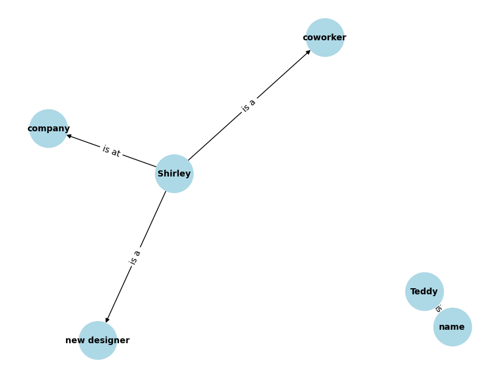

참고 : 테디노트의 RAG 비법노트 (https://fastcampus.co.kr/data_online_teddy)<br>소스코드: https://github.com/teddylee777/langchain-kr<br>위키독스: https://wikidocs.net/book/14314

&nbsp;

오늘은 대화 메모리를 저장하는 방법에 대해 끄적끄적 하고자 하는데<br>몇 가지만 다루고자 합니다.

&nbsp;

그 전에,

chain에서 retriever에 커스텀 함수 연결도 가능하다는 적어두고 가겠습니다.

> ### 💡깨알 Tip
>
> **chain에서 retriever에 커스텀 함수 연결**도 가능합니다.
>
> 이때 함수에 전달하는 인자는 1개여야 하는데,<br>인자가 여러 개일 때는 wrapper 함수를 통해 전달 가능합니다.
>
> ```python
> def format_doc(document_list):
>     ...
>     return ...
>     
> chain = (
>     # context: retriever -> format_doc
>     # question: RunnablePassthrough() (user_input)
>     {"context": retriever | format_doc, "question": RunnablePassthrough()}
>     | prompt
>     | llm
>     | StrOutputParser()
> )
> ```
>
> 이런 식으로 `retriever` 결과를 커스텀 함수 `format_doc`에 연결해줄 수 있습니다.
>
> 이때 전달하는 인자는  `document_list` 1개만 있기 때문에 연결이 가능합니다.

&nbsp;

그럼, 본격적으로 레츠기릿~!

&nbsp;

&nbsp;

## ConversationKGMemory: 지식 그래프 형태 기억

---

우선 LLM에서 '최신 k개의 대화를 기억, 최대 토큰 수에 따른 최신 대화를 기억, 특정 엔티티를 추출하여 대화를 기억, 지식 그래프 형태로 대화를 기억, 요약해서 대화를 기억 등 대화를 기억하는 방법'이 매우 다양하게 존재합니다.

그 중에 **지식 그래프 형태로 대화를 기억하는 방법**을 보고자 합니다.

현재 langchain 1.x 버전이며,<br>곧 사라질 수 있는 방법일 수 있으니 알아 두십쇼.

&nbsp;

✅ **먼저 알아두어야 할 것**

* **`ConversationChain` 객체는 대화 체인 객체이고,**
* **`ConversationKGMemory` 객체는 메모리 방식 객체임**

&nbsp;

### ConversationChain 객체 생성

```python
from langchain_openai import ChatOpenAI
from langchain_core.prompts import PromptTemplate
from langchain_classic.chains import ConversationChain
from langchain_classic.memory import ConversationKGMemory

llm = ChatOpenAI(temperature=0)

template = """The following is a friendly conversation between a human and an AI. 
The AI is talkative and provides lots of specific details from its context. 
If the AI does not know the answer to a question, it truthfully says it does not know. 
The AI ONLY uses information contained in the "Relevant Information" section and does not hallucinate.

Relevant Information:

{history}

Conversation:
Human: {input}
AI:"""
prompt = PromptTemplate(
    input_variables=["history", "input"], template=template)

# ConversationChain 객체 생성
# 메모리에 ConversationKGMemory(ChatOpenAI를 이용하여 생성)로 설정
# ConversationChain 객체의 llm으로 ChatOpenAI 설정
conversation_with_kg = ConversationChain(
    llm=llm, prompt=prompt, memory=ConversationKGMemory(llm=llm)
)
```

* 우선, `ConversationChain`과 `ConversationKGMemory` 클래스는 `langchain_classic`에 존재합니다. 현재 langchain 버전으로는 `langchain_classic`에서 가져와야 합니다.

* `ConversationChain` 객체 생성 시, LLM과 Prompt를 설정하며, memory 방식을 `ConversationKGMemory`으로 설정합니다.<br>(이때 지식 그래프 생성하는 `ConversationKGMemory` 객체도 LLM을 설정해줍니다.)
* ⭐️ **즉, `ConversationChain` 객체에서 메모리 방식을 설정해주는 것입니다.** ⭐️<br>다른 메모리 방식도 유사한 방법으로 설정합니다.

&nbsp;

### 대화하기

```python
# 첫번째 대화 시작  -> 메모리에 지식 그래프 생성됨
conversation_with_kg.predict(
    input="My name is Teddy. Shirley is a coworker of mine, and she's a new designer at our company."
)

"""출력:
"Hello Teddy! It's nice to meet you. Shirley must be excited to be starting a new job as a designer at your company. I hope she's settling in well and getting to know everyone. If you need any tips on how to make her feel welcome or help her adjust to the new role, feel free to ask me!"
"""
```

* `predict()` : 대화를 시작합니다.
  * `input`에 따른 출력이 생성됩니다.
  * 이때, `input`과 생성한  `출력(output)` 대화 쌍을 저장하고, 지식 그래프를 생성하게 됩니다.

&nbsp;

### 이전 대화 내용 보기

```python
# 이전 대화 내용 보기
conversation_with_kg.memory.chat_memory.messages
"""출력:
[HumanMessage(content="My name is Teddy. Shirley is a coworker of mine, and she's a new designer at our company.", additional_kwargs={}, response_metadata={}),
 AIMessage(content="Hello Teddy! It's nice to meet you. Shirley must be excited to be starting a new job as a designer at your company. I hope she's settling in well and getting to know everyone. If you need any tips on how to make her feel welcome or help her adjust to the new role, feel free to ask me!", additional_kwargs={}, response_metadata={})]
"""
```

* `conversation_with_kg.memory.chat_memory.messages`<br>: 이전 대화를 담아두고 있습니다.
  * `HumanMessage`, `AIMessage` 과 같이 메시지 객체로 저장되어 있습니다.

&nbsp;

### 지식 그래프의 정보 확인하기

```python
# 지식 그래프 안에 어떤 정보가 저장되어 있는지 확인
print(conversation_with_kg.memory.kg.get_triples())

"""출력:
[('Teddy', 'name', 'is'), ('Shirley', 'coworker', 'is a'), ('Shirley', 'new designer', 'is a'), ('Shirley', 'company', 'is at')]
"""
```

* `conversation_with_kg.memory.kg.get_triples()`<br>:`Triple`을 출력하여 지식 그래프 안에 어떤 정보가 저장되어 있는지 확인할 수 있습니다.
* `Triple` 요소: 노드(정보 대상), 엣지(관계), 방향 존재
* `Triple` 구조: **주어(관계 시작점)-동사(관계, 화살표)-목적어(관계 도착점) 형태**

&nbsp;

아래와 같이 **그래프 객체를 접근하여 모든 노드, 엣지를 확인할 수도 있습니다.**<br>(`memory.kg._graph()`의 `nodes()`, `edges(data=True)` 이용)

```python
# 내부의 실제 networkx 그래프 객체 접근
info_graph = conversation_with_kg.memory.kg._graph 

# 모든 노드(개체) 보기
print("Nodes:", info_graph.nodes())

# 모든 엣지(관계) 보기
print("Edges:", info_graph.edges(data=True))

"""출력:
Nodes: ['Teddy', 'name', 'Shirley', 'coworker', 'new designer', 'company']
Edges: [('Teddy', 'name', {'relation': 'is'}), ('Shirley', 'coworker', {'relation': 'is a'}), ('Shirley', 'new designer', {'relation': 'is a'}), ('Shirley', 'company', {'relation': 'is at'})]
"""
```

&nbsp;

아래와 같이 그래프를 직접 나타내어보면

```python
import networkx as nx
import matplotlib.pyplot as plt

# 내부 그래프 객체 가져오기
graph = conversation_with_kg.memory.kg._graph

# 그래프 그리기 설정
plt.figure(figsize=(8, 6))
pos = nx.spring_layout(graph)  # 노드 위치 결정 알고리즘

# 노드와 엣지 그리기
nx.draw(graph, pos, with_labels=True, node_color='lightblue', 
        node_size=2000, font_size=10, font_weight='bold')

# 엣지 라벨(관계 명칭) 그리기
edge_labels = nx.get_edge_attributes(graph, 'relation')
nx.draw_networkx_edge_labels(graph, pos, edge_labels=edge_labels)

plt.show()
```



요렇게 나옵니다.

이런 식으로 시각화함으로써 이전 대화에서 어떻게 지식 그래프를 생성해놓고 있는지 확인이 가능합니다.

&nbsp;

### ConversationKGMemory 대화 저장

```python
ConversationKGMemory.save_context(
    inputs={"human": "패키지 예약 시 예약금은 얼마인가요? 취소 정책은 어떻게 되나요?"},
    outputs={
        "ai": "패키지 예약 시 500유로의 예약금이 필요합니다. 취소 정책은 예약일로부터 30일 전까지는 전액 환불이 가능하며, 이후 취소 시에는 예약금이 환불되지 않습니다. 여행 시작일로부터 14일 전 취소 시 50%의 비용이 청구되며, 그 이후는 전액 비용이 청구됩니다."
    },
)
```

* `ConversationKGMemory.save_context()`<br>: `inputs`, `outputs` 파라미터에 대화쌍을 전달하여 대화를 저장합니다

&nbsp;

&nbsp;

## ConversationSummaryBufferMemory: 최근 대화 + 이전 대화 요약

---

**`ConversationSummaryBufferMemory`는 최근 대화는 그대로 유지하면서 이전 대화는 요약하여 메모리에 저장할 수 있습니다.**

어떻게 보면 가장 유용한 방식이지 않을까 생각합니다.

`ConversationSummaryMemory`는 이전 대화를 모두 요약하지만,<br>`ConversationSummaryBufferMemory`는 `max_token_limit`을 설정함으로써 최신 대화는 그대로 유지시킬 수 있습니다.

```python
from langchain_openai import ChatOpenAI
from langchain_classic.memory import ConversationSummaryBufferMemory

llm = ChatOpenAI()

memory = ConversationSummaryBufferMemory(
    llm=llm,
    max_token_limit=200,  # 200 토큰까지는 최근 대화 유지하고, 나머지는 요약
    return_messages=True,
)
```

이렇게 최대 n 토큰까지 최신 대화들을 그대로 유지하며<br>그 넘어가는 이전 대화는 모두 요약한 상태로 메모리를 저장할 수 있습니다.

```python
memory.save_context(
    inputs={"human": "여행 중에 방문할 주요 관광지는 어디인가요?"},
    outputs={
        "ai": "이 여행에서는 파리의 에펠탑, 로마의 콜로세움, 베를린의 브란덴부르크 문, 취리히의 라이네폴 등 유럽의 유명한 관광지들을 방문합니다. 각 도시의 대표적인 명소들을 포괄적으로 경험하실 수 있습니다."
    },
)
```

이렇게 **`save_context()` 메서드를 통해 대화를 저장해도 되고**<br>**`predict()` 메서드를 통해 대화를 직접 하며 메모리에 저장할 수 있습니다.**

**그렇게 몇 개의 대화를 저장한 후에,<br> `load_memory_variables({})["history"]`를 통해 메모리를 확인해보겠습니다.**

```python
# 메모리에 저장된 대화내용 확인
# 200토큰이 넘어 예전 대화는 요약되어 있고, 최근대화는 원본 그대로 가지고 있음
memory.load_memory_variables({})["history"]
"""
출력:
[SystemMessage(content="The human asks the AI about the price of a European travel package. The AI responds with the details of the package and optional costs, including traveler's insurance. The human then asks if they can upgrade to business class seats and the cost associated with it. The AI confirms that upgrading to business class is possible for an additional cost of around 1,200 euros round trip, offering benefits such as wider seats, premium in-flight meals, and additional luggage allowance.", additional_kwargs={}, response_metadata={}),
 HumanMessage(content='패키지에 포함된 호텔의 등급은 어떻게 되나요?', additional_kwargs={}, response_metadata={}),
 AIMessage(content='이 패키지에는 4성급 호텔 숙박이 포함되어 있습니다. 각 호텔은 편안함과 편의성을 제공하며, 중심지에 위치해 관광지와의 접근성이 좋습니다. 모든 호텔은 우수한 서비스와 편의 시설을 갖추고 있습니다.', additional_kwargs={}, response_metadata={})]
"""
```

이와 같이<br>**이전 대화들은 요약된 상태에서 `SystemMessage`의  `content`에 담겨 있고,<br>최신 대화들은 `HumanMessage`와 `AIMessage`의 `content`에 담겨있음을 확인할 수 있습니다.**

&nbsp;

&nbsp;

## VectorStoreRetrieverMemory: 유사성 있는 대화에 접근

---


```python
import faiss
from langchain_openai import OpenAIEmbeddings
from langchain_classic.docstore import InMemoryDocstore
from langchain_classic.vectorstores import FAISS
from langchain_classic.memory import VectorStoreRetrieverMemory


# 임베딩 모델 정의
embeddings_model = OpenAIEmbeddings()

# Vector Store 초기화
embedding_size = 1536
index = faiss.IndexFlatL2(embedding_size)  # FAISS 인덱스를 초기화합니다.
vectorstore = FAISS(embeddings_model, index, InMemoryDocstore({}), {})  # Vector Store를 초기화합니다.

retriever = vectorstore.as_retriever(search_kwargs={"k": 1})  # k=1은 가장 관련성 있는 문서만 반환
memory = VectorStoreRetrieverMemory(retriever=retriever)      # retriever를 사용하여 메모리 생성


memory.save_context(
    inputs={
        "human": "안녕하세요, 오늘 면접에 참석해주셔서 감사합니다. 자기소개 부탁드립니다."
    },
    outputs={
        "ai": "안녕하세요. 저는 컴퓨터 과학을 전공한 신입 개발자입니다. 대학에서는 주로 자바와 파이썬을 사용했으며, 최근에는 웹 개발 프로젝트에 참여하여 실제 사용자를 위한 서비스를 개발하는 경험을 했습니다."
    },
)
```

이렇게 **임베딩 모델을 생성**하고 **FAISS 인덱스를 초기화**한 후에<br>**`langchain_classic`의 `docstore`에서 `InMemoryDocstore` 모듈(문서를 메모리에 저장하는 저장소)을 이용해 `vectorstore`를 초기화**합니다.

**`vectorstore`의 `as_retriever` 메서드를 이용해 리트리버를 생성**하고<br>**`VectorStoreRetrieverMemory`에 해당 리트리버를 설정해주어 메모리를 생성**합니다.

**대화를 저장한 후에, `load_memory_variables()` 메서드에 `{role 부분: 질문}`를 전달하고 `["history"]` 값을 꺼내면 이전 대화들의 가장 유사한 대화를 출력하게 됩니다.**

```python
print(
    memory.load_memory_variables(
        {"human": "면접자가 프로젝트에서 맡은 역할은 무엇인가요?"}
    )["history"]
)
"""출력:
human: 프로젝트에서 어떤 역할을 맡았나요?
ai: 제가 맡은 역할은 백엔드 개발자였습니다. 사용자 데이터 처리와 서버 로직 개발을 담당했으며, RESTful API를 구현하여 프론트엔드와의 통신을 담당했습니다. 또한, 데이터베이스 설계에도 참여했습니다.
"""
```

&nbsp;

좀 복잡하지만 아래의 단계를 기억합시다.

1. 임베딩 모델 생성
2. FAISS 인덱스 초기화
3. 임베딩 모델, 인덱스, 메모리 방식, 문서 저장소를 이용해 `vectorstore` 초기화
4. `vectorstore`의 리트리버 생성
5. 리트리버 이용해 `VectorStoreRetrieverMemory` 메모리 생성
6. 메모리에 대화 저장(대화 시작)
7. 메모리의 `load_memory_variables()` 메서드에서 유사한 대화를 찾기 위한 질문을 넣어 호출 (`history` 값 확인)

&nbsp;

&nbsp;

이외에도 많은 메모리 저장하는 방식은 많은데<br>기회가 될 때 추가로 정리해보겠습니다.

끄읕.

```toc

```
