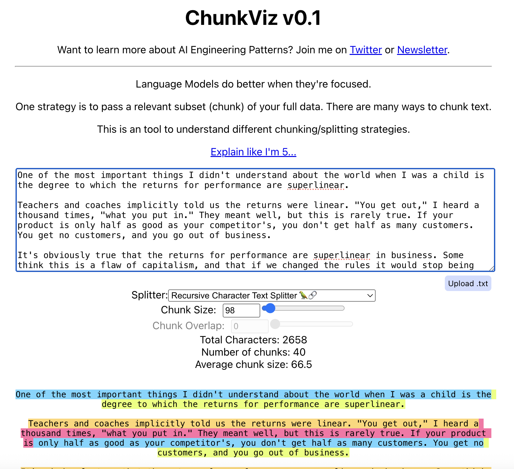
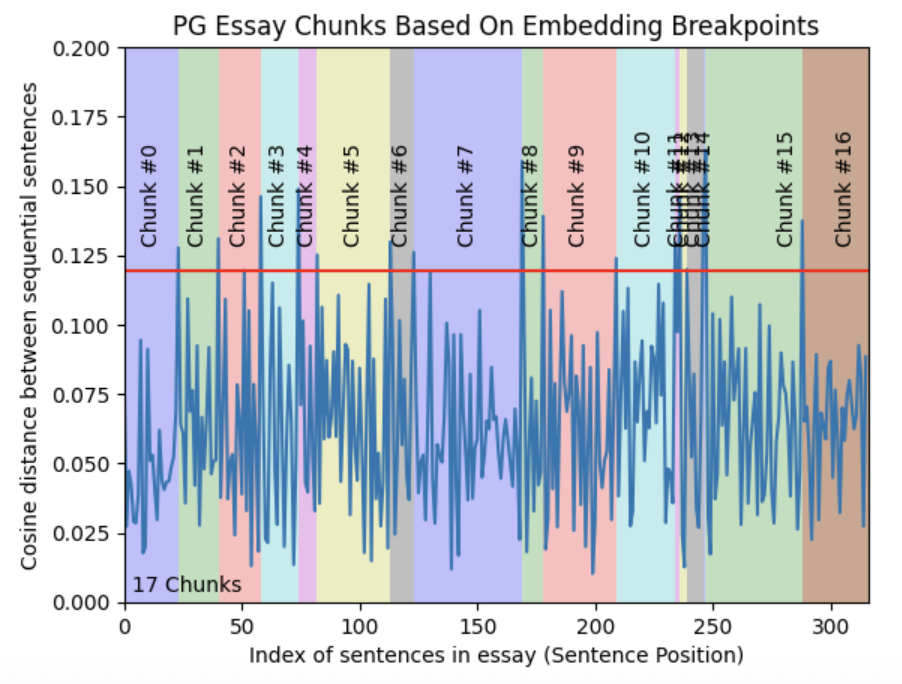

참고 : 테디노트의 RAG 비법노트 (https://fastcampus.co.kr/data_online_teddy)<br>소스코드: https://github.com/teddylee777/langchain-kr<br>위키독스: https://wikidocs.net/book/14314

&nbsp;

오늘도 와쓰요~<br>오늘은 문서 로드 방식과 청킹에 대해 정리해보고자 합니다.

바로 레츠기릿~!

&nbsp;

## 문서 로더 (Loader)

---

문서 로드 방식을 간단하게 정리하고자 합니다.

1. Document 생성

   ```python
   from langchain_core.documents import Document
   
   # 도큐먼트 생성 (내용, 메타데이터 주입)
   document = Document(page_content="내용", metadata={"키": "값"})
   
   # 메타데이터 추가
   document.metadata["키"] = "값"
   ```

2. 문서 로드

   * `load()` 메서드

     ```python
     from langchain_community.document_loaders import PyPDFLoader
     
     # PyPDFLoader 외에 다른 로더도 가능합니다.
     loader = PyPDFLoader(File_path)
     
     # List[Document] 형식으로 반환합니다.
     docs = loader.load()
     ```

   * `load_and_split()` 메서드: `text_splitter`를 설정해 줌

     ```python
     from langchain_text_splitters import RecursiveCharacterTextSplitter
     
     # 분할기(splitter) 생성
     text_splitter = RecursiveCharacterTextSplitter(chunk_size=200, chunk_overlap=0)
     
     # 로더 설정
     loader = PyPDFLoader(File_path)
     
     # 문서 분할
     split_docs = loader.load_and_split(text_splitter=text_splitter)
     ```

   * `lazy_load()` 메서드: 각 문서를 generator 방식으로 읽으면서 버림<br>(문서의 양이 많을 때 유용함)

     ```python
     # generator 방식으로 문서 로드
     for doc in loader.lazy_load():
         print(doc.metadata)
     ```

   * `aload()` 메서드: 비동기 방식으로 문서를 로드함

     ```python
     adocs = loader.aload()
     await adocs
     ```

&nbsp;

문서 로드 방식은 파일 형식이 어떠하든 그 방식이 비슷합니다.

파일 형식에 맞게 loader 설정 후,<br>`load()`, `load_and_split()` 등의 메서드를 이용하여 로드하면 됩니다.

&nbsp;

&nbsp;

## 청킹 (Chunking)

---

RAG에서 텍스트를 청킹하는 것은 중요합니다. 아. 청킹은 문서 내용을 chunk(뭉치?) 단위로 묶는 것이라 생각하면 됩니다.

### 1. 청킹을 하는 이유

- **답변 품질·정확성 향상**
   문서를 적절한 길이로 나누면 질문과의 **유사도 계산이 정확해짐**.
   청크가 너무 길면 핵심 정보가 희석돼 유사도가 낮게 나올 수 있음.
- **효율성 향상**
   모델의 **최대 토큰 제한**을 넘지 않게 하고,
   **비용 절감 + 불필요한 문맥 감소로 할루시네이션 위험 완화**.

문서 내용이 길다면 청킹은 반드시 필수겠죠.

가장 유명한 청킹 방식은 Recursive Character 기반 Chunking, Sentence 기반 Chunking, Semantic Chunking 등이 있습니다.

우선 Recursive Character 기반 chunking을 손쉽게 눈으로 확인할 수 있는 사이트를 가져와봤습니다.

[chunkviz](https://chunkviz.up.railway.app/)



청크 사이즈와 청크 오버랩(청크 간 겹치는 글자수)을 설정하여<br>화면에서 바로 확인해볼 수 있는 사이트입니다.

간단하고 빠르게 청크 사이즈 정할 때 사용해볼 수 있겠네요!

&nbsp;

이제 더 딥하게 한번 봅시다.

&nbsp;

### 2. Text Splitter와 Tokenizer

먼저, Text Splitter와 Tokenizer를 명확히 구분하고 갑시다.<br>(제가 헷갈렸었거든요..)

**Text Splitter는 말 그대로 텍스트를 분할하는 방식**입니다. 문서나 텍스트가 들어왔을 때, Text Splitter의 방식대로 이들을 분할합니다.

Tokenizer는 토큰을 분할하는 방식입니다.

**엥 그래서 둘의 차이는 뭐냐?**

> **청킹(Chunking)에서는**
>
> **Text Splitter**를 이용해서 텍스트를 분할하고<br>**Tokenizer**의 토큰화 방식을 이용하여 **청크 사이즈가 넘는지 계산**을 대신할 수 있습니다.
>
> 즉,
>
> 1) **문서를 Text Splitter의 특정 기준(\n, \n\n, 특정 모델의 토큰화 방식 등등)으로 분할한 후에**
> 2) **Tokenizer의 토큰 계산 방법을 이용해서 1개의 토큰이 청크 사이즈 1로 계산하여 청크 사이즈가 넘지 않을 만큼 분할한 문서를 합쳐줍니다.**
>
> OK!!! 이해 완.
>
> 결국,
>
> ⭐️ **분할**과 **토큰 계산 방식** 2가지만 기억하고 있으면 됩니다. ⭐️<br>(당연히 **Text splitter만으로 분할하고 청크 사이즈 계산할 수도 있습니다**!!!)

&nbsp;

&nbsp;

## 텍스트 분할기와 토크나이저

---

참고: 아래는 제가 정리한 내용을 지피티와 젬미니에게 정리하도록 하고, 재정리했습니다.<br>(좀 길어요.. 🫠)

한 줄로 요약하면

> 사용하는 모델의 입력 한계인 '토큰 수'를 정확히 계산하되<br>정보의 손실을 막기 위해 '의미 단위(문단·문장)'의 경계를 최대한 지킬 수 있도록 자르는 것이 가장 중요합니다.

&nbsp;

### 1. 문자 및 구조 기반 분할기

가장 기본이 되는 분할 방식으로, **텍스트의 구조적 형태(문단, 개행 등)를 기준**으로 나눕니다.

#### RecursiveCharacterTextSplitter ⭐️

가장 범용적으로 사용되는 방식입니다. 단순히 문자를 자르는 것이 아니라, 텍스트의 구조를 유지하며 재귀적으로 분할을 시도합니다.

- **동작 원리 (Algorithm):**
  - **사용자가 지정한 구분자 리스트(기본값: `["\n\n", "\n", " ", ""]`)**의 순서대로 분할을 시도합니다.
  - **재귀적 접근:** 가장 큰 단위(`\n\n`: 문단)로 먼저 잘라보고, 청크 크기(Chunk Size)를 초과하면 그 다음 단위(`\n`: 줄바꿈)로 내려가고, 그래도 크면 단어(` `), 문자 순으로 쪼갭니다.
  - **특이 사항 (Edge Case):** 일반적으로 설정한 `chunk_size`를 준수하지만, **절대적인 강제 사항은 아닙니다.** 예를 들어, 구분자가 없는 매우 긴 문자열(예: 긴 URL, 띄어쓰기 없는 텍스트)이 들어오면 설정된 크기를 초과하더라도 자르지 않고 하나의 청크로 유지하는 경우가 발생할 수 있습니다.
- **장점:** 문단이나 문장의 경계를 최대한 보존하므로 문맥(Context)이 잘리지 않고 유지될 확률이 높습니다. 구조가 불명확한 텍스트에도 비교적 안정적입니다.
- **단점:** 주제가 급격히 전환되는 지점을 완벽하게 잡아내지는 못하며, 텍스트의 의미(Semantic)보다는 **구조적 형태에 의존**합니다.

* 코드

  ```python
  from langchain_text_splitters import RecursiveCharacterTextSplitter
  
  text_splitter = RecursiveCharacterTextSplitter(
      # 청크 사이즈
      chunk_size=250,
      # 청크 간의 중복되는 문자 수
      chunk_overlap=50,
      # 문자열 길이를 계산하는 함수
      length_function=len,
      # 구분자로 정규식을 사용할지 여부
      is_separator_regex=False,
  )
  
  # create_documents(): 원문(String) → 문서(Document) 변환
  # List[str] 인자 전달
  texts = text_splitter.create_documents([text_file])
  print(texts[0])  # 분할된 문서의 첫 번째 문서를 출력합니다.
  print("===" * 20)
  print(texts[1])  # 분할된 문서의 두 번째 문서를 출력합니다.
  
  
  # split_documents(): 문서(Document) → 문서(Document) 재분할
  # List[Document] 인자 전달
  documents = text_splitter.create_documents([document_file])
  print(documents[0].page_content)  # 재분할된 첫번째 문서의 내용 출력
  print("===" * 20)
  print(documents[0].metadata)  # 재분할된 첫번째 문서의 메타데이터 출력
  
  
  # split_text(): 원문(String) → 원문(String) 분할
  split_texts = text_splitter.split_text(file)
  ```

&nbsp;

#### CharacterTextSplitter

- **동작 원리:** 단일 구분자(기본값: `\n\n`) 하나만을 기준으로 텍스트를 분할합니다.
- **특징:** `Recursive` 방식보다 단순하지만, 유연성이 떨어져 맥락이 끊길 가능성이 더 높습니다.

&nbsp;

### 2. 토큰 기반 분할기 (TokenTextSplitter)

LLM은 텍스트를 문자가 아닌 **토큰(Token)** 단위로 처리합니다. 따라서 LLM의 Context Window(입력 제한)를 효율적으로 관리하기 위해서는 토큰 기준 분할이 필수적입니다.

- ⭐️ **동작 방식:**

  1. 입력된 텍스트를 지정된 Tokenizer를 사용해 토큰(정수 ID)으로 변환합니다.
  2. 설정된 `chunk_size` (토큰 개수) 만큼 자릅니다.
  3. 잘린 토큰들을 다시 텍스트로 디코딩합니다.

- ⭐️ **역할 구분:** 분할을 수행하는 주체는 `TextSplitter` 객체이며, 내부의 `Tokenizer`는 오직 **"길이 계산(Counting)"**과 **"인코딩/디코딩"** 역할만 수행합니다.

- **주의사항:** 토큰 단위로 강제로 자르기 때문에, 단어 중간이나 문장 중간에서 끊길 수 있어 `RecursiveCharacterTextSplitter.from_tiktoken_encoder`와 같이 **구조적 분할과 토큰 계산을 결합**하여 사용하는 것이 일반적입니다.

- 코드

  ```python
  from langchain_text_splitters import TokenTextSplitter
  
  text_splitter = TokenTextSplitter(
      chunk_size=300,
      chunk_overlap=0,
  )
  
  # 텍스트를 청크로 분할
  texts = text_splitter.split_text(file)
  print(texts[0])  # 분할된 텍스트의 첫 번째 청크를 출력합니다.
  
  # ⭐️ '연�' 와 같이 글자가 깨져 보이는 것은 BPE(Bite Per Word)를 사용하여 토큰화하기 때문입니다. ⭐️
  ```

&nbsp;

### 3. 토크나이저(Tokenizer) 상세 분류 및 통합 전략 ⭐️

어떤 모델을 쓰느냐에 따라 토큰 계산 방식이 다르므로, 적절한 토크나이저를 선택해야 합니다.

#### tiktoken (OpenAI 계열)

OpenAI 모델을 사용한다면 사실상 **표준(Standard)**입니다.

- **연결 방식:** `from_tiktoken_encoder()` 메서드를 통해 `RecursiveCharacterTextSplitter` 등과 결합하여 사용합니다.

- **대상 모델:** GPT-3.5, GPT-4, GPT-4o, GPT-5 계열 모델

- **핵심 특징:**

  - **BPE(Bite Pair Encoding) 토크나이저**: UTF-8 바이트 단위까지 쪼개어 인식하기 때문에 이모지, 특수 기호, 깨진 문자열, 바이너리 데이터가 섞인 텍스트도 에러 없이 토큰화 및 복원이 가능합니다.
  - **정확성:** OpenAI API가 계산하는 토큰 수와 100% 일치합니다. 비용 계산 및 컨텍스트 길이 관리에 오차가 없습니다.
  - **성능:** Rust 등으로 최적화되어 있어 매우 빠르고 메모리 효율적입니다.
  - **강점:** 영어 및 프로그래밍 코드(Code) 텍스트 처리에 최적화되어 있습니다.

- 코드

  ```python
  from langchain_text_splitters import CharacterTextSplitter
  
  # tiktoken 인코더를 사용하여 '토큰 수'를 기준으로 길이를 계산하는 CharacterTextSplitter를 생성합니다.
  text_splitter = CharacterTextSplitter.from_tiktoken_encoder(
      chunk_size=300,
      chunk_overlap=0,
  )
  
  # 텍스트(file)를 분할하여 '문자열(String) 리스트'로 반환합니다.
  texts = text_splitter.split_text(file)
  ```

  

&nbsp;

#### HuggingFace Tokenizer (오픈소스 LLM 계열)

Llama, Mistral 등 오픈소스 모델을 로컬이나 별도 서버에 호스팅 할 때 필수적입니다.

- ⭐️ **연결 방식:** `from_huggingface_tokenizer()` 메서드에 `AutoTokenizer` 객체 등을 넘겨서 사용합니다.
- **대표 클래스:** `GPT2TokenizerFast`, `LlamaTokenizer`, `LlamaTokenizerFast`, `AutoTokenizer` emd
- **대상 모델:** LLaMA 2/3, Mistral, Qwen, Gemma, Solar 등 대부분의 오픈소스 LLM
- **핵심 특징:**
  - ⭐️ **Fast Tokenizer:** 대부분 Rust 기반으로 작성된 'Fast' 버전을 지원하여 속도가 매우 빠릅니다.
  - **유연성:** BPE, SentencePiece, Unigram 등 다양한 토큰화 알고리즘을 모델에 맞춰 자동으로 적용합니다(`AutoTokenizer` 사용 시).
- ⭐️ **주의 :** 모델마다 사용하는 어휘 사전(Vocab)이 다르므로, 반드시 **사용하려는 LLM 모델과 동일한 토크나이저**를 로드해야 정확한 토큰 수를 맞출 수 있습니다.

&nbsp;

#### Sentence Transformer (임베딩 특화)

- **연결 방식:** `SentenceTransformersTokenTextSplitter`
- **특징:** LLM의 입력 제한보다는, **임베딩 모델(Embedding Model)의 입력 한계(Max Sequence Length)**를 맞추기 위해 사용합니다. (예: BERT 계열은 보통 512 토큰 제한)
- **주의:** 생성용 LLM(예: GPT-4)과 토크나이저가 다르므로, 여기서 계산한 토큰 수가 LLM 입력 토큰 수와 일치하지 않습니다. 주로 **Semantic Chunking**이나 임베딩 벡터 생성 전처리 단계에서 사용됩니다.

&nbsp;

#### 언어학적/규칙 기반 토크나이저 (Linguistic/Rule-based)

토큰 개수보다는 **"문장의 의미적 완결성"**을 중시할 때 사용합니다.

(코드는 이전과 비슷한 방식으로 진행하면 됩니다.)

- **spaCy (`SpacyTextSplitter`)**
  - **특징:** 정교한 NLP 파이프라인을 사용하여 문장 경계를 매우 정확하게 인식합니다.
  - **단점:** 딥러닝 모델 로드가 필요해 무겁고 속도가 느릴 수 있습니다.
- **NLTK (`NLTKTextSplitter`)**
  - **특징:** 전통적인 규칙 기반 분할로 연구나 교육 목적으로 주로 쓰입니다.
  - **주의:** LLM 토큰 기준과는 호환성이 없습니다.
- **KoNLPy (`KonlpyTextSplitter`)**
  - **특징:** 한국어의 특성(교착어)을 반영하여 형태소 단위로 분석합니다. 한국어의 의미적 단위를 보존하는 데 유리합니다.
  - **주의 (Trade-off):**
    1. **속도:** Tiktoken이나 HuggingFace Fast Tokenizer에 비해 분석 속도가 현저히 느립니다.
    2. **불일치:** 형태소 개수와 LLM의 토큰 개수는 다릅니다. 따라서 이를 기준으로 자른 뒤, LLM에 넣을 때는 토큰 초과 여부를 다시 확인해야 할 수도 있습니다.

&nbsp;

&nbsp;

## 시맨틱 청킹 (Semantic Chunking)

---

`Semantic Chunking` 방법은 별도로 정리하고자 합니다.

**`Semantic Chunking`은 앞 뒤 문장의 시맨틱 거리(Semantic Distance)를 계산하여 특정 임계치(`breakpoint_threshold_type`, `breakpoint_threshold_amount`)를 넘지 않을 때까지 한 청크로 묶는 방법입니다.**

즉, **연속된 유사한 문장들을 묶어주는 방법**이라고 할 수 있습니다.

바로 코드로 보자면

```python
from langchain_experimental.text_splitter import SemanticChunker
from langchain_openai.embeddings import OpenAIEmbeddings

# OpenAI 임베딩을 사용하여 의미론적 청크 분할기를 초기화합니다.
# ⭐️ 청크 사이즈, 청크 오버랩은 설정하지 않음 ⭐️
text_splitter = text_splitter = SemanticChunker(
    # OpenAI의 임베딩 모델을 사용하여 시맨틱 청커를 초기화합니다.
    OpenAIEmbeddings(),
    # 분할 기준점 유형을 백분위수로 설정합니다.
    breakpoint_threshold_type="percentile",
    breakpoint_threshold_amount=95,
)

docs = text_splitter.create_documents([file])
print(docs[0].page_content)
```

* **`breakpoint_threshold_type`: 분할하는 기준 ⭐️**

  * `percentile`: 백분위수(디폴트)
    * 현재 문장의 이전 문장과의 시맨틱 거리가 백분위수를 넘지 않는 곳까지 청크를 나눕니다.
  * `standard_deviation`: 표준편차
  * `interquartile`: 사분위수 범위(IQR)
    * $$임계값(Threshold) = \text{Mean(평균)} + (\text{amount} \times \text{IQR})$$<br>값이 `breakpoint_threshold_amount`을 넘지 않는 곳까지 청크를 나눕니다.
    * 평균과 IQR은 현재 문장의 이전 문장간의 시맨틱 거리를 구한 값들에서 구합니다.
  * `gradient`: 기울기(그래디언트)

* **`breakpoint_threshold_amount`: 그 기준의 임계치 ⭐️**

  * **임계치가 높을수록, 시맨틱 거리가 먼 것(의미적 유사성이 덜한 것)도 한 청크로 묶이므로 청크 개수가 적어진다.** ⭐️
  * **임계치가 낮을수록, 시맨틱 거리가 짧은 것(의미적 유사성이 깊은 것)들끼리 청크로 묶이므로 청크 개수가 많아진다.** ⭐️

* 아래는 `percentile` 기준에서 `breakpoint_threshold_amount`에 대한 이해를 높이기 위한 그림입니다.<br>(임계치는 `percentile` 값이 95인 곳입니다.)

  

  (출처: [FullStackRetrieval-com Github의 gkamradt notebook](https://github.com/FullStackRetrieval-com/RetrievalTutorials/blob/main/tutorials/LevelsOfTextSplitting/5_Levels_Of_Text_Splitting.ipynb))

  * `x`축은 에세이의 첫 문장부터 마지막 문장까지 순서대로 나열한 것입니다.
  * `y`축은 **현재 문장의 바로 이전 문장과의 시맨틱 거리**(코사인 거리)입니다.<br>(**거리가 높다는 것은 의미적 유사도가 낮다**(즉, 주제가 급격히 바뀌었다)는 뜻입니다.)
  * **빨간 줄(임계치)를 위로 넘는 부분에서 시맨틱 거리의 백분위수 95를 넘는 곳**입니다. 그림에서 확인할 수 있듯이, **빨간 줄 위로 넘는 부분들에 대해 그 이전 백분위수 95를 넘는 곳에서 해당 부분까지 Chunk가 형성되는 것**입니다.
  * 결국, **순서대로 나열된 문장들이 이전 문장과의 시맨틱 거리(코사인 거리)의 `percentile`이 95가 넘을 때 Chunk를 끊는 형태**입니다.
  * 당연히 **청크별 길이가 크게 차이가 날 수 있습니다.**

&nbsp;

그런데,

> **Q. 계속 유사한 내용이 이어지면서 내용 주제가 서서히 바뀌고 있을 때는 어떡하는 게 좋을까요?**
>
> 개인적으로 저는 **`SemanticChunker` 클래스를 부모로 상속받아서 최대 청크 사이즈(`max_chunk_size`)를 설정하는 것이 좋을 것으로 보입니다.**<br>(`min_chunk_size`는 현재 존재하지만 없더라고요..)
>
> 아래처럼 클래스가 정의되어 있습니다.
>
> ```python
> class SemanticChunker(BaseDocumentTransformer):
>     """Split the text based on semantic similarity.
> 
>     Taken from Greg Kamradt's wonderful notebook:
>     https://github.com/FullStackRetrieval-com/RetrievalTutorials/blob/main/tutorials/LevelsOfTextSplitting/5_Levels_Of_Text_Splitting.ipynb
> 
>     All credits to him.
> 
>     At a high level, this splits into sentences, then groups into groups of 3
>     sentences, and then merges one that are similar in the embedding space.
>     """
> 
>     def __init__(
>         self,
>         embeddings: Embeddings,
>         buffer_size: int = 1,
>         add_start_index: bool = False,
>         breakpoint_threshold_type: BreakpointThresholdType = "percentile",
>         breakpoint_threshold_amount: Optional[float] = None,
>         number_of_chunks: Optional[int] = None,
>         sentence_split_regex: str = r"(?<=[.?!])\s+",
>         min_chunk_size: Optional[int] = None,
>     ):
>         self._add_start_index = add_start_index
>         self.embeddings = embeddings
>         self.buffer_size = buffer_size
>         self.breakpoint_threshold_type = breakpoint_threshold_type
>         self.number_of_chunks = number_of_chunks
>         self.sentence_split_regex = sentence_split_regex
>         if breakpoint_threshold_amount is None:
>             self.breakpoint_threshold_amount = BREAKPOINT_DEFAULTS[
>                 breakpoint_threshold_type
>             ]
>         else:
>             self.breakpoint_threshold_amount = breakpoint_threshold_amount
>         self.min_chunk_size = min_chunk_size
>         
>         (... 이하 생략)
> ```
>
> 아래 함수가 정의되어 있는데, 이를 정의하면 되지 않을까 합니다.

&nbsp;

&nbsp;

## 코드 분할기 (Code Splitter)

---

cpp, go, java, python, js, ts, html markdown, powershell 등의 언어로 코드 분할도 할 수 있습니다.

```python
from langchain_text_splitters import Language, RecursiveCharacterTextSplitter

print ([e.value for e in Language])
```

를 이용해 지원하는 모든 언어를 확인할 수 있습니다.

&nbsp;

```python
python_splitter = RecursiveCharacterTextSplitter.from_language(
    language=Language.PYTHON, chunk_size=50, chunk_overlap=0
)

python_docs = python_splitter.create_documents([PYTHON_CODE])
python_docs
```

텍스트 분할기로 이용되었던 **`RecursiveCharacterTextSplitter`의 `from_language()` 메서드에 `language`, `chunk_size`, `chunk_overlap` 등의 값을 전달하여 spiltter 객체를 생성하고,<br>splitter 객체의 `create_documents()` 메서드를 통해 Document로 분할이 가능합니다.**

&nbsp;

```python
RecursiveCharacterTextSplitter.get_separators_for_language(Language.PYTHON)
# 출력: ['\nclass ', '\ndef ', '\n\tdef ', '\n\n', '\n', ' ', '']
```

을 통해, 해당하는 언어의 구분자들은 어떻게 이루어져 있는지 확인 가능합니다.

&nbsp;

&nbsp;

## JSON 분할기 (RecursiveJsonSplitter)

---

JSON 분할기 `RecursiveJsonSplitter`은 데이터를 자를 때 **JSON의 문법(Key-Value 쌍, 리스트 구조)을 최대한 유지하며 자릅니다.** (그렇기 때문에 청크 사이즈가 서로 크게 다를 수 있습니다.)

(안 그래도 JSON 파일을 분할할 경우가 있었는데 이걸 이용해야겠습니다 👍🏻)

&nbsp;

**재귀적 분할 (Recursive) 방식**으로 JSON을 분할합니다.

1. 전체 JSON 객체를 봅니다.
2. 설정된 크기(`max_chunk_size`)보다 크면, 내부의 **키(Key)**나 **리스트(List)의 요소** 단위로 더 깊이 들어가서 쪼갭니다. (깊이우선탐색 DFS 알고리즘과 같은 방식입니다.)
3. 이 과정을 반복하여 각 조각이 제한 크기 안에 들어오도록 만듭니다.

&nbsp;

```python
from langchain_text_splitters import RecursiveJsonSplitter

# 재귀적 JSON 분할기 생성
# 청크 최대 사이즈 300
splitter = RecursiveJsonSplitter(max_chunk_size=300)

# JSON -> JSON 분할
json_chunks = splitter.split_json(json_data=json_data)

# JSON -> Document 분할
docs = splitter.create_documents(texts=[json_data])

# JSON -> String 분할
texts = splitter.split_text(json_data=json_data)

# JSON -> Document 분할 + ⭐️리스트 변형하여 분할⭐️
docs = splitter.create_documents(texts=[json_data], convert_lists=True)
```

* `RecursiveJsonSplitter` 객체 생성 시 2가지 설정이 가능합니다.
  * `max_chunk_size`
  * `min_chunk_size`
* **`RecursiveJsonSplitter`의 `split_json()`, `create_documents()`, `split_text()` 메서드를 이용해 분할이 가능합니다.**
  * **`convert_lists=True` 설정을 통해 리스트를 각각 값을 나눠가지며 JSON 분할할 수 있습니다.<br>(기본적으로 깊이 탐색하다가 리스트를 만나면 그 묶음을 그대로 가져옵니다.)**

&nbsp;

&nbsp;

다른 것들도 더 있지만<br>이 정도까지만 정리하고자 합니다. 끄읕.

```toc

```
