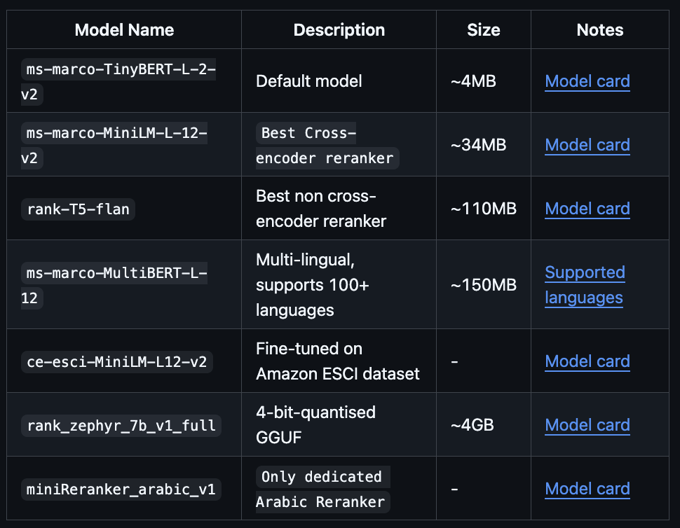

참고 : 테디노트의 RAG 비법노트 (https://fastcampus.co.kr/data_online_teddy)<br>소스코드: https://github.com/teddylee777/langchain-kr<br>위키독스: https://wikidocs.net/book/14314

&nbsp;

오랜만에 왔습니다!! (열심히 공부하고 왔습니다 🫡)

Text Embedding와 Vectorstore, Retriver, Reranker는 워낙 모델이 많아서 모두 각각 정리하는 것보다는<br>RAG 개발 시 각 단계별로 고려할 점들을 정리해보는 것이 좋지 않을까 해서 가져왔습니다.

고럼,, 레츠기릿~!

&nbsp;

## RAG 개발 단계별 고려할 점

---

각 단계에서 고려할 점들을 제 생각대로 정리해보았습니다. 떠오르는 부분들만 적어두었는데, 추가적으로 고려할 점들이 있다면 알려주시면 감사하겠습니다 😊

### 1. **데이터 로드**

* 데이터에 따라 로드 방식 설정
* PDF 등의 이미지의 문서의 경우 텍스트 OCR 모델 선정

&nbsp;

### 2. **텍스트 데이터 임베딩하면서 벡터스토어에 저장**

* 이미지, 오디오, 비디오 등 데이터는 텍스트화 해놓은 것이 좋음

* **임베딩 모델 선정**: **임베딩 차원 수, 언어** 등을 고려해야 합니다.

* **벡터스토어 선정**: **메타필터링** 등 검색 시 기능들을 확인해야 합니다.

* **문서 요약을 넣을 것인지, 넣는다면 방법은?**<br>: "**나의 문서 요약이 검색에 활용하는 것이 좋은 방법인지**"를 판단해야 합니다.

  * **요약 활용 방법**: 문서를 다양한 방식으로 요약하여, 그 요약들을 벡터스토어에 함께 넣을 수 있습니다. <strong>`MultiVectorRetriever`</strong>는 요약된 텍스트의 원본 문서를 `docstore`에 지정하면서 **검색된 문서가 요약된 텍스트이었을 때 해당 원본 문서를 가져오게끔** 할 수도 있습니다.

  * **요약 방식**:

    * **단순히 청크별 요약**하는 방식

    * **RAPTOR**(Recursive Abstractive Processing For Tree-Organized Retrieval) 활용

      > 유사한 청크들을 묶어 요약을 한 후<br>요약 텍스트들에서 유사한 것들을 묶어 **재귀적으로 요약**하는 방법

      개인적으로는

      >  **구조적인 문서(전체 내용이 논리적인 구조인 논문 등)에는 유리하지만<br>시계열 문서(대화 등)에는 어울리지 않는 방법**이라 생각합니다.

&nbsp;

### 3. **청킹 방식/방법/길이 설정**

* **청킹 방식**: **데이터와 retriever에 따라 결정**
  * 어떤 식으로 메타데이터를 구축 해놓을지
  * 부모/자식 문서 검색(청크를 더 쪼개어 자식 청크에서 부모 청크 찾음) 방법을 활용할지
  * 멀티벡터 검색(요약 등 다양한 형태 데이터를 만들어서 부모 청크 찾음) 방법을 활용할지 등등
* **청킹 방법**: **Splitter 선정**
  * 재귀적으로 문자 단위를 분할할지
  * 토큰화 모델을 활용할지
  * 시맨틱 분할, 코드/마크다운/JSON 등 전용 분할 등등
* **청크 길이**: **어느 정도 길이로 분할하는 것이 서로 유사한 정도가 잘 나올지 판단**<br>(검색은 쿼리와 데이터 각각 임베딩한 것을 바탕으로 유사한 것을 가져오는 bi-encoder 방식이기 때문에 청크 길이가 중요합니다.)

&nbsp;

### 4. **벡터스토어에서 retriever 설정**

* Retriever는 쿼리와 문서를 각각 독립적으로 벡터화(Bi-encoder)하여<br>유사도(Dense)나 키워드 중요도(Sparse)를 계산해 원하는 정보를 찾아옵니다. <br>(리랭커보단 보통 빠른 방식임)

* **검색 방식**: "**어떤 벡터를 쓸 것인가?** (데이터에 따라 결정)
  
  * **Dense 검색**(밀집 검색): ⭐️ **의미적 검색**할 때 사용 ⭐️
    
    * 보통 **cosine 유사도**로 점수 계산, 유클리드 거리, 내적 등도 존재
    * 문서의 임베딩 벡터와 쿼리의 임베딩 벡터 사이의 유사도를 계산함
    
  * **Sparse 검색**(희소 검색): ⭐️ **키워드 검색**할 때 사용 ⭐️
  
    * 보통 TF-IDF, **BM25** 알고리즘으로 점수 계산
  
    * 문서의 <strong>토큰별 중요도(TF-IDF/BM25 가중치)</strong>가 미리 계산된 벡터(인덱스)와<br>쿼리의 **토큰 존재 여부**를 <strong>매칭(내적)</strong>하여 최종 점수를 계산함
  
      > <strong>"쿼리 단어(키워드)가 저 문서 벡터에 얼마나 중요하게(높은 점수로) 박혀있는가?"</strong>를 계산
  
    * BM25은 문서 길이 길면 점수 페널티도 추가함
  
  * ⭐️ **Hybrid 검색**: **Dense + Sparse 결합** ⭐️
  
    * 보통 <strong>RRF (Reciprocal Rank Fusion)</strong> 알고리즘을 사용 ⭐️
  
* **결과 정제 및 선택**: "**가져온 걸 어떻게 골라낼 것인가?**"
  
  * **유사한 k개 단순히 선정**
  * <strong>MMR(Maximum Marginal Relevance)</strong> 알고리즘을 이용하여 선정
    * **유사성 + '다양성'을 모두 고려하는 방식**
    * 즉, **유사한 k개 먼저 가져오고, 그 k개 사이에서 다양하게 최종 선택하는 방법** (서로 너무 유사한 것은 제외함)
    * 최대한 서로 유사한 내용들은 제외하고, 쿼리와 관련한 내용을 다양하게 가져오고 싶을 때 이용함
  * 설정한 임계값 이상인 것들만 선정 등등

&nbsp;

### 5. **Reranker 선정**

* Reranker 모델은 Retriever와 적절히 조정하여 비용 & 성능 개선이 필요합니다.

  * 빠르게 많은 양을 검색해오고, 정확하게 리랭킹하는 방법
  * Hybrid Search로 정밀하게 검색해오고, 가벼운 모델 사용 또는 키워드 매칭 정도로 리랭킹


  등등.. 시간, 경제적 비용과 성능 등을 고려하면서 정하면 됩니다.

* **표준 (Cross-encoder) 방법**

  - 쿼리와 문서를 하나로 결합해 **Transformer의 Full Self-Attention**을 수행하며, 문맥을 완벽히 파악한 뒤 **관련성 확률(Score)**을 직접 추론합니다. (속도는 느리지만 정확도 최고!!)
  - 즉, **보통의 Reranker는 쿼리와 문서를 쌍으로 묶어 동시에 인코딩(Cross-encoder)한 후, 쿼리 각 토큰과 문서의 토큰들 사이의 관련성 점수를 계산하면서(Full Attention) 순위를 재조정합니다(느리지만 정확함).**

* **Late Interaction (예: ColBERT) 방법**- 경량화 방법

  - 쿼리와 문서를 **독립적으로 임베딩**한 뒤<br>마지막 단계에서 <strong>토큰별 최대 유사도(MaxSim)</strong>만 빠르게 계산하여 합산합니다.

    > **Bi-encoder의 빠른 속도 + Cross-encoder의 높은 정확성**을 가진 방법입니다.

* **무료 오픈소스 Reranker 모델**

  * <strong>`BAAI/bge-reranker-v2-m3`</strong>: 성능이 좋고, 유명함 ⭐️

  * <strong>`FlashrankRerank` 모델</strong>( `ms-marco-MultiBERT-L-12` 등)<br>: **Cross-encoder 방식이지만, 속도가 빠른 모델**

    * FlashrankRerank에서 MultiBERT 모델은 한국어도 지원합니다.

      [FlashRank Github](https://github.com/PrithivirajDamodaran/FlashRank)

      

    * **Cross-encoder인데, 어떻게 빠른가?**

      <strong>실행 환경(Runtime)과 최적화 기법(Optimization)</strong>의 차이 때문입니다.<br>**`ms-marco` 모델들은 `MiniLM` 아키텍처를 기반으로 합니다.**

      > Teacher 모델(BERT Large 등)의 지식을 **지식 증류(Knowledge Distillation)** 기법을 활용해 학습함으로써 **파라미터 수와 연산량을 줄였습니다.**

      | **비교 항목**   | **기존 Cross-Encoder (PyTorch)** | **FlashRank (ONNX)**               |
      | --------------- | -------------------------------- | ---------------------------------- |
      | **연산 정밀도** | Float32 (무거움)                 | **Int8 (가벼움)**                  |
      | **실행 엔진**   | PyTorch (Eager execution)        | **ONNX Runtime (Graph optimized)** |
      | **의존성**      | Torch, Transformers (수 GB)      | **Numpy, Onnxruntime (수 MB)**     |
      | **하드웨어**    | GPU 권장                         | **CPU에서도 매우 빠름**            |
      | **용도**        | 연구 및 고성능 학습용            | **실서비스 배포(Inference)용**     |
    
    * **실제로 사용했을 때, 어떠했는지?**<br>: 개인적으로는.. 우선 속도는 매우 빨랐지만 성능이 기대한만큼 나오지 않았습니다.
    
      다만!! 성능이 좋지 않게 나왔던 이유를 생각해봤을 때
    
      > **청크를 쪼개는 방식의 문제였거나** (여러 내용이 섞이지 않도록 더 잘게 또는 헤더를 이용한 청킹 방식 채택하는 것이 좋았을 듯)
      >
      > **한국어 성능이 생각보다 좋지 않은 모델이었거나**
      >
      > **키워드가 중요한 쿼리였는데, 의미적으로 비슷한 내용들이 많은 문서가 있었거나**<br>(하지만 이것은 검색된 충분한 문서를 LLM에게 쥐어줘서 답변하게끔 하면 될 것 같습니다.)
    
      이정도로 생각이 드네요.
    
      하지만, **CPU로도 돌아갈 정도로 경량화되고 빠른 모델** 장점은 포기 못합니다.. ㅎㅎ

&nbsp;

&nbsp;

다음 글에서는

프로젝트에서 RAG 개발하면서 고민했던 점을 담아서 얘기를 할 것 같습니다.<br>(그렇지만 또 남기고 싶은 얘기가 있다면 그 얘기를 쓸지도...?)

암튼 오늘도 봐주셔서 감사합니다 빠잇~!


```toc

```
