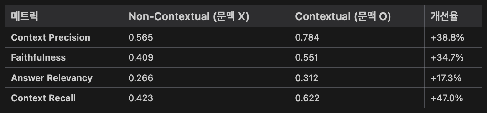
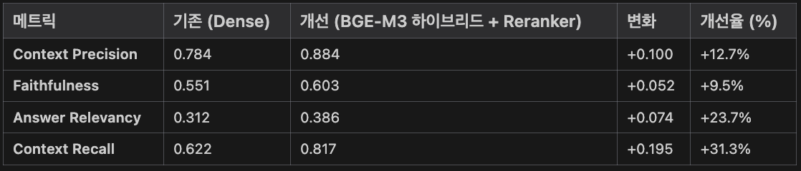

오늘은 제가 진행하고 있는 프로젝트에서<br>**RAG 성능 평가**를 진행했던 부분을 다루고자 합니다.

&nbsp;

우선 저는,

**유튜브 콘텐츠의 자동 생성 자막** 등을 이용한<br>Agent 프로젝트 (자세한 건 아직 비밀 🤫)를 진행 중에 있습니다.

이 데이터를 벡터 임베딩을 통해 RAG 개발을 하고 있는데,<br>개발하면서 했던 여러 고민들을 정리해보고자 합니다.

&nbsp;

## 첫번째 고민: ASR 오류 어떻게 해결하지?

---

**유튜브 콘텐츠 자동 생성 자막**은 **ASR**(Automatic Speech Recognition, 자동 음성 인식)을 통해 만들어지기 때문에 오류가 있습니다.

이는 주변 배경음이나 발화자의 발음, STT 모델의 성능 등의 이유로 발생하는 오류인데<br>이를 곧바로 RAG 개발에 이용하면 문제가 차암 많아지겠죠.

그래서 LLM을 이용해 데이터 전처리를 해보자 마음을 먹었습니다.

### Phase 1. 자막 교정 시도해보자.

ASR 오류에서 "**문자의 형태학적 오류로 인한 의미적 차이를 분명하게 차이가 있었을 때**" 문제가 생깁니다.

**'꽃게'의 '게'를 '개'로 인식이 되어 있다면<br>'꽃게를 먹은 장면을 찾을 때 해당 문서가 검색되지 않을 가능성이 높아집니다.**

이를 해결하고자 "**LLM을 이용해 자막 교정**"을 시도해보았습니다.

결론부터 말씀드리면..

실패 🫨

&nbsp;

자막 교정은

1. 로컬 오픈소스 모델들로 테스트했고 (LLM API는 모든 자막 수정하기에 돈이 많이 듦)
2. 우선 수정을 정확하게 해주지 않은 부분이 많았고
3. 필요한 부분만 수정한 후 해당 자막 청크를 그대로 출력도 안해 줬습니다.
4. 그리고, LLM에게 전체 맥락을 알려주기 위해 해당 영상의 전체 자막과 유튜브 영상 제목 등을 함께 제공해보았지만 3번의 문제가 정말 많이 발생했습니다. 

프롬프트 수정도 많이 해보고 그랬지만<br>오픈소스 소형 모델에게 이걸 시킨다는 시도 자체가 잘못된 것 같아 보였습니다.

결국,

어쨌든 모델의 성능 문제인 건데<br>모델을 자막 교정을 잘하도록 Fine-tuning을 해보자..? 하기에는 한국어 교육을 전범위에서 해줘야 하기에 너무 큰 Task가 됩니다.

그래서 이 방법은 **PASS** 했습니다.

&nbsp;

### Phase 2. 자막을 '요약한 문서'를 이용하자.

요약의 방식은 정말 다양합니다.

> 1. 전체 단순 요약
> 2. 각 자막 청크별 요약
> 3. CoD(Chain-of-Dense)
> 4. Semantic Chunking을 이용한 요약

등이 존재하는데 3, 4에 대해 좀 얘기해보고자 합니다.

&nbsp;

#### 1) CoD는 비용적 문제가 크다.

요약 시 놓친 엔티티를 함께 반환하고 반복 요약을 함으로써 요약의 밀집 정도를 높여 가는 CoD는 시간적, 경제적 비용 문제가 큽니다.

먹방 유튜버를 타겟으로 했기 때문에<br>유튜버가 먹은 음식, 해당 음식점 관련 내용, 음식평 등에 초점에 맞춰 밀집 정도가 높은 요약을 시도할 수 있었지만

> **문제점**이 있었습니다.
>
> 1. **반복적인 요약으로 인한 비용 문제**가 있었고,
> 2. **유튜버의 특정 발화 내용이 많이 사라지는 부분이 굉장히 리스크가 있다**고 판단했습니다. (ex. 존맛탱이라는 표현이 요약에서는 없음)

그래서 이 방법도 **PASS**했습니다.

&nbsp;

#### 2) Semantic Chunking을 이용한 요약은 자막의 시간적 흐름을 무시한다.

유사한 자막 청크끼리 묶어서 요약을 하는 방법인데

> 이 또한 **문제점**이 있었습니다.
>
> 1. **자막의 시간적 흐름을 무시하게 되고**
> 2. 가장 큰 문제점은 "**먹방 유튜버가 한 영상에서 여러 음식점을 다녀왔을 경우에 발화 장소가 뒤섞여서 요약이 될 수 있다**"는 점이었습니다.

그래서 이 방법도 **PASS**했습니다...

&nbsp;

### Phase 3. Contextual Retrieval (Anthropic)을 이용하자. ‼️

"**자막을 어떻게 활용하고자 하는 것인가**" 본질적인 질문으로 돌아봤습니다.

> "**사용자가 입력한 영상의 특정 내용과 연관된 자막 문서를 검색해오는 것**"

그렇다면 자막 문서를 그대로 살리되, 검색의 성능만을 높여야 했습니다.

&nbsp;

**유튜브의 (자동 생성) 자막의 특성**을 파악해봅시다.

> 1. **자막은 구어체 중심의 표현이 많으며 불명확한 지시대명사(ex. 이것, 저것)가 많다.**
> 2. **자막은 시간의 흐름에 따라 상황이 달라진다.**
> 3. **각 자막 청크에는 어떠한 상황인지 문맥을 파악할 수 있는 내용이 충분하지 않다.**

&nbsp;

그래서

1) 불명확한 지칭 표현을 해결하고
2) 시간의 흐름을 그대로 살리면서
3) 문맥을 살릴 수 있는 방법을 적용해야 했습니다.

그것이

Anthropic에서 2024년도에 발표한

#### "Contextual Retrieval"을 적용해보았습니다.

&nbsp;

이를 적용한 방법을 바로 얘기해보자면

> 1. **영상의 자막 전체**와 **문맥을 추가할 자막 청크**를 LLM에게 함께 주어 **전체 맥락을 파악하여 '해당 청크의 문맥'을 추가**해달라고 합니다.
> 2. 그 이후, **'문맥 + 기존 청크 내용'을 자막 청크 검색 문서로 사용**합니다.

**청킹 방법은 자막의 시간대 한 구간을 묶어서** 하도록 했고,<br>**오버랩은 자막 문맥에 들어가지 않도록 metadata에 따로** 넣어두었습니다.

(필요할 때 프롬프트 템플릿에 따로 꺼내어 쓰고자 합니다.)

&nbsp;

#### **‼️ 문맥이 추가된 자막 한 청크 ‼️**

```
문맥: 쯔양이 '굽네치킨'의 신메뉴인 맵단짠칩킨을 시식하는 장면입니다.
그녀는 치킨의 맛이 약간 매콤하면서도 단맛과 짭짤함이 조화를 이루어
중독성이 강하다고 평가합니다. 특히, 요블링소스에 치킨을 찍어 먹는 방법을
추천하며, 소스가 치킨의 맛을 한층 더 돋보이게 한다고 말합니다.
또한, 소스에 찍어 먹는 것이 더욱 맛있다고 강조하며, '굽네'의 소스
실력이 뛰어나다고 칭찬합니다.

[04:16 ~ 05:11] 막 맵진 않고 약간 매콤한데\n약간 단맛도 나고
짭짤한 맛도 나면서\n(멈출 수 없는 중독적인 맛-!!) 진짜 딱 중독성 있는
그런 맛이거든요?\n(뼈도 맛있옹ㅎ)\n진짜 감칠맛이 어마어마한 그런 맛?\n
이번엔 소스에 찍어서!\n요블링소스에 푹 찍어서 먹어보겠습니다...!\n
맛있다\n이게 약간 맵단짠이잖아요, 그래서\n요블링소스가 진짜 잘 어울려요\n
감사합니다!\n(1인 2 뼈 통...ㅎ) 2개를ㅋㅋㅋ\n와, 근데 역시 '굽네'가
\n소스를 진짜 잘해요!\n고추바사삭 먹을 때도 고블링, 마블링소스 찍어
먹잖아요!\n이번 소스도!
```

* 문맥을 생성할 때에, "**누가, 무엇을, 어떻게 하는지 문장형식으로 서술히도록 하고, 음식명, 음식점명과 같은 고유명사는 그대로 사용**"하여 생성하도록 했습니다.
  * 그래서 **"맵단짠'칩'킨"의 고유명사를 그대로 사용하고 있음**을 볼 수 있습니다.
* '문맥' 아래에 있는 자막에서는 "진짜 감칠맛이 어마어마한 그런 맛"의 **대상이 불명확**했지만<br>**전체 자막 맥락을 통해 현재 맵단짠칩킨을 시식하고 있었음을 맥락적으로 확인**하여 서술해주고 있습니다.

&nbsp;

#### **‼️ 모델은 오픈소스 소형 모델 ‼️**

자막 텍스트 길이가 너무 길다 보니 **비용 문제**를 신경쓰지 않을 수가 없었습니다.

한국어를 잘한다는 모델 다양하게 이용해보았습니다.<br>(a.x-4.0-light-imatrix:Q8_0, exaone3.5:7.8b, qwen3:8b, EEVE-Korean-Instruct-10.8B, solar:10.7b-instruct-v1-q5_0 등)

그 중에 SK텔레콤의 **a.x-4.0-light-imatrix:Q8_0** 모델이 현 데이터에 가장 적합한 모델이었습니다. 👍🏻

&nbsp;

**인사이트** 💡

> 1. **대화형 데이터는 a.x 모델이 가장 적합하다.**
>
> 2. **오픈소스 소형 모델의 기존 학습된 출력 포맷으로 인해 '문맥'만 출력하도록 하는 것이 어렵다.**
>

2의 문제에서는

프롬프트 엔지니어링을 통해 생성한 문맥만 출력하도록 유도를 해보아도<br>"~~는 아래와 같습니다."과 같은 말과 마크다운 문법 등을 사용하며 그 부분이 지켜지지 않은 경우가 많았습니다.

그래서, **bullet point, 마크다운 문법 등이 있을 때 출력을 정제하는 후처리 파싱까지 진행**했습니다 ‼️

&nbsp;

&nbsp;

## 두번째 고민: 문맥 추가한 것에 관한 'RAG 평가 설계'는 어떻게 할 것인가?

---

RAGAS 기반으로 평가셋을 우선 만들었습니다. (무작위 32개 영상을 뽑아 자막 청크를 만들었습니다.)

생성된 평가셋은

> 1. 정원분식과 떡볶당은 떡볶이와 분위기에서 어떻게 다른가요?
>2. 압구정동 식당의 스테이크 트러플 짜장면이 특별한 이유는 무엇인가요?
> 3. 메뉴에 있는 매운 해산물 국수 요리가 무엇인가요?

이런 것들이 있었습니다.

**simple: 0.4**, **reasoning: 0.2**, **multi_context: 0.4**의 비율로 평가셋을 생성했지만<br>전체 맥락적 요소를 파악하지 못한 부분들이 꽤 있었습니다.

&nbsp;

이를 기반하여 평가를 진행한 결과,

&nbsp;

### 비교: 문맥 추가 전 vs 문맥 추가 후

(모두 OpenAI Text-embedding-3-small 임베딩)



&nbsp;

‼️ **문맥(Context)를 추가한 후에 4가지 평가 지표 모두 많이 상승했습니다.** ‼️

&nbsp;

특히

**`Context Precision`, `Faithfulness`, `Context Recall` 3가지 지표가 크게 상승했음**을 알 수 있습니다.

1. `Context Precision`: 검색된 문서들이 실제로 관련 있는 문서들의 비율
2. `Faithfulness`: LLM이 검색된 Context에 얼마나 충실하게 답변하는지
3. `Context Recall`: 정답을 생성하기 위해 필요한 정보를 얼마나 잘 검색해왔는지

&nbsp;

본 프로젝트의 RAG 개발에서는

**사용자의 입력과 관련한 문서를 '많이', '정확히' 가져오는 것이 중요**해서<br>**`Context Precision`와 `Context Recall`가 주요한 지표였습니다.**

&nbsp;

이들이 충분히 크게 개선이 되어<br>**문맥을 추가한 자막 문서를 이용하자고 결정**했습니다.

&nbsp;

&nbsp;

## 세번째 고민: RAG 성능을 더욱 개선시킬 수 있는 방법은?

문맥 추가로 4가지 평가 지표를 크게 개선시켰지만<br>가장 낮은 `Answer Relevancy`을 제외하더라도, 50~80점 사이로 다소 아쉬운 성능입니다.

이에, **앙상블 Retriever**와 **Reranker**을 도입해보고자 합니다.

1. 자막은 **Sparse 벡터 검색도 추가**하여 **하이브리드 방식으로 검색하는 것이 좋을 것**이라 생각했고<br>(특정 음식과 같은 고유명사가 들어간 사용자 입력이 있을 수 있어, 키워드 기반의 검색도 필요해보였습니다.)

2. **Cross Encoder 방식인 Reranker를 도입**하는 것이 좋을 것이라 생각했습니다.<br>(좀 더 빠른 ColBERT도 고민해보았지만 본 프로젝트에서는 관련 깊은 문서를 가져오는 것이 더 중요했습니다.)

그렇게 Dense + Sparse 검색과 리랭커를 도입해보았습니다.

&nbsp;

여기서는 여러 모델의 테스트를 진행하지 못했습니다.<br>다만, 한국어 잘한다는 BGE 모델을 적극 활용했습니다.

1. Dense Vector(OpenAI text-embedding-3-small) + Sparse Vector 검색(BGE-m3) + Reranker(BGE-reranker-v2-m3)
2. **Dense Vector(BGE-m3l) + Sparse Vector 검색(BGE-m3) + Reranker(BGE-reranker-v2-m3)**

둘을 비교했을 때

2번째 **Dense Vector(BGE-m3l) + Sparse Vector 검색(BGE-m3) + Reranker(BGE-reranker-v2-m3)** 방식이 더 성능이 좋았습니다.

&nbsp;

아까 개선했던

문맥 있는 자막 문서에서의 성능에서<br>**'앙상블 Retriever+리랭커'를 도입**하면서 **모든 평가 지표에서 추가 개선**되었습니다 ‼️



&nbsp;

`Answer Relevancy`를 제외한 지표들은 60~90점 사이의 값을 가지네요.

**`Context Precision`와 `Context Recall`가 80점대로 괜찮은 성능이라 판단하여 이 방식을 따르자고 결정했습니다.**

&nbsp;

**인사이트** 💡

> "**임베딩 차원이 높다고 항상 성능이 좋은 것은 아니다.**"
>

BGE-m3 임베딩 모델은 1024차원, OpenAI text-embedding-3-small 임베딩 모델은 1536차원입니다.

그런데도 BGE-m3 임베딩 모델의 성능이 더 좋았습니다.

결국 임베딩 차원이 단순히 높은 것보다는, <strong>"한국어에 적합한 임베딩 모델을 선택하는 것"</strong>이 주요해보였습니다.<br>

&nbsp;

&nbsp;

해당 프로젝트에서 Agent가 해당 Retriver를 이용하도록 설계할 예정이라 RAG의 성능을 높이는 것이 필요했었습니다.

지금까지 프로젝트에서 RAG 개발 여정기였습니다.

끄읕.

```toc

```


