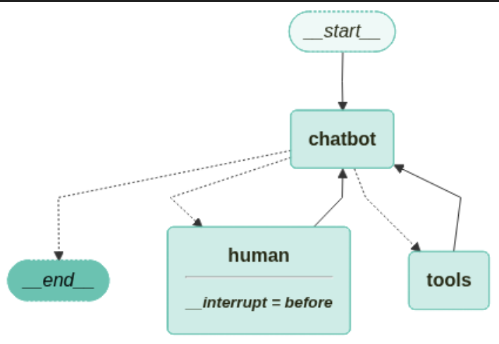

참고 : 테디노트의 RAG 비법노트 (https://fastcampus.co.kr/data_online_teddy)<br>소스코드: https://github.com/teddylee777/langchain-kr<br>위키독스: https://wikidocs.net/book/14314

&nbsp;

오늘은 LangGraph 기능들 좀 더 알아보고자 합니다.<br>[26-01-17 게시글][https://byeonwoojung.github.io/26-01-17_1/]에서 좀 얘기를 하긴 했었지만 너무 줄줄이 적어나간 글인 것 같아 오늘은 좀 더 정리해서 올리고자 합니다.

&nbsp;

## Human-in-the-loop

---

3가지만 기억합시다.

1. **HumanRequest 툴과 human_node 노드(실제 실행되는 함수) 생성**
2. **interrupt_before 설정**
3. **그래프 상태 업데이트 & 계속 호출**

&nbsp;

### HumanRequest 툴과 human_node 노드(실제 실행되는 함수) 생성

HumanRequest는 LLM에게 docstring을 주는 방식으로 작성합시다.

```python
from pydantic import BaseModel

# 전문가의 도움이 필요할 때 적절한 가이드를 요청할 수 있는 클래스
class HumanRequest(BaseModel):
    """Forward the conversation to an expert. Use when you can't assist directly or the user needs assistance that exceeds your authority.
    To use this function, pass the user's 'request' so that an expert can provide appropriate guidance.
    """

    request: str
    
```

이후, tools에 HumanRequest를 추가해주고 LLM에게 바인드해줍시다.

```python
from langchain_openai import ChatOpenAI

# 도구 추가
tool = TavilySearch(max_results=3)

# 도구 목록 추가(HumanRequest 도구)
tools = [tool, HumanRequest]

# LLM 추가
llm = ChatOpenAI(model="gpt-4o-mini", temperature=0)

# 도구 바인딩
llm_with_tools = llm.bind_tools(tools)


def chatbot(state: State):
    # LLM 도구 호출을 통한 응답 생성
    response = llm_with_tools.invoke(state["messages"])

    # 사람에게 질문할지 여부 초기화
    ask_human = False

    # 도구 호출이 있고 이름이 'HumanRequest' 인 경우 (여기서는 툴 중에 1번째만 가져옴)
    if response.tool_calls and response.tool_calls[0]["name"] == HumanRequest.__name__:
        ask_human = True

    # 메시지와 ask_human 상태 반환
    return {"messages": [response], "ask_human": ask_human}
```

그리고,

response의 툴 호출이 있을 때 그 이름이 HumanRequest이면 ask_human 상태값을 True로 바꾸도록 합시다.

```python
# 상태 그래프 초기화
graph_builder = StateGraph(State)

# 챗봇 노드 추가
graph_builder.add_node("chatbot", chatbot)

# 도구 노드 추가
graph_builder.add_node("tools", ToolNode(tools=[tool]))
```

그래프 빌더에 상태 초기화, 챗봇과 도구 노드를 추가해준 후에

```python
from langchain_core.messages import AIMessage, ToolMessage


# 응답 메시지 생성(ToolMessage 생성을 위한 함수) -> 사람이 아무 응답을 하지 않는 경우에 이용하기 위함
def create_response(response: str, ai_message: AIMessage):
    return ToolMessage(
        content=response,
        tool_call_id=ai_message.tool_calls[0]["id"],
    )


# 인간 노드 처리
def human_node(state: State):
    new_messages = []
    if not isinstance(state["messages"][-1], ToolMessage):
        # ‼️ 사람으로부터 응답이 없는 경우 ‼️
        new_messages.append(
            create_response("No response from human.", state["messages"][-1])
        )
    return {
        # 새 메시지 추가
        "messages": new_messages,  # 사람으로부터 응답을 받았으면 추가하지 않음
        # 플래그 해제
        "ask_human": False,
    }


# 그래프에 인간 노드 추가
graph_builder.add_node("human", human_node)
```

human_node를 정의해줍시다.

1. `human_node`는 `chatbot`이 `HumanReqeust`라는 도구를 호출하고자 할 때 사람에게 입력을 받은 후에 이루어집니다. **즉, 사람에게 입력 받은 값이 가장 마지막 값에 들어가 있는 거죠.**

2. **그러면 `human_node`에서 입력을 안 받는 것인데, 이것은 무엇이냐?**

   > **human_node 이전에 interrupt해서 값을 받아서 메시지에 넣어두고,**
   >
   > <strong>human_node에서는 사람의 응답을 처리하거나 보정합니다. (ex. 빈 값이면 "No response from human."으로 변경 등)</strong>

3. `create_response` 함수를 이용해서 툴 메시지에 tool_call_id와 사람의 답변(response)를 넣도록 합시다. 이 함수를 이용해서 `human_node`에서 상태 값을 보정하는 것을 `ToolMessage` 형태로 변환되도록 합시다.

&nbsp;

그리고 **인간 노드 관련 조건부 엣지**를 추가해줍시다.

```python
from langgraph.graph import END
from langgraph.prebuilt import tools_condition


# ‼️ 다음 노드 선택 ‼️
# 인간에게 질문하는 것 있을 때는 state["ask_human"]이 true이면 human 노드로 반환함
def select_next_node(state: State):
    # 인간에게 질문 여부 확인
    if state["ask_human"]:
        return "human"
    # 이전과 동일한 경로 설정
    return tools_condition(
        state
    )  # 현재 state["messages"]의 마지막 메시지를 보고 AIMessage.tool_calls 있으면 tools, 없으면 END(__end__)를 반환


# 조건부 엣지 추가 (문자열 보고 노드로 이동)
graph_builder.add_conditional_edges(
    "chatbot",  # 출발 노드
    select_next_node,  # 분기 함수(state -> 라벨)
    {
        "human": "human",
        "tools": "tools",
        END: END,
    },  # select_next_node가 human 반환하면 human 노드로, tools 반환하면 tools 노드로, 그외 END (종료)
)
```

`select_next_node`에서는 현재 `ask_human` 상태 값이 true이면 `human`(human_node 이름)를 반환하고, 아니면 현재 상태(`tools` 또는 `END`) 이름을 반환합니다. (반환은 단순히 문자열임)

(tools_condition와 같은 LangGraph에서 제공하는 라우팅 함수 말고 직접 구현도 가능합니다.)

그리고 그 함수를 이용해서

1. `chatbot`에서 출발해서
2. `select_next_node` 분기 함수의 값이
3. human이면 `human` 노드로, tools이면 `tools` 노드(액션노드)로, END이면 `END` 노드로 보내도록 **조건부 엣지**를 추가합니다.

&nbsp;

### interrupt_before 설정

다음은 각 엣지들 추가한 후에 메모리 체크포인터와 human 노드에서 Interrupt를 걸어둡시다.<br>이때 interrupt_before로 걸어둡시다!

```python
# 엣지 추가: 'tools'에서 'chatbot'으로
graph_builder.add_edge("tools", "chatbot")

# 엣지 추가: 'human'에서 'chatbot'으로
graph_builder.add_edge("human", "chatbot")

# 엣지 추가: START에서 'chatbot'으로
graph_builder.add_edge(START, "chatbot")

# 메모리 저장소 초기화
memory = MemorySaver()

# 그래프 컴파일: 메모리 체크포인터 사용
# ‼️‼️ 그래프 컴파일할 떄 interrupt_before를 걸어두기 ‼️‼️
graph = graph_builder.compile(
    checkpointer=memory,
    # 'human' 이전에 인터럽트 설정
    interrupt_before=["human"],  # ‼️ human 노드애서 인터럽트 ‼️
)
```

그래프 빌더를 컴파일할 때 메모리와 인터럽트를 설정 가능합니다.

```python
from langchain_teddynote.graphs import visualize_graph

visualize_graph(graph)
```

그래프 출력해보면



이런 식으로 human_interrupt를 통해 human 노드에 조건부 엣지가 생겨있음을 확인할 수 있습니다.

&nbsp;

### 그래프 상태 업데이트 & 계속 호출

먼저 config에 configurable의 쓰레드 ID를 설정해준 상태에서 `stream_mode`은 `values`로 설정하여<br>user 메시지에 input값을 넣어 stream으로 호출해봅시다.

```python
# user_input = "이 AI 에이전트를 구축하기 위해 전문가의 도움이 필요합니다. 검색해서 답변하세요" (Human 이 아닌 웹검색을 수행하는 경우)
user_input = "이 AI 에이전트를 구축하기 위해 전문가의 도움이 필요합니다. 도움을 요청할 수 있나요?"

# config 설정
config = {"configurable": {"thread_id": "1"}}

# 스트림 또는 호출의 두 번째 위치 인수로서의 구성
events = graph.stream(
    {"messages": [("user", user_input)]}, config, stream_mode="values"
)
for event in events:
    if "messages" in event:
        # 마지막 메시지의 예쁜 출력
        event["messages"][-1].pretty_print()

"""출력:
================================ Human Message =================================

이 AI 에이전트를 구축하기 위해 전문가의 도움이 필요합니다. 도움을 요청할 수 있나요?
================================== Ai Message ==================================
Tool Calls:
  HumanRequest (call_KNeSo6khmAxmGlh4wLlTmY97)
 Call ID: call_KNeSo6khmAxmGlh4wLlTmY97
  Args:
    request: AI 에이전트를 구축하는 데 필요한 전문가의 도움을 요청합니다. 구체적으로 어떤 기술 스택과 방법론이 필요한지, 그리고 프로젝트를 시작하기 위한 단계에 대한 조언이 필요합니다.
"""
```

for문으로 롤링할 때, 각 event에서 messages가 존재할 때 가장 마지막 메시지(최신 메시지)만 출력하는 코드입니다.

아직 Tool을 호출하지 않은 상태네요. (ToolMessage가 아님)

현재 chatbot은 HumanRequest 툴을 request 인자 값을 채워 호출을 준비하고 있는데, 

```python
# 그래프 상태 스냅샷 생성
snapshot = graph.get_state(config)

# 다음 스냅샷 상태 접근
snapshot.next
"""출력: ('human',)"""
```

위 코드로 현재 다음 노드를 확인하면 `human`임을 확인할 수 있습니다.<br>즉, human을 호출하기 직전에 interrupt 되어 있는 것을 확인할 수 있습니다.

그러면

**그 다음 할 일은 `ToolMessage`를 직접 채워준 후에 계속해서 호출을 진행하면 됩니다.**

```python
# 가장 마지막 AI 메시지 추출
# -> create_response에서 tool_calls에서 해당 툴 id를 가져올 것임
ai_message = snapshot.values["messages"][-1]

# 인간 응답 생성
human_response = (
    "전문가들이 도와드리겠습니다! 에이전트 구축을 위해 LangGraph를 확인해 보시기를 적극 추천드립니다. "
    "단순한 자율 에이전트보다 훨씬 더 안정적이고 확장성이 뛰어납니다. "
    "https://wikidocs.net/233785 에서 더 많은 정보를 확인할 수 있습니다."
)

# 도구 메시지 생성 (content에 human_response 넣고, tool_call_id에 ai_message에서 해당 툴 id 가져옴)
tool_message = create_response(human_response, ai_message)

# 그래프 상태 업데이트
graph.update_state(config, {"messages": [tool_message]})
```

인간의 응답과 가장 마지막 AI 메시지로 인자로 하여 `create_response` 함수를 호출하여<br>각각 `content`와 `tool_call_id` 값을 채워 ToolMessage로 감싸도록 합니다.

그 이후 `config`와 메시지를 함께 주어 `update_state`를 통해 그래프 상태를 수동으로 업데이트 합니다.

업데이트 이후 아래와 같이 계속 호출하면 됩니다.

```python
# 그래프에서 이벤트 스트림 생성
events = graph.stream(None, config, stream_mode="values")

# 각 이벤트에 대한 처리
for event in events:
    # 메시지가 있는 경우 마지막 메시지 출력
    if "messages" in event:
        event["messages"][-1].pretty_print()
        
"""출력:
================================= Tool Message =================================

전문가들이 도와드리겠습니다! 에이전트 구축을 위해 LangGraph를 확인해 보시기를 적극 추천드립니다. 단순한 자율 에이전트보다 훨씬 더 안정적이고 확장성이 뛰어납니다. https://wikidocs.net/233785 에서 더 많은 정보를 확인할 수 있습니다.
================================= Tool Message =================================

전문가들이 도와드리겠습니다! 에이전트 구축을 위해 LangGraph를 확인해 보시기를 적극 추천드립니다. 단순한 자율 에이전트보다 훨씬 더 안정적이고 확장성이 뛰어납니다. https://wikidocs.net/233785 에서 더 많은 정보를 확인할 수 있습니다.
================================== Ai Message ==================================

전문가의 추천에 따라, AI 에이전트를 구축하기 위해 LangGraph를 확인해 보시기를 권장합니다. LangGraph는 단순한 자율 에이전트보다 훨씬 더 안정적이고 확장성이 뛰어난 솔루션입니다. 더 많은 정보는 [여기](https://wikidocs.net/233785)에서 확인하실 수 있습니다. 도움이 필요하시면 언제든지 말씀해 주세요!
"""
```

(참고로 같은 것이 출력된 것은 `stream_mode`가 `values`이기 때문에 ToolMessage 출력 후, 또 한번의 ToolMessage와 최종 AIMessage가 출력된 것입니다.)

&nbsp;

&nbsp;

## DeleteMessages

---

특정 메시지를 삭제하는 방법은 아래와 같습니다.

```python
from langchain_core.messages import RemoveMessage

# ⭐️ 메시지 배열의 특정 메시지(여기서는 1번째 메시지)를 ID 기반으로 제거하고 앱 상태 업데이트 ⭐️
graph.update_state(config, {"messages": RemoveMessage(id=messages[0].id)})
```

`update_state` 메서드에 현 설정값인 `config`와 `messages` 키 값에 `RemoveMessage()` 객체를 넣어준 딕셔너리를 인자로 주면 됩니다.

이때, `RemoveMessage`에는 지우고자 하는 특정 메시지의 `id`를 넣어 인스턴스 생성하여 전달합니다.

&nbsp;

### Agent가 Tool Calling 모두 마쳤을 때, 메시지 정리 후 종료하는 그래프 예시

아래는 Agent의 Tool calliing을 마친 뒤에 메시지 개수가 3개 초과 시, 최신 3개만 유지하는 코드입니다.

```python
from langchain_core.messages import RemoveMessage
from typing import Literal
from langchain_core.tools import tool
from langchain_openai import ChatOpenAI
from langgraph.checkpoint.memory import MemorySaver
from langgraph.graph import MessagesState, StateGraph, START, END
from langgraph.prebuilt import ToolNode, tools_condition

# 체크포인트 저장을 위한 메모리 객체 초기화
memory = MemorySaver()


# 웹 검색 기능을 모방하는 도구 함수 정의
@tool
def search(query: str):
    """Call to surf on the web."""
    return "웹 검색 결과: LangGraph 한글 튜토리얼은 https://wikidocs.net/233785 에서 확인할 수 있습니다."


# 도구 목록 생성 및 도구 노드 초기화
tools = [search]
tool_node = ToolNode(tools)

# 모델 초기화 및 도구 바인딩
model = ChatOpenAI(model_name="gpt-4o-mini")
bound_model = model.bind_tools(tools)


# LLM 모델 호출 및 응답 처리 함수
def call_model(state: MessagesState):
    response = bound_model.invoke(state["messages"])
    return {"messages": response}


# ⭐️ 메시지 개수가 3개 초과 시 오래된 메시지 삭제 및 최신 메시지만 유지 ⭐️
def delete_messages(state):
    messages = state["messages"]
    if len(messages) > 3:
        return {"messages": [RemoveMessage(id=m.id) for m in messages[:-3]]}


# 메시지 상태에 따른 다음 실행 노드 결정 로직
def should_continue(state: MessagesState) -> Literal["action", "delete_messages"]:
    """Return the next node to execute."""
    last_message = state["messages"][-1]
    # ‼️ 함수 호출이 없는 경우(더 이상 agent가 툴 호출할 것이 없을 때) 메시지 삭제 함수 실행 ‼️
    if not last_message.tool_calls:
        return "delete_messages"
    # ‼️ 함수 호출이 있는 경우 액션(툴 호출) 실행 ‼️
    return "action"


# 메시지 상태 기반 워크플로우 그래프 정의
workflow = StateGraph(MessagesState)

# 에이전트와 액션 노드 추가
workflow.add_node("agent", call_model)
workflow.add_node("action", tool_node)

# 메시지 삭제 노드 추가
workflow.add_node(delete_messages)

# 시작 노드에서 에이전트 노드로 연결
workflow.add_edge(START, "agent")

# 조건부 엣지 추가를 통한 노드 간 흐름 제어
workflow.add_conditional_edges(
    "agent",
    should_continue,
)

# 액션 노드에서 에이전트 노드로 연결
workflow.add_edge("action", "agent")

# 메시지 삭제 노드에서 종료 노드로 연결
workflow.add_edge("delete_messages", END)

# 메모리 체크포인터를 사용하여 워크플로우 컴파일
app = workflow.compile(checkpointer=memory)
```

간단히 정리하면

1. `agent` 노드에서 모델을 메시지 상태를 인자로 하여 `invoke()` 메서드로 호출한 후, 메시지 상태를 반환합니다.
2. `action` 노드는 툴을 모아놓은  `tool_node` (ToolNode)입니다.
3. `agent`에는 `should_continue` 분기 함수로 조건부 엣지가 있습니다. (메시지 삭제 또는 툴 호출)
4. **`should_continue`는 agent에서 매번 더이상 툴 호출할 것이 있는지 확인하여 있다면 action(툴 호출) 노드, 없다면 delete_messages(메시지 정리) 노드로 이동합니다.**
5. **`delete_messages`는 `state`를 인자로 받고, 메시지가 3개 이상이면 `{"messages": [RemoveMessage(id=m.id) for m in messages[:-3]]}`를 통해 가장 최신 3개 메시지만 남기고 지우면서 업데이트할 `messages` 상태를 반환합니다.**

&nbsp;

**`should_continue`는 라우터 함수로서 이용하고, 이때 노드 이름을 반환하도록 하면 됩니다.<br>그리고 조건부 엣지의 분기 함수로 사용하게 되면 should_continue를 거치면서 계속 툴을 호출할지, 중간에 메시지를 삭제할지, 끝낼지 결정되면 됩니다.**

그러면, 중간에 요약하는 노드도 `should_continue` 라우터에서 분기처리 하면 되겠죠?

&nbsp;

&nbsp;

## 중간 요약 및 메시지 삭제

---

위에서 메시지 삭제하는 노드

```python
from langgraph.graph import END
from langchain_core.messages import HumanMessage, AIMessage, RemoveMessage


# 대화 종료 또는 요약 결정 로직
def should_continue(state: State) -> Literal["summarize_conversation", END]:
    # 메시지 목록 확인
    messages = state["messages"]

    # 메시지 수가 6개 초과라면 요약 노드로 이동 ‼️
    if len(messages) > 6:
        return "summarize_conversation"
    return END


def safe_delete_ops(messages, keep_last_human_turns=2):
    # 툴 호출 진행 중이면 정리하지 않음
    if isinstance(messages[-1], AIMessage) and messages[-1].tool_calls:
        return []

    human_idxs = [i for i, m in enumerate(messages) if isinstance(m, HumanMessage)]
    if len(human_idxs) <= keep_last_human_turns:
        return []

    # 마지막 N개 human 턴 시작점 이전만 삭제
    cut = human_idxs[-keep_last_human_turns]
    return [RemoveMessage(id=m.id) for m in messages[:cut]]


# 대화 내용 요약 및 메시지 정리 로직
def summarize_conversation(state: State):
    # 이전 요약 정보 확인
    summary = state.get("summary", "")

    # 이전 요약 정보가 있다면 요약 메시지 생성
    if summary:
        # 지금까지의 대화 요약이다. 위의 새로운 메시지를 고려하여 요약을 확장하라.
        summary_message = (
            f"This is summary of the conversation to date: {summary}\n\n"
            "Extend the summary by taking into account the new messages above in Korean:"
        )
    else:
        # 요약 메시지 생성
        summary_message = "Create a summary of the conversation above in Korean:"

    # 이전 메시지에 요약 메시지(HumanMessage로 감쌈)를 결합
    messages = state["messages"] + [HumanMessage(content=summary_message)]
    # 모델 호출
    response = model.invoke(messages)
    
    delete_messages = safe_delete_ops(state["messages"], keep_last_human_turns=2)
    return {"summary": response.content, "messages": delete_messages}


# 워크플로우 그래프 초기화
workflow = StateGraph(State)

# 대화 및 요약 노드 추가
workflow.add_node("conversation", ask_llm)
workflow.add_node(summarize_conversation)

# 시작점을 대화 노드로 설정
workflow.add_edge(START, "conversation")

# 조건부 엣지 추가
workflow.add_conditional_edges(
    "conversation",
    should_continue,
    {
        "summarize_conversation": "summarize_conversation",
        END: END,
    },  # 생략 가능
)

# 요약 노드에서 종료 노드로의 엣지 추가
workflow.add_edge("summarize_conversation", END)

# 워크플로우 컴파일 및 메모리 체크포인터 설정
app = workflow.compile(checkpointer=memory)

```

1. (조건부 엣지 추가)  `conversation`에서 `should_continue` 분기 함수로 조건부 엣지를 추가합니다.
2. <strong>(노드 라우팅 조건) `should_continue`에서 메시지가 6개 초과하면 `summarize_conversation` 노드로 라우팅합니다.</strong>
3. (요약) `summarize_conversation`에서 이전 요약이 있다면 요약을 확장하고, 없다면 새롭게 요약을 진행합니다.
4. <strong>(요약 후 메시지 삭제) `summarize_conversation`에서 요약을 진행한 후, `safe_delete_ops` 함수를 통해 아래의 사항을 지키면서 메시지를 삭제합니다.</strong>
   * <strong>`AIMessage`인 가장 마지막 메시지에서 `tool_calls`가 있다면(툴 호출 진행 중이라면) 정리하지 않음</strong>
   * <strong>2개의 `HumanMessage` 턴만큼만 남기고 삭제한다. (삭제할 것 없을 때는 `add_message` 리듀서라서 []를 반환)</strong>

&nbsp;

조건부 엣지와 노드 라우팅, 상태 업데이트만 잘 고려한다면 쉽게 할 수 있습니다.

&nbsp;

&nbsp;

오늘은 우선 여기까지 쓰고 다음에 나머지를 쓰도록 하겠습니다. 👍🏻

&nbsp;

```toc

```
