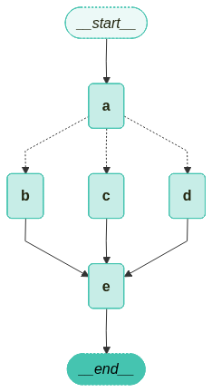
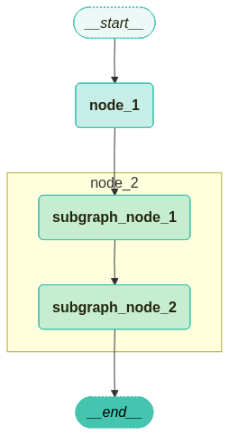

참고 : 테디노트의 RAG 비법노트 (https://fastcampus.co.kr/data_online_teddy)<br>소스코드: https://github.com/teddylee777/langchain-kr<br>위키독스: https://wikidocs.net/book/14314

&nbsp;

오늘도 LangGraph 기능들을 몇 가지 정리하고자 합니다..<br>레츠기리잇...!!

&nbsp;

## 병렬 처리 (fan-out, fan-in) + 신뢰도 따른 정렬

---

병렬 노드를 처리한 후 병렬로 처리된 결과를 신뢰도에 따라 정렬하는 코드를 봅시다.

```python
from typing import Annotated, Sequence
from typing_extensions import TypedDict
from langgraph.graph import StateGraph
from langgraph.graph.message import add_messages


# 팬아웃 값들의 병합 로직 구현, 빈 리스트 처리 및 리스트 연결 수행
"""
reducer에서는
- left: 채널에 이미 있던 누적값(이전 상태)
- right: 이번 단계에서 노드가 반환한 새 값(update/write)

해당 노드에서 반환한 fanout_values 값이 right로 들어가는 것임
 - b,c,d에서는 right가 병렬로 처리된 값이 들어올 것임
 - e에서는 []를 반환하므로 right가 []로 들어올 것임 -> if not right 조건에 걸림
"""
def reduce_fanouts(left, right):
    if left is None:  # left 없으면 (이전에 처리한 것이 없으면 -> 병렬처리 첫번째인 경우)
        # left는 []로 넣음 -> [] or [] + right
        left = []
    if not right:     # right 없으면 (현재 반환된 값이 없거나 []이면 -> e인 경우)
        # [] : 비우기 -> 해당 병렬처리 라운드 초기화
        return []
    return left + right  # 누적


# 상태 관리를 위한 타입 정의, 집계 및 팬아웃 값 저장 구조 설정
class State(TypedDict):
    # add_messages 리듀서 사용
    aggregate: Annotated[list, add_messages]
    fanout_values: Annotated[list, reduce_fanouts]
    which: str


# 그래프 초기화
builder = StateGraph(State)
builder.add_node("a", ReturnNodeValue("I'm A"))
builder.add_edge(START, "a")


# 병렬 노드 값 반환 클래스
class ParallelReturnNodeValue:
    def __init__(
        self,
        node_secret: str,
        reliability: float,
    ):
        self._value = node_secret
        self._reliability = reliability

    # 호출시 상태 업데이트
    def __call__(self, state: State) -> Any:
        print(f"Adding {self._value} to {state['aggregate']} in parallel.")
        return {
            "fanout_values": [
                {
                    "value": [self._value],
                    "reliability": self._reliability,
                }
            ]
        }


# 신뢰도(reliability)가 다른 병렬 노드들 추가
builder.add_node("b", ParallelReturnNodeValue("I'm B", reliability=0.1))
builder.add_node("c", ParallelReturnNodeValue("I'm C", reliability=0.9))
builder.add_node("d", ParallelReturnNodeValue("I'm D", reliability=0.5))


# 팬아웃 값들을 신뢰도 기준으로 정렬하고 최종 집계 수행
def aggregate_fanout_values(state: State) -> Any:
    # ‼️ 신뢰도(reliability) 기준 정렬 (상태 fanout_values의 reliability 기준으로 state["fanout_values"]을 정렬) ‼️
    ranked_values = sorted(
        state["fanout_values"], key=lambda x: x["reliability"], reverse=True
    )
    print(ranked_values)
    # ‼️ 정렬된 state["fanout_values"]에서 value 값만 가져와서 aggregate 상태에 넣고, E 부분 따로 추가 ‼️
    return {
        "aggregate": [x["value"][0] for x in ranked_values] + ["I'm E"],
        "fanout_values": [],
    }


# 집계 노드 추가
builder.add_node("e", aggregate_fanout_values)


# 상태에 따른 조건부 라우팅 로직 구현
def route_bc_or_cd(state: State) -> Sequence[str]:
    if state["which"] == "cd":
        return ["c", "d"]
    return ["b", "c"]


# 중간 노드들 설정 및 조건부 엣지 추가
intermediates = ["b", "c", "d"]
builder.add_conditional_edges("a", route_bc_or_cd, intermediates)

# 중간 노드들과 최종 집계 노드 연결
for node in intermediates:
    builder.add_edge(node, "e")

# 그래프 완성을 위한 최종
graph = builder.compile()
```

1. 병렬 처리할 때 상태 관리는 `fanout_values` 변수에서 하고, `Annotated[list, reduce_fanouts]` 타입 힌트를 갖습니다.

2. `reduce_fanouts` 리듀서는 병렬처리용 리듀서입니다.

   * `def reduce_fanouts(left, right)`
     * left: `fanout_values`의 이전 상태
     * right: 해당 노드의 이번 단계의 `fanout_values` 반환 값
     * `fanout_values` 값은 이전에 (병렬) 처리로 얻은 값이 없으면 이번 단계에 반환한 right만 누적하고, 이번 단계 처리한 값이 없으면(fan-in일 때=여기서는 `e` 노드) 빈 리스트 []로 초기화 합니다.

3. 노드 엣지 연결은 아래 그림과 코드를 보고 확인하면 됩니다. (**which 상태 이용해서 병렬로 처리할 노드 설정 가능**)

   

4. `e` 노드에서는 `aggregate_fanout_values` (병렬 처리 신뢰도 높은 순으로 정렬하는 함수)에서는`fanout_values` 상태를 `reliability`(신뢰도)에 따라 정렬합니다. 이후, `value` 값들과 ["I'm E"] 값을 추가하여 `aggregate` 상태에 넣고,  `fanout_values`  상태를 빈 리스트 []로 초기화합니다.

&nbsp;

&nbsp;

## 서브그래프 추가

---

서브 그래프는 컴파일된 그래프를 어떤 그래프 안에 노드로서 추가된 것입니다.<br>(= **컴파일된 그래프(서브그래프)를 부모 그래프에 노드로서 추가 가능하다.**)

**이때, 각 그래프별로 가지고 있는 상태 필드가 다르기 때문에 연결 시 주의할 점이 있습니다.** ‼️

&nbsp;

### 1. 스키마 키 공유하는 경우

알아두어야 할 것은 <strong>"공유된 스키마 키는 상태 업데이트 될 때 부모 상태와 자식 상태 모두 변합니다."</strong>

1. 자식 그래프 컴파일

   ```python
   class ChildState(TypedDict):
       name: str  # 부모 그래프와 공유되는 상태 키
       family_name: str
       
   # 서브그래프의 첫 번째 노드, family_name 키에 초기값 설정
   def subgraph_node_1(state: ChildState):
       return {"family_name": "Lee"}
   
   def subgraph_node_2(state: ChildState):
       # ‼️ 서브그래프 내부에서만 사용 가능한 family_name 키와 공유 상태 키 name를 사용하여 업데이트 수행 ‼️
       # 즉, state["name"]는 부모 그래프에서 설정된 name 키의 값을 가져와서 공유함 !!
       # ‼️ 최종적으로 자식에서 name을 수정하면서 부모 그래프 name 상태도 수정됨 ‼️
       return {"name": f'{state["name"]} {state["family_name"]}'}
   
   subgraph_builder = StateGraph(ChildState)
   subgraph_builder.add_node(subgraph_node_1)
   subgraph_builder.add_node(subgraph_node_2)
   subgraph_builder.add_edge(START, "subgraph_node_1")
   subgraph_builder.add_edge("subgraph_node_1", "subgraph_node_2")
   subgraph = subgraph_builder.compile(checkpointer=memory)
   
   builder.add_node("child_node", subgraph)
   ```

   * `START` -> `subgraph_node_1` 노드 -> `subgraph_node_2` 노드로 이동하는 자식 그래프를 컴파일하여 만들었습니다.

   * **자식 상태는 `name`와 `family_name`가 있고, `name`은 부모 상태와 공유하는 필드입니다.**


2. 부모 그래프에 자식 그래프 노드를 연결하여 컴파일

   ```python
   # 부모 그래프의 상태 정의를 위한 TypedDict 클래스, name 키만 포함
   class ParentState(TypedDict):
       name: str
       company: str
   
   
   # 부모 그래프의 첫 번째 노드, name 키의 값을 수정하여 새로운 상태 생성
   def node_1(state: ParentState):
       return {"name": f'My name is {state["name"]}'}
   
   
   # 부모 그래프 구조 정의 및 서브그래프를 포함한 노드 간 연결 관계 설정
   builder = StateGraph(ParentState)
   builder.add_node("node_1", node_1)
   
   # 컴파일된 서브그래프를 부모 그래프의 노드로 추가 (서브그래프를 노드로 추가 가능)
   """
   ‼️ ParentState가 통째로 “ChildState로 변환”되는 게 아니라, 공유 키(예: name)를 통해 상태가 전달/반환됩니다. ‼️
   ‼️ ChildState에 없는 키(예: company)는 서브그래프 내부에서 직접 못 쓰고, 부모 상태에는 그대로 유지됩니다. ‼️
   node_1이 name만 반환해도 company는 지워지지 않습니다(부분 업데이트 병합, 당연함).
   """
   
   builder.add_node("node_2", subgraph)  # 서브그래프 노드 추가
   builder.add_edge(START, "node_1")
   builder.add_edge("node_1", "node_2")  # node_1에서 서브그래프로 가는 엣지 추가
   builder.add_edge("node_2", END)
   
   graph = builder.compile(checkpointer=memory)
   ```

   * `START` -> `node_1` -> `node_2`(자식 서브그래프) -> `END` 노드로 이동하는 부모 그래프를 컴파일하여 만듭니다.

   * 부모 상태는 `name`와  `company`가 있고, `name`은 자식 상태와 공유하는 필드입니다.


3. `subgraphs=True` 설정하여 stream 호출 & 상태 출력

   ```python
   for chunk in graph.stream({"name": "Teddy"}, config, subgraphs=True):
       print(chunk)
   """출력:
   ((), {'node_1': {'name': 'My name is Teddy'}})
   (('node_2:142e5280-832c-0ccd-d554-5901a76bd5d1',), {'subgraph_node_1': {'family_name': 'Lee'}})
   (('node_2:142e5280-832c-0ccd-d554-5901a76bd5d1',), {'subgraph_node_2': {'name': 'My name is Teddy Lee'}})
   ((), {'node_2': {'name': 'My name is Teddy Lee'}})
   """    
       
   
   snapshot = graph.get_state(config, subgraphs=True)
   print(snapshot)
   """출력:
   StateSnapshot(values={'name': 'My name is Teddy Lee'}, next=(), config={'configurable': {'thread_id': 'teddy-1', 'checkpoint_ns': '', 'checkpoint_id': '1f10a41c-1ed1-6a70-8006-1f8f4a737d90'}}, metadata={'source': 'loop', 'step': 6, 'parents': {}}, created_at='2026-02-15T07:41:36.788947+00:00', parent_config={'configurable': {'thread_id': 'teddy-1', 'checkpoint_ns': '', 'checkpoint_id': '1f10a41c-1ecb-647c-8005-b481c2ced8ed'}}, tasks=(), interrupts=())
   """
   ```

   * `graph.stream({"name": "Teddy"}, config, subgraphs=True)`
     * `subgraphs=True`을 설정하여, 현재 namespace 뿐만 아니라 부모 스냅샷, 각 서브그래프 스냅샷이 포함하여 stream 호출하게 됩니다.
     * **즉, 부모 그래프에서 연결된 자식 그래프까지 각 노드(함수)를 호출하면서 반환되는 값들을 확인할 수 있습니다.**
     
   * `graph.get_state(config, subgraphs=True)`
     * `subgraphs=True`을 설정하여, 현재 상태 출력
     * `name`은 부모와 자식 상태 공유되어 있는 필드라서 현 namespace에서 공통으로 나옵니다.
     * 참고로, 부모 상태에서 company 값이 설정되어 있지 않아서 출력에서 보이지 않은 상태입니다.

&nbsp;

> #### ✔️ 참고
>
> checkpointer 설정하여 get_state로 상태를 보고자 하면 config 설정을 해줘야 합니다.<br>이때 config에서 configurable에 thread_id, checkpoint_ns, checkpoint_id 중에 하나를 설정하여 stream 호출을 해야 합니다.
>
> ```python
> # ‼️ checkpointer 설정하면 config에 (thread_id or checkpoint_ns or checkpoint_id)를 설정하여 stream() 호출해야 한다. ‼️
> config = {"configurable": {"thread_id": "teddy-1"}}
> 
> for chunk in graph.stream({"name": "Teddy"}, config):
>     print(chunk)
> ```

&nbsp;

### 2. 스키마 키 공유하지 않는 경우

부모 상태와 자식 상태가 서로 공유하는 키가 없기 때문에<br>**업데이트 된 자식 상태에서 특정 상태 필드(name)를 부모 상태의 필드(full_name)에 변환해서 넣어주는 노드를 하나 거쳐야 합니다.**

>  #### ‼️ ** 소스코드 작성 순서 기억** ‼️
>
> 1. **가장 자식 그래프부터 컴파일하고**
> 2. **상위 부모 그래프 상태 업데이트할 때 자식 그래프를 invoke해서 상태 넣기**

```python
# 서브그래프의 상태 타입 정의 (‼️ 부모 그래프와 키를 공유하지 않음 ‼️)
class ChildState(TypedDict):
    # 부모 그래프와 공유되지 않는 키들
    name: str


# 서브그래프의 첫 번째 노드: name 키에 초기값 설정 (예제를 위해 2단계로 쪼갠 것)
def subgraph_node_1(state: ChildState):
    return {"name": "Teddy " + state["name"]}


# 서브그래프의 두 번째 노드: name 값 그대로 반환
def subgraph_node_2(state: ChildState):
    return {"name": f'My name is {state["name"]}'}


# 서브그래프 빌더 초기화 및 노드 연결 구성
subgraph_builder = StateGraph(ChildState)
subgraph_builder.add_node(subgraph_node_1)
subgraph_builder.add_node(subgraph_node_2)
subgraph_builder.add_edge(START, "subgraph_node_1")
subgraph_builder.add_edge("subgraph_node_1", "subgraph_node_2")
subgraph = subgraph_builder.compile()


# 부모 그래프의 상태 타입 정의 (‼️ name이 없음 ‼️)
class ParentState(TypedDict):
    family_name: str
    full_name: str


# 부모 그래프의 첫 번째 노드: family_name 값 그대로 반환
def node_1(state: ParentState):
    return {"family_name": state["family_name"]}


# ⭐️ 부모 그래프의 두 번째 노드: 서브그래프와 상태 변환 및 결과 처리 ⭐️
def node_2(state: ParentState):
    # 부모 상태를 서브그래프 상태로 변환
    response = subgraph.invoke({"name": state["family_name"]})
    # 서브그래프 응답을 부모 상태로 변환
    return {"full_name": response["name"]}  # 자식 상태 name -> 부모 상태 full_name로 넣음


# 부모 그래프 빌더 초기화 및 노드 연결 구성
builder = StateGraph(ParentState)
builder.add_node("node_1", node_1)

# 컴파일된 서브그래프 대신 서브그래프를 호출하는 node_2 함수 사용
builder.add_node("node_2", node_2)
builder.add_edge(START, "node_1")
builder.add_edge("node_1", "node_2")
builder.add_edge("node_2", END)
graph = builder.compile()
```

자식 상태는 name 뿐이고 부모 상태는 family_name, full_name인데<br>자식 그래프(서브 그래프)를 바로 노드로 추가하지 않고 **`node_2`와 같이 부모 상태를 입력 받은 후, 자식 그래프를 호출하여 받은 응답을 부모 상태의 `full_name`에 넣으면서 상태 변환을 통해 연결할 수 있습니다.**

이렇게 해야 컴파일 오류가 나지 않습니다!!

&nbsp;

⭐️ <strong>이때, 부모 그래프 노드에서 자식 그래프를 invoke할 때 자식 상태는 실제로 업데이트 되지 않고 업데이트된 상태를 반환만 하여 그 상태를 부모 상태에 전달만 해주는 것입니다.</strong> ⭐️

⭐️ <strong>`부모_graph.stream(input, config, subgraphs=True)`로 호출하면 부모 그래프 실행 중 호출된 하위 자식/손자 그래프 노드들의 진행 과정까지 순서대로 스트림으로 확인할 수 있고, 하위 그래프의 결과는 부모 노드로 다시 돌아와 매핑된 부모 상태 키에 저장됩니다.</strong>⭐️

&nbsp;

테디노트님의 라이브러리를 통해서

```python
from langchain_teddynote.graphs import visualize_graph

visualize_graph(graph, xray=True)
```



그래프를 출력하여 보면 요렇게 생겼습니다.

&nbsp;

끄읕.

&nbsp;

```toc

```
